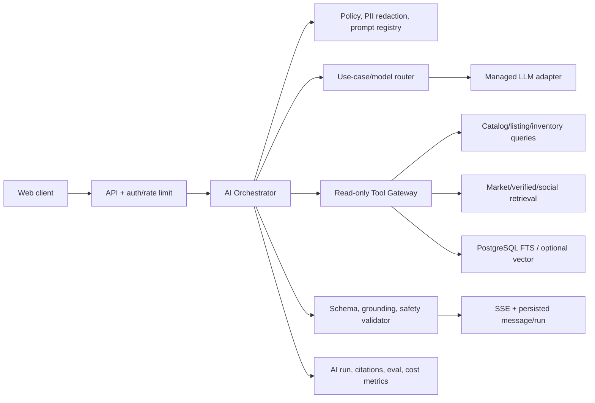
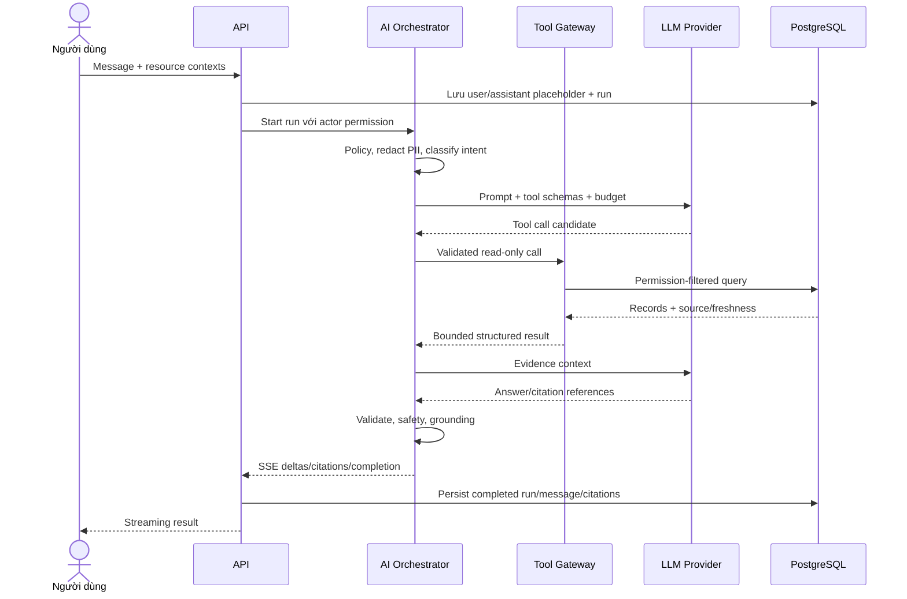

# Kiến trúc AI

## 1. Trạng thái và phạm vi

- Trạng thái: **Proposed — chờ review**.
- Phạm vi có bằng chứng UI (giao diện người dùng):
  - Chat bất động sản.
  - Hiểu truy vấn tự nhiên.
  - Đánh giá và so sánh.
  - Tìm kiếm xã hội có tổng hợp.
  - Tóm tắt bài viết, bình luận, hồ sơ.
  - Nội dung AI chính thức.
- Không có bằng chứng UI đủ để yêu cầu STT (chuyển giọng nói thành văn bản), TTS (chuyển văn bản thành giọng nói), xử lý audio, OCR (nhận dạng ký tự quang học) hoặc file attachment. Không dùng self-hosted model (mô hình tự lưu trữ). Các phần này không nằm trong baseline cho đến khi OQ-031/OQ-032 được trả lời.
- AI là lớp hỗ trợ tìm hiểu và giải thích. Nó không phải nguồn sự thật. Nó không tự thay đổi listing (tin đăng), project (dự án), hoặc unit (căn hộ). Nó không tạo hoặc xác nhận lead (khách hàng tiềm năng), hold (giữ chỗ), booking (đặt chỗ), thanh toán hoặc xuất bản nội dung.

## 2. Mục tiêu và nguyên tắc

1. **Grounded trước fluent**: Ưu tiên grounding (gắn câu trả lời vào dữ liệu thực). Câu trả lời phải có bằng chứng, thời điểm và nguồn. Không ưu tiên văn phong tự tin nhưng thiếu chính xác.
2. **Deterministic nơi có thể**: Lọc giá, khu vực, diện tích, quyền và state transition do code xử lý chắc chắn. LLM (mô hình ngôn ngữ lớn) chỉ trích xuất intent (ý định của người dùng) và giải thích.
3. **Trust tier rõ ràng**: Cần phân loại trust tier (mức tin cậy của nguồn dữ liệu). Dữ liệu canonical (dữ liệu gốc, chính thức) khác với dữ liệu đã xác minh. Nó cũng khác với UGC (nội dung do người dùng tạo).
4. **Tool chỉ đọc**: Model không có credential database. Không có API mutation (API thay đổi dữ liệu).
5. **Version và audit**: Model, prompt (lệnh điều khiển AI), policy (chính sách), tool, retrieval (trích xuất dữ liệu) và score version phải được ghi lại theo mỗi lần chạy (run).
6. **Privacy by design**: Giảm thiểu hoặc redact (che giấu) PII (thông tin định danh cá nhân) trước khi đưa vào model. Không dùng hội thoại để train nếu chưa có policy hoặc người dùng cho phép. Ví dụ: che số điện thoại, email trước khi gửi lên model.
7. **Eval trước rollout**: Mọi thay đổi về model, prompt, hoặc retrieval đều phải qua eval (kiểm tra chất lượng AI). Cần test offline và kiểm tra an toàn trước khi phát hành từng bước (staged release).
8. **Graceful fallback**: Cần có fallback (cơ chế dự phòng). AI hỏng không làm mất chức năng tìm kiếm thường. Dữ liệu chi tiết canonical vẫn phải hoạt động tốt.

## 3. Use case và mức rủi ro

| Use case | Input | Output | Mức rủi ro | Guardrail chính |
|---|---|---|---|---|
| Chat khám phá | Câu hỏi + context được phép | Trả lời streaming + citation (trích dẫn nguồn) | Trung bình/cao nếu pháp lý/tài chính | Tool allowlist, trust tier, disclaimer, abstain |
| NL market search | Query tự nhiên | Filter có cấu trúc + kết quả deterministic | Trung bình | JSON schema, allowlist, hiển thị applied filters |
| AI evaluation/compare | Resource + preference | Điểm/tiêu chí/giải thích | Cao nếu gây hiểu sai | Score versioned, evidence, unknowns; LLM không tự tính tùy ý |
| Social AI search | Query + content corpus | Summary/highlight/results/citation | Cao do UGC | Tách UGC, source mix, moderation/visibility filter |
| Tóm tắt post/comments/profile | Nội dung được phép | Summary | Trung bình | Không suy luận đặc điểm nhạy cảm, link source, thời điểm |
| Nội dung AI chính thức | Dữ liệu thị trường/nguồn | Draft hoặc published content | Cao về uy tín | Human review theo OQ-030/OQ-037; version/source |
| Market/risk explanation | Canonical/verified content | Giải thích giáo dục | Cao | Không tư vấn pháp lý/tài chính cá nhân hóa khi chưa policy |

## 4. Kiến trúc logic



### Thành phần

- **AI Orchestrator**: Quản lý vòng đời run. Quản lý intent, giới hạn tool loop, timeout, cancel. Chuẩn bị prompt và lưu trữ dữ liệu.
- **Policy layer**: Quản lý quyền và nguồn được phép. Xử lý quy tắc PII và an toàn nội dung. Quản lý ngân sách context/tool/token theo use case.
- **Model router**: Chọn cấp độ model theo use case. Không fix cứng vendor vào code domain.
- **Tool Gateway**: API nội bộ có type rõ ràng. Chỉ cho phép đọc. Trả về record ID/nguồn gốc và kiểm tra quyền.
- **Retrieval**: Tìm kiếm có cấu trúc và full-text. Chỉ dùng semantic retrieval (tìm kiếm theo ngữ nghĩa) sau khi có eval.
- **Output validator**: Kiểm tra schema và trích dẫn. Ánh xạ claim với bằng chứng. Loại bỏ hành động/từ ngữ cấm. Cảnh báo dữ liệu cũ.
- **Telemetry/eval**: Ghi nhận version, token, chi phí, độ trễ. Ghi lại kết quả tool, trích dẫn, độ an toàn. Không lưu chain-of-thought (chuỗi suy luận nội bộ).

## 5. Chat pipeline

Đây là pipeline RAG (AI tìm dữ liệu rồi mới trả lời) điển hình.



### Run state

Trạng thái Candidate: `queued → running → completed`.
Trạng thái Terminal: `failed`, `cancelled`, `blocked`.
Mỗi bước chuyển trạng thái đều an toàn (idempotent). Retry provider không tự tạo tin nhắn mới. Regenerate (tạo lại) là một run mới. Nó có quan hệ rõ ràng với run cũ.

### Context budget

Thứ tự ưu tiên dữ liệu đưa vào prompt:

1. System/policy và câu hỏi hiện tại.
2. Context của trang người dùng đang xem.
3. Kết quả tool canonical hoặc dữ liệu đã xác minh mới nhất.
4. Các lượt chat gần nhất liên quan.
5. Tóm tắt hội thoại cũ nếu policy cho phép.

Không nạp toàn bộ lịch sử. Không nạp toàn bộ comment hoặc tài liệu thô vào prompt mặc định. Cần giới hạn cụ thể theo model sau OQ-035. Ví dụ: chỉ giới hạn lấy 5 bình luận gần nhất.

## 6. Trust tier và provenance

| Tier | Ví dụ | Cách dùng |
|---:|---|---|
| T1 — Canonical nghiệp vụ | Project/unit/listing record đã qua authority; legal document verified; booking state | Ưu tiên cao nhất; vẫn ghi freshness/source |
| T2 — Verified/curated | Market observation, article/official update đã được duyệt | Dùng cho phân tích; gắn publisher/effective date |
| T3 — UGC có identity | Bài/comment của tác giả, kể cả verified profile | Trình bày là ý kiến/nội dung người dùng, không biến thành fact |
| T4 — Unverified/external | Record mới ingest, URL chưa duyệt | Không dùng hoặc nêu cảnh báo rõ theo policy |

> **Ghi chú mapping UI**: UI hiện tại không phân biệt trust tier. Dữ liệu mock hiển thị giống nhau. Backend cần thêm badge hoặc indicator để phân biệt nguồn theo tier.

Sự tin cậy của **tác giả** không tự động biến mọi claim (tuyên bố) thành sự thật. Một bài từ tài khoản verified vẫn cần nguồn gốc cho số liệu hoặc pháp lý.

Mỗi evidence chunk (đoạn bằng chứng) hoặc kết quả tool cần:

- ID canonical và loại dữ liệu.
- Nguồn, người đăng và URL nếu được phép.
- Thời gian `effectiveAt/observedAt/publishedAt` phù hợp.
- Mức trust tier và verification.
- Phạm vi quyền (permission scope).
- Chỉ lấy giá trị cần thiết. Không lấy toàn bộ record hoặc PII.

## 7. Retrieval và indexing

### 7.1 Baseline

- Dùng bộ lọc có cấu trúc cho vị trí, giao dịch, giá, diện tích, phòng ngủ, trạng thái, thời gian.
- Dùng PostgreSQL full-text cho tiêu đề, mô tả và nội dung đã publish.
- Phải luôn lọc theo quyền, trạng thái, và độ mới trước hoặc cùng lúc với retrieval.
- Xếp hạng (ranking) kết hợp nhiều yếu tố. Bao gồm: bộ lọc chính xác, độ phù hợp văn bản, độ mới và mức độ tin cậy. Trọng số cần qua eval và product duyệt.

### 7.2 Semantic retrieval

Chỉ thêm embedding (vector hóa) khi full-text không đáp ứng được query tự nhiên. Ưu tiên dùng `pgvector` để giảm gánh nặng vận hành. Chỉ dùng vector DB riêng nếu quy mô lớn yêu cầu.

Quy trình Index:

1. Lắng nghe outbox khi resource thay đổi (published/updated/hidden/deleted).
2. Worker tạo document chuẩn. Chia chunk theo thực thể hoặc phần (section).
3. Redact PII, thêm tag quyền. Tạo embedding bằng model có quản lý version.
4. Cập nhật index với mã băm nội dung.
5. Nếu dữ liệu bị ẩn/xóa/đổi quyền, phải loại bỏ ngay (tombstone) theo policy.

Không embedding số điện thoại, email, ghi chú nội bộ, hội thoại mặc định. Re-embedding cần có checkpoint, kiểm soát ngân sách và khả năng rollback (hoàn tác) index.

### 7.3 Citation

- Model dùng ID citation do tool cung cấp. Không tự bịa URL hoặc ID.
- Output validator loại bỏ citation không tồn tại hoặc không có quyền.
- Các tuyên bố về giá, trạng thái, pháp lý, thời gian bắt buộc có citation trực tiếp.
- Nếu bằng chứng mâu thuẫn, báo cáo mâu thuẫn kèm timestamp và nguồn. Không tự chọn bừa.
- Snapshot của citation lưu cùng `ai_run`. Khi load lại vẫn phải kiểm tra quyền.

Mức chi tiết (granularity) cuối cùng chờ OQ-033.

## 8. Tool catalog đề xuất

Tất cả tool dùng nội bộ ở server. Cần define type, chỉ đọc và có giới hạn.

| Tool | Input chính | Output | Không được làm |
|---|---|---|---|
| `search_listings` | Structured filters + cursor/limit | Listing summaries + source/freshness | Không tạo lead/save |
| `get_listing` | Listing ID | Allowed detail + citations | Không lộ private contact |
| `search_projects` | Geography/query/filter | Project summaries | Không thay canonical data |
| `get_project` | Project ID + requested sections | Structured detail/source | Không đọc unpublished section |
| `search_units` | Project/hierarchy/filter | Unit snapshot + offers/freshness | Không hold/booking |
| `get_unit_availability` | Unit ID | Latest permitted snapshot | Không cam kết lock |
| `get_market_prices` | Geography/metric/time | Observations + source | Không nội suy không khai báo |
| `search_verified_content` | Query/time/source | T2 content | Không trả hidden/licensed text quá quyền |
| `search_social_content` | Query/filter | T3 content + identity/citations | Không bỏ visibility/moderation |
| `get_user_preferences` | Actor scope | Explicit preferences only | Không suy luận sensitive attributes |

Không có tool `create_booking`, `contact_sale`, `publish_post`, `send_message_to_user` hay `make_payment`.

Tool schema từ chối field lạ. Giới hạn số lượng kết quả và độ dài text. Cài đặt timeout và ghi nhận `tool_version`. Model không được truyền câu lệnh SQL hoặc order-by trực tiếp.

## 9. Natural-language search

Tìm kiếm tự nhiên (NL search) là quy trình 2 bước:

1. LLM hoặc model có cấu trúc trích xuất `SearchIntent` theo JSON Schema.
2. Ứng dụng validate taxonomy, ID, giới hạn rồi gọi query deterministic.

Ví dụ schema:

```json
{
  "transactionKind": "sale",
  "cityId": "<resolved-uuid>",
  "districtIds": ["<resolved-uuid>"],
  "minPriceAmountVnd": null,
  "maxPriceAmountVnd": 9000000000,
  "minAreaSqm": null,
  "bedroomCount": 2,
  "preferences": ["near_lake"],
  "unresolvedTerms": []
}
```

- Trình phân giải thực thể ánh xạ "Tây Hồ" thành ID trong phạm vi thành phố. Model không tự tạo ID.
- Nếu không rõ ràng, trả về `unresolvedTerms` (các từ chưa rõ) thay vì đoán mò.
- Hiển thị các bộ lọc đã áp dụng. Cho phép người dùng chỉnh sửa.
- Nếu LLM không khả dụng, tính năng tìm kiếm bằng keyword hoặc bộ lọc thường vẫn hoạt động.

## 10. Match score, evaluation và comparison

UI có tính năng “AI evaluation” và so sánh nhưng chưa có thuật toán cụ thể. Baseline an toàn:

1. **Feature calculator deterministic/versioned**: Code cứng tính toán tiêu chí từ dữ liệu có nguồn. Phải được product duyệt trước.
2. **Scoring policy versioned**: Áp dụng trọng số và quy tắc đã duyệt. Không tự cho điểm tốt/xấu nếu thiếu thông tin.
3. **LLM explanation**: LLM diễn giải điểm số, bằng chứng và rủi ro. LLM không tự sửa điểm.
4. Kết quả lưu `algorithmVersion`, thời gian nguồn, tùy chọn input và citation.

Không hiển thị “phù hợp X%” cho đến khi OQ-029 được duyệt về người phụ trách, trọng số và eval. Với pháp lý/giá chưa đủ nguồn, output phải nêu rõ “chưa đủ dữ liệu”.

## 11. Social AI và content generation

### Search/tóm tắt

- Query chỉ quét bài đăng/comment/profile đã công khai (published). AI chỉ được tìm kiếm dữ liệu mà người dùng có quyền xem.
- Bài viết nháp, đã xóa, hoặc bị hạn chế sẽ không xuất hiện trong ngữ cảnh AI.
- Cập nhật index tự động qua outbox.
- Bản tóm tắt phải phân biệt rõ. Ví dụ: "Dữ liệu nền tảng ghi nhận..." khác với "Một số thành viên nhận xét...".
- Trả về nguồn kết hợp (source mix) và khoảng thời gian. Khai báo trạng thái nếu không đủ bằng chứng.
- Không suy đoán danh tính, tài chính, sức khỏe, hoặc thông tin nhạy cảm của tác giả.

### AI official content

Nội dung do AI tạo cho mục đích chính thức nên là quy trình tạo nháp:

`Lấy snapshot gốc → Sinh nội dung → Kiểm tra tự động → Người duyệt (nếu cần) → Đăng → Lưu lịch sử phiên bản`.

Chưa duyệt việc auto-publish. Các cảnh báo rủi ro và số liệu phải có nguồn, ngày áp dụng. Bản đính chính (correction) không được xóa lịch sử kiểm toán của phiên bản cũ.

## 12. Model/provider và serving architecture

### Baseline đề xuất

- Dùng managed LLM API qua interface `ModelGateway`.
- Điều hướng (route) request dựa vào use case. Không gọi cứng tên nhà cung cấp (vendor) trong code.
- Credential cho từng môi trường lưu trong secret manager. Nếu provider yêu cầu, dùng private connectivity.
- Cài đặt timeout, giới hạn số lượng gọi song song, số lần retry. Sử dụng circuit breaker và có fallback prompt khi eval.
- Ghi nhận thông tin provider, model, vùng và chi phí theo run.

Repo có chứa dependency Gemini. Tuy nhiên, điều này **không chứng minh** Gemini đã được phê duyệt (OQ-026).

### Khi nào cân nhắc self-hosted model

Chỉ đánh giá khi có bằng chứng thực tế:

- Chính sách lưu trữ dữ liệu (data residency) hoặc tính riêng tư không cho phép dùng provider.
- Tải đều đặn khiến chi phí duy trì GPU rẻ hơn đáng kể.
- Cần latency cực thấp hoặc model cục bộ.
- Cần fine-tune cho domain đặc thù mà provider không hỗ trợ.

Khi đó phải thiết kế GPU scheduler, model registry, canary, on-call,... Không triển khai sẵn phần này.

## 13. STT/TTS và media AI

### Hiện tại

- **STT: không áp dụng** — UI chưa có tính năng nhập liệu bằng giọng nói.
- **TTS: không áp dụng** — UI chưa có tính năng đọc văn bản hoặc trợ lý giọng nói.
- **OCR/document analysis: chưa xác nhận** — Trình soạn thảo chưa có luồng đính kèm tệp rõ ràng.
- **Video transcription/image generation: không có yêu cầu**.

### Nếu được thêm sau này

Cần thiết kế ADR mới cho luồng xử lý tiếng Việt, model, định dạng audio, độ trễ, lưu trữ, kiểm duyệt, chi phí. Không được đưa audio vào luồng chữ hiện tại chỉ bằng cách gọi thêm thư viện.

## 14. Safety, security và privacy

- Cấu hình prompt/template chỉ được sửa qua quy trình duyệt. Coi nội dung từ người dùng và dữ liệu trích xuất là không an toàn (untrusted data).
- Quản lý tool allowlist, schema và quyền lợi trong từng call. Đầu ra của model không có quyền quyết định quyền hạn hệ thống.
- Ngăn chặn prompt injection (tấn công bằng lệnh giả mạo) qua phân cấp lệnh, giới hạn và xác thực đầu ra.
- Công cụ ẩn PII sẽ che thông tin nhạy cảm trước khi gọi provider. Không lưu toàn bộ prompt đầy đủ mặc định.
- Cấu hình provider retention và khu vực chờ OQ-026/OQ-028.
- Moderation input/output theo use case. Khi block hoặc bỏ qua cần ghi rõ mã lý do.
- Không đưa chuỗi suy luận nội bộ (chain-of-thought) ra ngoài. Chỉ tóm tắt lý do có bằng chứng.
- Quét URL nội bộ tránh SSRF, mã độc.
- Giới hạn budget, rate limit theo use case. Chống prompt bombing hoặc context exhaustion.
- Bắt buộc cài đặt tool timeout, số lần lặp, giới hạn token cho mọi tool.

## 15. Reliability và fallback

| Failure | Hành vi đề xuất |
|---|---|
| Model timeout/unavailable | Dừng run, trả lỗi retryable; search/filter thường vẫn dùng được |
| Tool timeout | Có thể trả câu trả lời giới hạn kèm thiếu nguồn, hoặc fail theo use case rủi ro |
| Không đủ bằng chứng | Abstain/nêu unknown, không tạo fact |
| Nguồn mâu thuẫn | Trình bày nguồn/thời điểm mâu thuẫn, ưu tiên theo authority rule đã duyệt |
| Stream mất kết nối | Client reconnect `Last-Event-ID`; fallback GET message/run state |
| Safety block | Event/error có mã an toàn, không lộ policy nội bộ |
| Citation validation fail | Không publish answer hoàn chỉnh hoặc đánh dấu phần không có nguồn theo policy |
| Chi phí/quota vượt ngưỡng | Throttle, route model đã eval hoặc tắt feature bằng kill switch |

## 16. Evaluation và release gate

### Bộ eval tối thiểu theo use case

- NL search: Đo lường exact/partial match của filter, phân giải vùng địa lý, xử lý đơn vị tiền tệ.
- RAG QA: Đo lường recall/precision, độ đúng của citation, độ mới và quản lý mâu thuẫn.
- AI evaluation: Sự thống nhất về điểm số, lý do bám sát bằng chứng.
- Social: Phân biệt rõ UGC và sự thật. Chống rò rỉ nội dung bị cấm hoặc đã xóa.
- Safety: Chống prompt injection, jailbreak, rò rỉ PII, tool chưa cấp quyền, tư vấn quá đà.
- Vietnamese quality: Ngữ điệu tiếng Việt, thuật ngữ bất động sản, cách diễn đạt từ chối.

### Release process

1. Đánh version model, prompt, tool, policy, index.
2. Chạy offline regression test với dữ liệu ẩn danh và có chủ sở hữu.
3. Review kỹ các kết quả lỗi nguy hiểm. Không chỉ dùng điểm số trung bình.
4. Triển khai shadow/canary theo phần trăm traffic được phép.
5. Theo dõi quality, safety, chi phí, tốc độ. Cần có cơ chế rollback bằng cờ (flag).
6. Chỉ promote khi đạt ngưỡng OQ-035 được duyệt.

Không dùng mỗi thumbs-up/down trên production làm bộ eval duy nhất.

## 17. Observability và cost

Ghi lại các thông số theo `useCase`, model, prompt, tool, index version:

- Trạng thái run: success, block, cancel, error.
- Độ trễ: time-to-first-token và total latency.
- Token in/out, kích thước tool call và ước tính chi phí.
- Số lượng retrieval, mức độ tin cậy của nguồn.
- Tỉ lệ rớt citation và fallback rate.
- Danh mục safety.
- Tương tác từ người dùng (theo privacy policy).

Tuyệt đối không đưa PII thực hoặc prompt thô vào metric label. Thiết lập ngân sách (budget) theo môi trường và use case. Chỉ cache AI response khi context công khai. KHÔNG cache các nội dung cá nhân hóa hoặc phòng trống (booking availability) giống như dữ liệu chung.

## 18. Câu hỏi chặn và tiêu chí duyệt

Các OQ chặn (Câu hỏi mở chặn tiến độ): OQ-026..035, OQ-037, OQ-044..046. Thiết kế AI được duyệt khi:

- Xác định rõ người chịu trách nhiệm về chính sách source/trust/citation.
- Việc xử lý dữ liệu và lưu trữ qua provider được bảo mật, pháp lý và product duyệt.
- Điểm đánh giá (score) không tạo ra các khẳng định không có cơ sở.
- Danh sách tool đã được xác nhận chỉ đọc (read-only) và có test quyền.
- Chốt được bộ eval, giới hạn an toàn (threshold), luồng rollback và kill switch.
- Tiếp tục bỏ STT/TTS và đính kèm khỏi code nếu chưa có yêu cầu rõ ràng.
