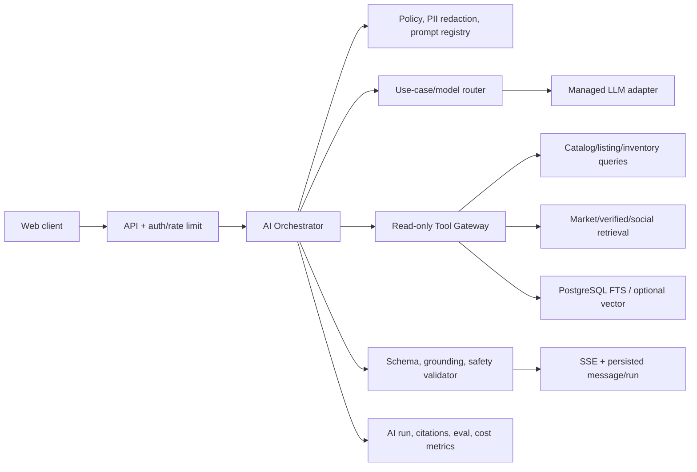
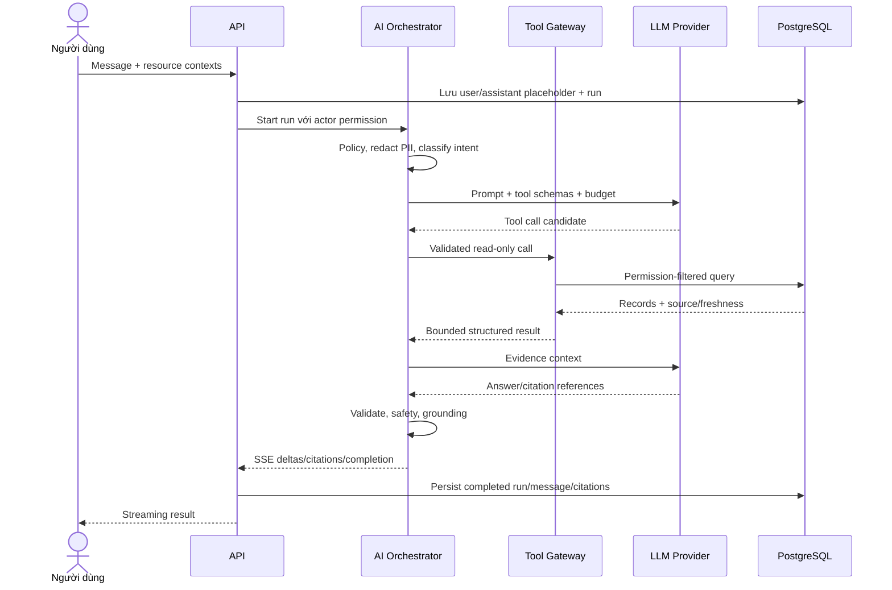

# Kiến trúc AI

## 1. Trạng thái và phạm vi

- Trạng thái: **Proposed — chờ review**.
- Phạm vi có bằng chứng UI: chat bất động sản, hiểu truy vấn tự nhiên, đánh giá/so sánh, tìm kiếm xã hội có tổng hợp, tóm tắt bài/bình luận/hồ sơ và nội dung AI chính thức.
- Không có bằng chứng UI đủ để yêu cầu STT, TTS, xử lý audio, OCR/file attachment hoặc self-hosted model; các phần này không nằm trong baseline cho đến khi OQ-031/OQ-032 được trả lời.
- AI là lớp hỗ trợ tìm hiểu/giải thích. Nó không phải nguồn sự thật, không tự thay đổi listing/project/unit, không tạo/xác nhận lead, hold, booking, thanh toán hoặc xuất bản nội dung.

## 2. Mục tiêu và nguyên tắc

1. **Grounded trước fluent**: ưu tiên câu trả lời có bằng chứng, thời điểm và nguồn hơn văn phong tự tin.
2. **Deterministic nơi có thể**: lọc giá/khu vực/diện tích, quyền và state transition do code/query thực hiện; LLM chỉ trích xuất ý định và giải thích.
3. **Trust tier rõ ràng**: dữ liệu canonical khác dữ liệu đã xác minh và khác UGC.
4. **Tool chỉ đọc**: model không có credential database hay API mutation.
5. **Version và audit**: model, prompt, policy, tool, retrieval và score version được ghi theo run.
6. **Privacy by design**: giảm thiểu/redact PII trước model; không dùng hội thoại để train nếu chưa có consent/policy.
7. **Eval trước rollout**: mọi thay đổi model/prompt/retrieval qua offline + safety eval và staged release.
8. **Graceful fallback**: AI hỏng không làm mất search/filter thường hoặc dữ liệu chi tiết canonical.

## 3. Use case và mức rủi ro

| Use case | Input | Output | Mức rủi ro | Guardrail chính |
|---|---|---|---|---|
| Chat khám phá | Câu hỏi + context được phép | Trả lời streaming + citation | Trung bình/cao nếu pháp lý/tài chính | Tool allowlist, trust tier, disclaimer, abstain |
| NL market search | Query tự nhiên | Filter có cấu trúc + kết quả deterministic | Trung bình | JSON schema, allowlist, hiển thị applied filters |
| AI evaluation/compare | Resource + preference | Điểm/tiêu chí/giải thích | Cao nếu gây hiểu sai | Score versioned, evidence, unknowns; LLM không tự tính tùy ý |
| Social AI search | Query + content corpus | Summary/highlight/results/citation | Cao do UGC | Tách UGC, source mix, moderation/visibility filter |
| Tóm tắt post/comments/profile | Nội dung được phép | Summary | Trung bình | Không suy luận đặc điểm nhạy cảm, link source, thời điểm |
| Nội dung AI chính thức | Dữ liệu thị trường/nguồn | Draft hoặc published content | Cao về uy tín | Human review theo OQ-030/OQ-037; version/source |
| Market/risk explanation | Canonical/verified content | Giải thích giáo dục | Cao | Không tư vấn pháp lý/tài chính cá nhân hóa khi chưa policy |

## 4. Kiến trúc logic



### Thành phần

- **AI Orchestrator**: quản lý run lifecycle, intent, tool loop có giới hạn, timeout/cancel, prompt assembly và persistence.
- **Policy layer**: permission, allowed sources, PII rule, content safety, maximum context/tool/token budget theo use case.
- **Model router**: chọn capability/model tier theo use case; không hard-code vendor vào domain.
- **Tool Gateway**: API nội bộ typed, read-only, trả record ID/provenance và enforce authorization.
- **Retrieval**: structured query + full-text; semantic retrieval chỉ sau eval.
- **Output validator**: schema, citation/claim mapping, forbidden action/language, stale-data warning.
- **Telemetry/eval**: version, token/cost/latency, tool/citation/safety outcome; không lưu chain-of-thought.

## 5. Chat pipeline



### Run state

Candidate: `queued → running → completed`; terminal `failed`, `cancelled`, `blocked`. Mỗi transition idempotent. Retry provider không tự tạo message mới; regenerate là một run mới có quan hệ rõ.

### Context budget

Thứ tự ưu tiên đề xuất:

1. System/policy và user request hiện tại.
2. Resource context người dùng chọn.
3. Kết quả tool canonical/verified mới nhất.
4. Các turn hội thoại gần có liên quan.
5. Summary hội thoại cũ nếu memory policy cho phép.

Không nạp toàn bộ lịch sử, toàn bộ comment hoặc raw document vào prompt mặc định. Limit cụ thể theo model/use case sau OQ-035.

## 6. Trust tier và provenance

| Tier | Ví dụ | Cách dùng |
|---:|---|---|
| T1 — Canonical nghiệp vụ | Project/unit/listing record đã qua authority; legal document verified; booking state | Ưu tiên cao nhất; vẫn ghi freshness/source |
| T2 — Verified/curated | Market observation, article/official update đã được duyệt | Dùng cho phân tích; gắn publisher/effective date |
| T3 — UGC có identity | Bài/comment của tác giả, kể cả verified profile | Trình bày là ý kiến/nội dung người dùng, không biến thành fact |
| T4 — Unverified/external | Record mới ingest, URL chưa duyệt | Không dùng hoặc nêu cảnh báo rõ theo policy |

> **Ghi chú mapping UI**: UI hiện tại không phân biệt trust tier khi hiển thị dữ liệu — tất cả thông tin từ mock data được hiển thị đồng nhất. Khi implement backend, cần thêm indicator/badge phân biệt nguồn dữ liệu theo tier để đáp ứng thiết kế này.

Trust của **tác giả** không tự động làm mọi claim thành dữ kiện chuẩn. Một bài từ tài khoản verified vẫn cần nguồn cho số liệu/pháp lý.

Mỗi evidence chunk/tool result cần:

- canonical record ID và loại;
- source/publisher và URL nếu được phép;
- `effectiveAt/observedAt/publishedAt` phù hợp;
- trust tier/verification;
- permission scope;
- text/value giới hạn cần thiết, không đưa toàn record/PII.

## 7. Retrieval và indexing

### 7.1 Baseline

- Structured filters cho geography, transaction, price, area, bedrooms, status, time và resource type.
- PostgreSQL full-text cho title/description/content đã publish.
- Metadata permission/visibility/status/freshness luôn filter trước hoặc cùng retrieval.
- Ranking kết hợp exact filter, text relevance, recency và trust; trọng số cần eval/product approval.

### 7.2 Semantic retrieval

Chỉ thêm embedding khi test set cho thấy full-text/structured không đủ cho query diễn đạt tự nhiên. Lựa chọn đầu tiên có thể là `pgvector` để giảm hệ vận hành; vector DB riêng chỉ khi quy mô/latency/filter capability chứng minh cần.

Index pipeline:

1. Outbox phát resource published/updated/hidden/deleted.
2. Worker tạo document được chuẩn hóa, chunk có boundary theo entity/section.
3. Redact/permission tag và tạo embedding bằng model versioned.
4. Upsert index với content hash/version.
5. Hidden/deleted/resource permission change phải tombstone/remove nhanh theo policy.

Không embedding phone/email/private note/hội thoại mặc định. Re-embedding có checkpoint, budget và rollback index version.

### 7.3 Citation

- Model dùng citation handle do tool cấp, không tự bịa URL/ID.
- Output validator loại/đánh dấu citation không tồn tại hoặc không được phép.
- Claim quan trọng về giá, trạng thái, pháp lý và thời gian cần citation trực tiếp.
- Nếu bằng chứng mâu thuẫn, trả mâu thuẫn và timestamp/source; không tự chọn một số không có rule.
- Citation snapshot/version lưu với `ai_run`; access khi render lại vẫn kiểm tra quyền.

Mức granularity cuối chờ OQ-033.

## 8. Tool catalog đề xuất

Tất cả tool là server-internal, typed, read-only và bounded.

| Tool | Input chính | Output | Không được làm |
|---|---|---|---|
| `search_listings` | Structured filters + cursor/limit | Listing summaries + source/freshness | Không tạo lead/save |
| `get_listing` | Listing ID | Allowed detail + citations | Không lộ private contact |
| `search_projects` | Geography/query/filter | Project summaries | Không thay canonical data |
| `get_project` | Project ID + requested sections | Structured detail/source | Không đọc unpublished section |
| `search_units` | Project/hierarchy/filter | Unit snapshot + offers/freshness | Không hold/booking |
| `get_unit_availability` | Unit ID | Latest permitted snapshot | Không cam kết lock |
| `get_market_prices` | Geography/metric/time | Observations + source | Không nội suy không khai báo |
| `search_verified_content` | Query/time/source | T2 content | Không trả hidden/licensed text quá quyền |
| `search_social_content` | Query/filter | T3 content + identity/citations | Không bỏ visibility/moderation |
| `get_user_preferences` | Actor scope | Explicit preferences only | Không suy luận sensitive attributes |

Không có `create_booking`, `contact_sale`, `publish_post`, `send_message_to_user` hay `make_payment` trong tool list.

Tool schema reject unknown field, cap result count/text length, set timeout và ghi `tool_version`. Model không truyền raw SQL/order-by expression.

## 9. Natural-language search

NL search là pipeline hai bước:

1. LLM/structured model trích xuất `SearchIntent` theo JSON Schema.
2. Application validate taxonomy/ID/range rồi gọi query deterministic.

Ví dụ schema logic:

```json
{
  "transactionKind": "sale",
  "cityId": "<resolved-uuid>",
  "districtIds": ["<resolved-uuid>"],
  "minPriceAmountVnd": null,
  "maxPriceAmountVnd": 9000000000,
  "minAreaSqm": null,
  "bedroomCount": 2,
  "preferences": ["near_lake"],
  "unresolvedTerms": []
}
```

- Entity resolver map “Tây Hồ” sang ID trong phạm vi city, không để model tự tạo ID.
- Ambiguity quan trọng trả `unresolvedTerms`/clarification thay vì đoán.
- Applied filters được hiển thị và có thể chỉnh.
- Nếu LLM không khả dụng, keyword/filter UI vẫn hoạt động.

## 10. Match score, evaluation và comparison

UI có “AI evaluation” và compare nhưng chưa có tiêu chí/thuật toán. Baseline an toàn:

1. **Feature calculator deterministic/versioned** tính các tiêu chí được product duyệt từ dữ liệu có provenance.
2. **Scoring policy versioned** áp trọng số/rule đã duyệt; missing feature không tự gán điểm tốt/xấu.
3. **LLM explanation** diễn giải score, evidence, trade-off và unknown; không sửa score.
4. Kết quả lưu `algorithmVersion`, source snapshot/time, preference input và citation.

Không công bố “phù hợp X%” cho đến khi OQ-029 xác định owner, trọng số, calibration và eval. Với pháp lý/giá không đủ nguồn, output phải nêu “chưa đủ dữ liệu”.

## 11. Social AI và content generation

### Search/tóm tắt

- Query chỉ trên post/comment/profile được publish và actor có quyền.
- Bỏ nội dung moderation-blocked/deleted; update index theo outbox.
- Summary phân biệt “Dữ liệu nền tảng ghi nhận...” với “Một số thành viên nhận xét...”.
- Trả source mix, phạm vi thời gian và insufficient-evidence state.
- Không suy luận danh tính, tài chính, sức khỏe hoặc thuộc tính nhạy cảm của tác giả/người dùng.

### AI official content

Content AI chính thức nên là workflow draft:

`source snapshot → generation → automated checks → human review (nếu policy yêu cầu) → publish → correction/version history`.

Việc auto-publish chưa được phê duyệt. Số liệu và cảnh báo rủi ro phải có source/effective date; correction không xóa audit của phiên bản cũ.

## 12. Model/provider và serving architecture

### Baseline đề xuất

- Dùng managed LLM API qua `ModelGateway` interface.
- Cấu hình route theo use case/capability, không theo tên vendor trong domain.
- Credential per environment trong secret manager; egress allowlist/private connectivity nếu provider hỗ trợ và yêu cầu.
- Timeout, concurrency cap, retry có giới hạn, circuit breaker và fallback model/prompt khi được eval.
- Ghi provider/model/version/region policy/cost theo run.

Repository có dependency/scaffold Gemini nhưng điều này **không chứng minh** Gemini đã được phê duyệt (OQ-026).

### Khi nào cân nhắc self-hosted model

Chỉ đánh giá khi một trong các điều kiện có bằng chứng:

- data residency/privacy không thể đáp ứng với managed provider;
- tải ổn định làm TCO GPU thấp hơn đáng kể;
- latency/availability cần model cục bộ;
- capability/domain fine-tune không có qua provider.

Khi đó cần thiết kế riêng GPU scheduler/autoscaling, model registry, artifact supply-chain, canary, batching, quantization, capacity, on-call và eval parity. Không triển khai sẵn phần này.

## 13. STT/TTS và media AI

### Hiện tại

- **STT: không áp dụng** — UI không có input audio/voice.
- **TTS: không áp dụng** — UI không có playback/voice assistant.
- **OCR/document analysis: chưa xác nhận** — composer hiện không có luồng attachment nhất quán.
- **Video transcription/image generation: không có yêu cầu**.

### Nếu được thêm sau này

Cần ADR mới cho streaming/batch, ngôn ngữ tiếng Việt, model/provider, audio format, latency, consent ghi âm, object retention, transcript correction, moderation và chi phí. Audio không được đưa vào pipeline text hiện tại chỉ bằng cách thêm một SDK.

## 14. Safety, security và privacy

- Prompt template/config chỉ sửa qua review/version; user/retrieved content luôn là untrusted data.
- Tool allowlist + schema + authorization ở mỗi call; model output không quyết định quyền.
- Defend prompt injection bằng instruction hierarchy, delimit/untrusted label, source allowlist và output/tool-call validation.
- PII classifier/redaction theo policy trước provider; log/trace không chứa prompt đầy đủ mặc định.
- Provider retention/training setting, DPA và region chờ OQ-026/OQ-028.
- Content moderation input/output theo use case; block/abstain/escalate có reason code.
- Không cung cấp chain-of-thought; có thể cung cấp tóm tắt lý do dựa trên evidence.
- URL fetching/crawling nếu được duyệt phải chống SSRF, malware, private-network access và license violation.
- Rate limit/budget theo actor/use case; chống prompt bombing/context exhaustion/tool loops.
- Maximum tool iterations, timeout, token/result size và cancellation bắt buộc.

## 15. Reliability và fallback

| Failure | Hành vi đề xuất |
|---|---|
| Model timeout/unavailable | Dừng run, trả lỗi retryable; search/filter thường vẫn dùng được |
| Tool timeout | Có thể trả câu trả lời giới hạn kèm thiếu nguồn, hoặc fail theo use case rủi ro |
| Không đủ bằng chứng | Abstain/nêu unknown, không tạo fact |
| Nguồn mâu thuẫn | Trình bày nguồn/thời điểm mâu thuẫn, ưu tiên theo authority rule đã duyệt |
| Stream mất kết nối | Client reconnect `Last-Event-ID`; fallback GET message/run state |
| Safety block | Event/error có mã an toàn, không lộ policy nội bộ |
| Citation validation fail | Không publish answer hoàn chỉnh hoặc đánh dấu phần không có nguồn theo policy |
| Chi phí/quota vượt ngưỡng | Throttle, route model đã eval hoặc tắt feature bằng kill switch |

## 16. Evaluation và release gate

### Bộ eval tối thiểu theo use case

- NL search: exact/partial match của filter, ambiguity, unit/currency, geography resolution.
- RAG QA: retrieval recall/precision, citation correctness/coverage, freshness và conflict handling.
- AI evaluation: score determinism, missing data, explanation faithful với score/evidence.
- Social: phân biệt UGC/fact, moderation leakage, permission/deleted-content leakage.
- Safety: prompt injection, jailbreak, PII leakage, unauthorized tool/data, harmful/legal/financial overclaim.
- Vietnamese quality: thuật ngữ, số/đơn vị, date/time, tone và refusal clarity.

### Release process

1. Version model/prompt/tool/index/policy.
2. Chạy offline regression trên eval set đã ẩn danh và có owner.
3. Review failure rủi ro cao; không chỉ dùng một điểm tổng.
4. Shadow/canary theo traffic được phép, không dùng PII ngoài policy.
5. Theo dõi quality/safety/cost/latency và rollback bằng version/flag.
6. Chỉ promote khi threshold OQ-035 được duyệt.

Không dùng thumbs-up/down production làm bộ eval duy nhất.

## 17. Observability và cost

Theo `useCase`, model/prompt/tool/index version:

- run success/block/cancel/error;
- time-to-first-token/total latency;
- token in/out, tool calls/result bytes và estimated cost;
- retrieval count/trust mix/freshness;
- citation coverage/validation failure;
- safety category và fallback rate;
- user feedback/task completion proxy theo privacy policy.

Không đưa raw PII/prompt vào metric label. Budget/alert theo environment và use case; cache AI response chỉ khi input/public context ổn định, permission-safe và invalidation rõ. Không cache câu trả lời cá nhân hóa/booking availability như dữ liệu chung.

## 18. Câu hỏi chặn và tiêu chí duyệt

Các OQ chặn: OQ-026..035, OQ-037, OQ-044..046. Thiết kế AI được duyệt khi:

- source/trust/citation policy có owner;
- provider/data processing/retention được security/legal/product duyệt;
- score/evaluation không tạo claim không đo được;
- tool list xác nhận read-only và có permission tests;
- eval set/threshold/rollback/kill switch được thống nhất;
- STT/TTS/attachment vẫn bị loại khỏi implementation nếu chưa có yêu cầu rõ.

