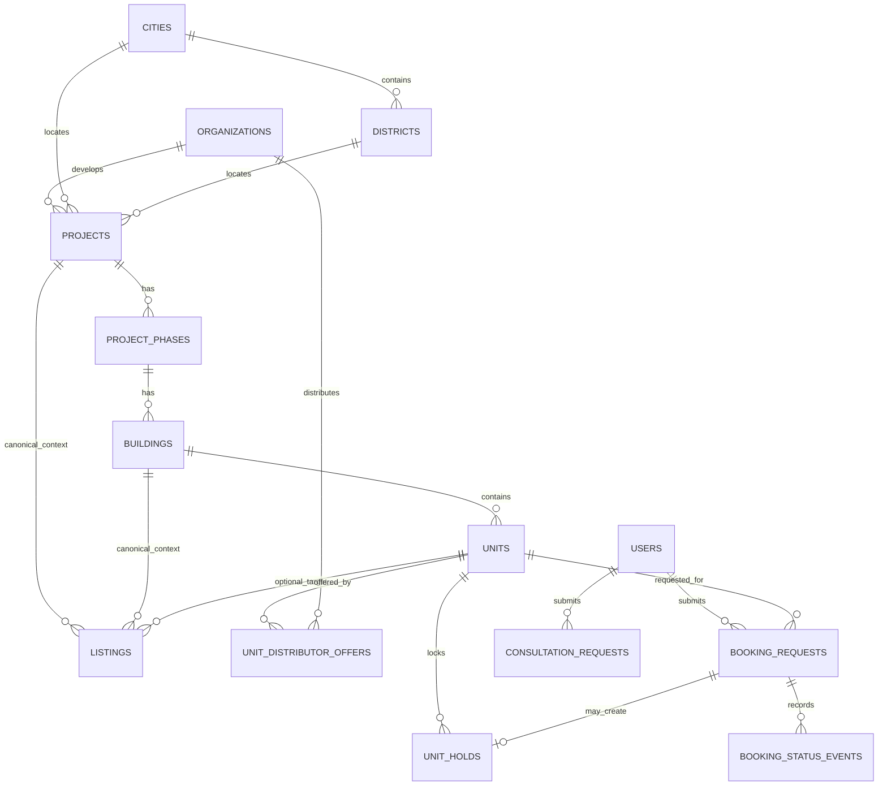
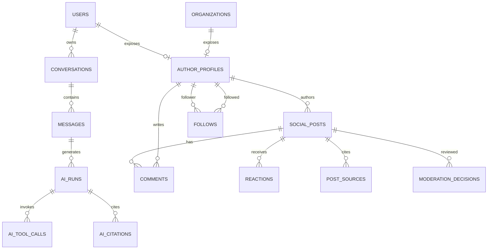
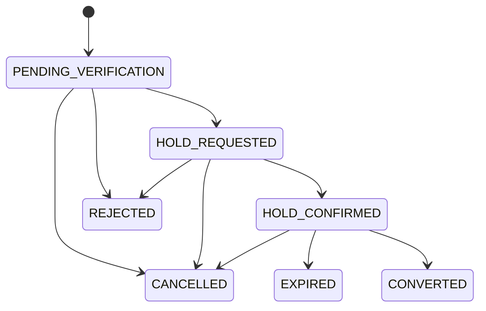

# Thiết kế cơ sở dữ liệu

## 1. Trạng thái và lựa chọn nền tảng

- Trạng thái: **Proposed — chờ review**.
- Hệ quản trị đề xuất: PostgreSQL managed. Cần bật tính năng backup/PITR (khôi phục dữ liệu theo thời điểm) theo mục tiêu sẽ được chốt tại OQ-045.
- Ở giai đoạn đầu, hệ thống dùng một database logic chung cho cấu trúc modular monolith (nguyên khối có module). Tuy nhiên, mỗi module vẫn tự quản lý các bảng của mình dù nằm chung một schema vật lý.
- Không dùng Redis, search index (chỉ mục tìm kiếm) hoặc object storage (lưu trữ đối tượng) làm nguồn sự thật (source of truth) cho nghiệp vụ cốt lõi.
- Schema dưới đây là thiết kế logic (logical design). Các chi tiết như tên enum, reference code, thời gian lưu trữ (retention), tenant key (khóa phân biệt khách hàng), và tính bắt buộc của một số trường chỉ được chốt sau khi các câu hỏi mở quan trọng (OQ P0) được giải quyết.

### 1.1 Mapping với mock UI hiện tại

Mock types (`src/types.ts`) dùng convention khác DB schema đề xuất. Bảng dưới ghi nhận các khác biệt chính cần migration:

| Đặc điểm | Mock (`types.ts`) | DB Schema đề xuất | Ghi chú |
|---|---|---|---|
| Primary key | Readable string (`'PROJ-LUMI'`, `'UNIT-LUMI-L1-1205'`) | UUID | Cần tạo mapping table khi import |
| Giá bán | `price: string` ("6.85 tỷ") + `priceValueNumber: number` (billions) | `bigint` VND integer (`price_amount_vnd`) | `priceValueNumber * 1_000_000_000` |
| Giá thuê | `priceValueNumber` (millions) | `bigint` VND integer + `price_period` | `priceValueNumber * 1_000_000` |
| Property type | Tiếng Việt (`'Căn hộ'`, `'Biệt thự'`) | `property_type_code` (taxonomy chuẩn) | Cần mapping table |
| Location | Flat: `district: string`, `city: string` | FK: `city_id`, `district_id` UUID | Cần resolve sang geography reference |
| Timestamp | `updatedAt: string` (display format) | `timestamptz` UTC: `observed_at`, `published_at` | Parse và chuẩn hóa |
| Version | Không có | `version integer` trên mọi mutable resource | Thêm mới |
| Booking | `BookingPreviewRequest { customerName, customerPhone, distributor }` | `booking_requests` table có `phone_e164`, `consent`, `offer_id` | Restructure hoàn toàn |
| Social author | `SocialAuthor` inline trong post | `author_profiles` tách riêng với FK `user_id`/`organization_id` | Normalize |
| Saved items | `savedListingIds: string[]` (chỉ listing) | `saved_items` hỗ trợ listing/project/unit/post | Mở rộng scope |
| Social category | `SocialFeedCategory` có giá trị thừa không dùng trong UI | `post_type` taxonomy chuẩn | Cleanup type trước migration |

## 2. Quy ước dữ liệu

| Chủ đề | Quy ước đề xuất |
|---|---|
| Primary key | UUID (mã định danh duy nhất toàn cục, `uuid`), sinh ở application hoặc database theo chuẩn được chọn |
| External identity | Cặp `source_id` + `external_id`, có unique constraint; không dùng ID đối tác làm PK |
| Money | `bigint` (số nguyên lớn) lưu số nguyên VND, tên `*_amount_vnd`; không lưu “triệu/tỷ” |
| Decimal | `numeric(p,s)` (số thập phân chính xác cao) cho diện tích, tọa độ, tỷ lệ; không dùng float cho tiền |
| Time | `timestamptz` (thời gian có kèm múi giờ) lưu múi giờ UTC; `effective_at`, `observed_at`, `published_at`, `created_at`, `updated_at` có nghĩa riêng |
| Soft delete | Soft delete (xóa mềm - chỉ đánh dấu xóa chứ không xóa thật) chỉ dùng khi cần retention/audit; `deleted_at` không thay thế status/lifecycle |
| Version | `version integer` cho optimistic concurrency (cơ chế khóa lạc quan) trên resource mutable (tài nguyên có thể thay đổi) quan trọng |
| Flexible metadata | Dùng `jsonb` (dữ liệu JSON lưu trữ trong PostgreSQL) chỉ cho thông tin mở rộng, linh hoạt. Những trường cần lọc hoặc join (ví dụ: giá, quận, loại BDS) phải là cột riêng, không nhét vào JSON. |
| Status | Code ổn định; state transition kiểm tra ở domain và database constraint phù hợp |
| Text search | `tsvector`/GIN (kiểu dữ liệu và chỉ mục hỗ trợ tìm kiếm văn bản) cho field đã chọn, dictionary/ngôn ngữ cần benchmark với tiếng Việt |
| Provenance | Dữ kiện quan trọng gắn `source_id`, `observed_at/effective_at`, verification/freshness metadata |

Mọi bảng có dữ liệu thay đổi (mutable) đều có hai cột `created_at` và `updated_at`. Để lược bớt, các cột này sẽ không hiển thị trong các bảng mô tả chi tiết bên dưới.

## 3. Sơ đồ quan hệ tổng quan

### 3.1 Catalog, listing, inventory và booking

### 3.2 AI, social và tương tác

## 4. Identity, organization và consent

### `users`

| Cột chính | Kiểu/constraint | Ghi chú |
|---|---|---|
| `user_id` | uuid PK | Canonical user |
| `status` | text/check | `pending`, `active`, `suspended`, `deleted` là trạng thái đề xuất; policy chưa duyệt |
| `display_name` | text nullable | Không dùng để phân quyền |
| `phone_e164` | text nullable unique | Chỉ lưu nếu auth/product cho phép; mã hóa/tokenization tùy threat model |
| `email_normalized` | citext nullable unique | Cần extension/quy tắc xác minh nếu dùng email |
| `identity_provider_subject` | text nullable unique | Hoặc tách `user_identities` nếu nhiều provider |
| `last_active_at` | timestamptz nullable | Không thay audit |
| `deleted_at` | timestamptz nullable | Deletion/retention chờ policy |

Nếu hệ thống dùng nhiều dịch vụ xác thực (auth provider) như Google hay Facebook, ta nên tạo thêm bảng `user_identities(user_identity_id, user_id, provider, provider_subject, verified_at)`. Bảng này dùng khóa duy nhất (unique) cho cặp `(provider, provider_subject)` thay vì nhồi nhét nhiều cột vào bảng `users`.

### `organizations`

Bảng này đại diện cho các tổ chức như agency (đại lý), developer (chủ đầu tư), distributor (nhà phân phối), hoặc tổ chức vận hành. Tổ chức ở đây không mặc định tương đương với tenant (khách hàng thuê bao hệ thống).

| Cột | Kiểu/constraint | Ghi chú |
|---|---|---|
| `organization_id` | uuid PK |  |
| `organization_type` | text | Tập giá trị chờ OQ-002/OQ-004 |
| `name` | text |  |
| `slug` | text unique | Dùng cho URL nếu public |
| `status` | text |  |
| `contact_metadata` | jsonb | Chỉ thông tin public/được phép |

### `organization_memberships`

Bảng này lưu trữ thành viên của tổ chức. Các cột bao gồm `membership_id`, `organization_id` (FK - khóa ngoại — liên kết 2 bảng), `user_id` (FK), `role_key`, `status`, `valid_from`, và `valid_until`. Hệ thống cần một ràng buộc duy nhất (unique) để đảm bảo mỗi người dùng chỉ có một membership đang hiệu lực (active) tại một thời điểm theo quy tắc được duyệt. Danh sách các quyền `role_key` (ví dụ: ADMIN, EDITOR) sẽ được chốt tại OQ-002.

### `author_profiles`

Mỗi hồ sơ công khai (author profile) chỉ được thuộc về đúng một người dùng (user) **hoặc** một tổ chức (organization). Không thể thuộc về cả hai.

- `author_profile_id` là PK (khóa chính).
- `user_id` và `organization_id` là khóa ngoại có thể rỗng (nullable FK).
- Dùng ràng buộc CHECK tại cơ sở dữ liệu để đảm bảo đúng một trong hai trường này có giá trị.
- Các trường thông tin cơ bản: `handle` (tên định danh duy nhất, ví dụ: @nguyenvana), `display_name`, `bio`, `avatar_media_id`, `specialties`, `visibility`.
- Trường `profile_type_code` để phân loại hồ sơ hiển thị trên UI (như `USER`, `SALE`, `CREATOR`, `AGENCY`, `DEVELOPER`, `OFFICIAL_APP`). Tập giá trị này chờ taxonomy được duyệt. Đây chỉ là nhãn hiển thị, không dùng làm vai trò phân quyền (authorization role).
- Các cột đếm (như `followers_count`, `posts_count`) chỉ là dữ liệu cache (lưu trữ tạm thời để truy vấn nhanh). Chúng không phải là nguồn sự thật duy nhất (source of truth).

Bảng `author_contact_methods` dùng để tách biệt thông tin liên hệ (số điện thoại, email, Zalo) khỏi profile công khai:
- Các cột bao gồm `contact_method_id`, `author_profile_id`, `method_type`.
- Giá trị liên hệ (`value`) cần được mã hóa (encrypted) hoặc dùng token theo chuẩn bảo mật.
- Nếu được phép hiển thị, dùng cột `display_value`.
- Các cột quản lý khác gồm `visibility`, `verified_at`, và `consent_reference` (chứng cứ đồng ý). Ràng buộc duy nhất hoặc mức độ hiển thị sẽ phụ thuộc vào chính sách (policy). API chỉ trả về giá trị nằm trong phạm vi quyền hạn.

### `verifications`

Bảng này lưu trữ các mốc xác minh danh tính. Các cột bao gồm `verification_id`, `author_profile_id` (FK), `verification_type`, `status`, `evidence_reference`, `reviewed_by_user_id`, `reviewed_at`, `expires_at`, và `reason`.
Quá trình xác minh của một tin đăng (listing), dự án (project), hoặc nguồn dữ liệu (data source) sử dụng quy trình quản lý riêng. Không trộn lẫn các mốc xác minh đó vào dấu xác minh dành cho tác giả. Mọi thay đổi trong bảng này đều phải được kiểm toán (audit).

### `user_consents`

Bảng này ghi nhận sự đồng ý của người dùng. Các cột bao gồm `consent_id`, `user_id`, `consent_type`, `policy_version`, `granted`, `captured_at`, `withdrawn_at`, `source`, và `evidence_json`.
Đối với các khách vãng lai (khách chưa có tài khoản - chưa có `user_id`), khi họ để lại thông tin (lead), hệ thống cần chụp lại (snapshot) một bản ghi đồng ý riêng biệt gắn trực tiếp trên yêu cầu của họ.

## 5. Geography và nguồn dữ liệu

### Reference geography

| Bảng | Cột chính |
|---|---|
| `cities` | `city_id`, `code` unique, `name`, `country_code`, `centroid` nullable |
| `districts` | `district_id`, `city_id`, `code`, `name`, `boundary` nullable; unique `(city_id, code)` |
| `wards` | Chỉ thêm nếu nguồn/UI yêu cầu; không nằm trong MVP đã xác nhận |

Chỉ sử dụng PostGIS cho dữ liệu tọa độ nếu OQ-014 xác nhận cần tìm kiếm theo bán kính hoặc đa giác (radius/polygon). Nếu chỉ dùng để đánh dấu điểm (marker) trên bản đồ, việc lưu trữ vĩ độ `latitude numeric` và kinh độ `longitude numeric` là đủ cho giai đoạn đầu.

### Provenance/ingestion

| Bảng | Trách nhiệm |
|---|---|
| `data_sources` | Nguồn partner/manual/news, owner, trust tier, license/usage metadata, active status |
| `sync_runs` | Một lần ingest: source, loại dữ liệu, started/completed, status, cursor, counters, error summary |
| `source_records` | External ID, checksum/version, first/last seen, canonical entity mapping, raw object key tùy retention |
| `data_quality_issues` | Record/entity, rule code, severity, details, resolution status/actor |

Không lưu trữ vô thời hạn các gói dữ liệu thô (raw payload) có chứa PII (thông tin định danh cá nhân). Thời gian lưu trữ (retention) và chính sách quản lý object storage sẽ chờ quyết định từ OQ-028/OQ-045.

## 6. Catalog dự án và tồn kho

### `projects`

| Cột chính | Kiểu/constraint |
|---|---|
| `project_id` | uuid PK |
| `developer_organization_id` | uuid nullable FK organizations |
| `city_id`, `district_id` | FK; district phải thuộc city qua validation/constraint phù hợp |
| `slug` | text unique nếu public URL được duyệt |
| `name`, `summary`, `description` | text |
| `status_code` | text; taxonomy chờ nguồn nghiệp vụ |
| `address_text` | text |
| `latitude`, `longitude` | numeric nullable |
| `launch_at`, `expected_handover_at` | timestamptz/date nullable |
| `min_price_amount_vnd`, `max_price_amount_vnd` | bigint nullable, CHECK min ≤ max |
| `currency_code` | char(3), mặc định chỉ sau product confirmation |
| `source_id`, `observed_at`, `verification_status` | provenance |
| `version` | integer |

Không lưu trữ tổng số lượng căn (`unit_count`) như một nguồn sự thật (source of truth). Nếu giao diện cần hiển thị nhanh, hãy dùng các phương pháp tính toán trung gian (như projection hoặc materialized view) kết hợp với cơ chế cập nhật đồng bộ.

### Hierarchy

- `project_phases(phase_id, project_id, code, name, status, launch_at, handover_at, sort_order)`; sử dụng unique cho `(project_id, code)`.
- `buildings(building_id, phase_id, code, name, floor_count, status)`; sử dụng unique cho `(phase_id, code)`.
- Không tự động nội suy cấu trúc phân cấp (hierarchy) từ chuỗi văn bản gộp (ví dụ: `projectName/phase/building`) trong file mock. Cấu trúc cần được lưu riêng biệt và rõ ràng.

### `units`

| Cột chính | Kiểu/constraint | Ghi chú |
|---|---|---|
| `unit_id` | uuid PK | Canonical unit |
| `building_id` | uuid FK | Có thể cần model khác nếu unit không thuộc building; chờ OQ-013 |
| `unit_code` | text | unique `(building_id, unit_code)` |
| `floor_number` | integer nullable |  |
| `unit_type_code` | text | Taxonomy chuẩn |
| `bedroom_count`, `bathroom_count` | smallint nullable | CHECK không âm |
| `net_area_sqm`, `gross_area_sqm` | numeric nullable | CHECK > 0 |
| `direction_code`, `view_code` | text nullable | Reference code |
| `canonical_status` | text | Chỉ cập nhật theo authority/policy OQ-009/OQ-011 |
| `status_observed_at` | timestamptz | Freshness |
| `version` | integer | Concurrency |

### `unit_distributor_offers`

- Các cột: `offer_id` (PK), `unit_id` (FK), `distributor_organization_id` (FK).
- Các thông tin từ nguồn: `source_id`, `external_id`, `status_code`, `status_observed_at`.
- Thông tin về giá: `list_price_amount_vnd` (giá niêm yết), `net_price_amount_vnd` (giá net). Những cột này có thể rỗng (nullable). Hệ thống cần các chính sách rõ ràng để xác định các khoản thuế hoặc phí đi kèm (fee/tax inclusions).
- Khuyến mãi: `promotion_text` hoặc structured promotion (khuyến mãi có cấu trúc) tùy thuộc vào nguồn, đi kèm với `valid_from` (từ ngày) và `valid_until` (đến ngày).
- Mức độ ưu tiên (`priority`) không được sử dụng để qua mặt các cơ chế thẩm quyền (authority) khi chưa có luật nghiệp vụ (rule) xác định rõ ràng.
- Ràng buộc duy nhất `(source_id, external_id)` và sử dụng chỉ mục (index) cho `(unit_id, status_code, status_observed_at desc)`.

### `unit_status_observations`

Đây là bảng dạng chỉ thêm mới (append-only) dùng để lưu lại lịch sử nhận trạng thái thay vì chỉ ghi đè dữ liệu mới nhất. Điều này giúp theo dõi và khắc phục các vấn đề xung đột.

- Các cột: `unit_status_observation_id`, `unit_id`, `offer_id` (nullable), `source_id`, `sync_run_id` (nullable).
- Chi tiết trạng thái: `status_code`, `observed_at` (thời điểm ghi nhận từ nguồn), `received_at` (thời điểm hệ thống tiếp nhận), và `source_version`/`payload_hash`.
- Cột `accepted_as_canonical` và `decision_reason` chỉ dùng để lưu kết quả từ các quy tắc thẩm quyền (authority) hoặc quy tắc xử lý xung đột (conflict rule) đã được duyệt. Tuyệt đối không để worker tự ý suy đoán và điền vào các cột này.
- Bảng dùng ràng buộc duy nhất (unique) dựa trên sự kiện và phiên bản nguồn (source event/version) hoặc mã băm (checksum) để đảm bảo việc nạp dữ liệu (ingest) mang tính lũy đẳng (idempotent - nạp nhiều lần vẫn cho ra một kết quả). Bảng cũng có chỉ mục `(unit_id, observed_at desc)`.

Trong bảng `units`, các cột `canonical_status` và `status_observed_at` lưu trữ ảnh chụp trạng thái hiện tại, được cập nhật theo quy tắc của OQ-009/OQ-011. Bảng observation này dùng làm lịch sử để kiểm toán (audit) và giải thích độ tươi (freshness) cũng như các xung đột dữ liệu.

### Chi tiết dự án

| Bảng | Nội dung |
|---|---|
| `project_media` | `project_id`, `media_asset_id`, type, caption, sort order, provenance |
| `project_legal_documents` | title/type/reference, issue/effective date, issuer, media/object, verification |
| `project_progress_events` | event date, title, description, media, source |
| `amenities` + `project_amenities` | Taxonomy tiện ích và quan hệ many-to-many |
| `project_layouts` | unit type/building scope, area, bedrooms, media, version; thay `layouts: any` hiện tại |
| `project_price_observations` | project/unit type/metric, amount VND, effective/observed time, source |
| `project_content_links` | Liên kết article/event/video/3D khi mô hình content được duyệt |

## 7. Tin đăng thứ cấp

### `listings`

| Nhóm | Cột đề xuất |
|---|---|
| Identity | `listing_id`, `source_id`, `external_id`, `slug`, `status`, `published_at`, `expires_at` |
| Classification | `transaction_kind` (`sale`/`rent`), `property_type_code` |
| Canonical links | `project_id`, `building_id`, `unit_id` nullable; không ép liên kết nếu chưa xác định |
| Location | `city_id`, `district_id`, `address_text`, `latitude`, `longitude` |
| Physical | `area_sqm`, `bedroom_count`, `bathroom_count`, `floor_number`, `direction_code` |
| Commercial | `price_amount_vnd`, `price_period` nullable cho thuê, `price_per_sqm_amount_vnd` có thể tính/projection |
| Detail | `title`, `description`, `furnishing_code`, `legal_status_code`, `attributes_json` cho field hiếm |
| Contact/ownership | `owner_organization_id`/`created_by_user_id` theo role đã duyệt; không public PII trực tiếp |
| Trust | `verification_status`, `observed_at`, `version`, `deleted_at` |

Constraints và chỉ mục (index) chính:

- Cần ràng buộc duy nhất (unique constraint) cho `(source_id, external_id)` khi hệ thống xử lý bản ghi từ bên ngoài.
- Dùng CHECK để ràng buộc phân loại mua bán (sale) hay cho thuê (rent), và `price_period` (chu kỳ thanh toán) phải tuân theo các hợp đồng đã được duyệt.
- Dùng CHECK để đảm bảo giá và diện tích phải là số dương khi có dữ liệu.
- Thiết lập index cho `(transaction_kind, city_id, district_id, status, published_at desc)`.
- Chỉ thêm index có chọn lọc (selective index) cho giá, diện tích, và số phòng ngủ dựa trên biểu đồ thực thi truy vấn thực tế (query plan).
- Sử dụng GIN cho công cụ tìm kiếm vector (search vector) trên các cột title, description, project, và address sau khi đã đánh giá hiệu năng (benchmark) cẩn thận với tiếng Việt.
- Không lạm dụng việc tạo quá nhiều chỉ mục phức hợp (composite index) trước khi thu thập được các số liệu đo lường truy vấn (query telemetry) thực tế.

### `listing_media`

Các cột bao gồm `listing_media_id`, `listing_id`, `media_asset_id`, `media_role`, `sort_order`, `caption`. Cần đảm bảo quy tắc sắp xếp (sort/order rule) là duy nhất trong một listing. Vòng đời của tập tin (Media lifecycle) thuộc về module Media.

### `listing_feature_values` — tùy chọn

Chỉ thêm bảng này nếu hệ thống cần lọc dữ liệu linh hoạt theo các tiện ích hoặc thuộc tính thông qua hệ thống phân loại (taxonomy). Không sử dụng mô hình EAV (Entity-Attribute-Value) cho các trường cốt lõi như giá, diện tích, số phòng và vị trí.

## 8. Saved, interest và lead

### `saved_items`

- Các cột: `saved_item_id`, `user_id`.
- Mục tiêu lưu trữ: `listing_id`, `project_id`, `unit_id`, `social_post_id` đều là khóa ngoại có thể rỗng (nullable).
- Dùng ràng buộc CHECK để đảm bảo luôn có đúng một trong bốn khóa ngoại này khác null (người dùng phải lưu một thứ gì đó).
- Tạo các chỉ mục duy nhất một phần (partial unique index) cho từng cặp `(user_id, <resource_id>) WHERE <resource_id> IS NOT NULL`.
- Chỉ thêm `collection_key` nếu ứng dụng xác nhận cho phép tạo nhiều bộ sưu tập (collection) khác nhau.

Phương án này giữ các khóa ngoại chặt chẽ. API có thể truy vấn và trả về một luồng tin lưu (saved feed) thống nhất. Nếu sau này có thêm nhiều loại tài nguyên mới, ta có thể cân nhắc một sổ đăng ký tài nguyên chung (resource registry). Tuy nhiên, hiện tại (MVP) thì chưa cần thiết.

### `interest_signals`

Cấu trúc lưu trữ giống với `saved_items` nhưng có thêm các cột: `signal_type`, `source_surface`, `captured_at`, và `withdrawn_at`. Ngữ nghĩa chi tiết của các tín hiệu (semantics) sẽ chờ giải quyết tại OQ-023. Không tự động gộp chung (hợp nhất) tín hiệu quan tâm với các mục đã lưu (saved).

### `consultation_requests`

| Cột | Ghi chú |
|---|---|
| `consultation_request_id` | PK |
| `requester_user_id` | nullable cho guest nếu được phép |
| Target FK | listing/project/unit/post; exactly-one hoặc request-level generic registry sau khi scope chốt |
| `topics` | Tách `consultation_request_topics` nếu cần query/report; không lưu chuỗi mơ hồ |
| `name`, `phone_e164`, `note` | PII; quyền/retention riêng |
| `consent_policy_version`, `consented_at` | Snapshot bằng chứng |
| `source_surface`, `status`, `assigned_organization_id`, `assigned_user_id` | Assignment rule chưa xác định |
| `idempotency_key`, `version` | Unique theo actor/scope |

Bảng `consultation_status_events` dùng để lưu lại quá trình chuyển đổi trạng thái (từ trạng thái cũ sang mới), người thực hiện (actor), lý do, và thời gian nếu quy trình nhiều bước (lifecycle) được thông qua.

## 9. Booking và hold

### `booking_requests`

- Các cột: `booking_request_id`, `unit_id`, và `requester_user_id` (nullable theo chính sách xác thực - auth policy).
- Snapshot thông tin định danh cá nhân (PII): `customer_name`, `phone_e164`, `email_normalized` (có thể rỗng cho đến khi chốt OQ-022), và `note`.
- Nguồn yêu cầu: `source_offer_id` (nullable), `source_surface`.
- Trạng thái và điều khiển: `status`, `idempotency_key`, `version`.
- Đồng ý của người dùng: `consent_policy_version`, `consented_at`.
- Thời gian: `submitted_at`, `cancelled_at`, `resolved_at`.
- Tính duy nhất lũy đẳng (Idempotency) dựa trên actor (người thực hiện) kết hợp với key. Đối với người dùng chưa đăng nhập (guest), hệ thống cần cơ chế vân tay (fingerprint) hoặc token an toàn. Không nên chỉ dựa vào IP vì IP không đại diện cho một người dùng cụ thể.

### `unit_holds`

- Các cột: `unit_hold_id`, `unit_id`, `booking_request_id` (unique nullable theo quy trình luồng xử lý).
- Trạng thái và thời gian: `status`, `starts_at`, `expires_at`, `released_at`, `release_reason`.
- Quản lý: `created_by_user_id` (hoặc định danh hệ thống - system actor), `version`.
- Database tự đảm bảo: mỗi căn hộ chỉ có tối đa 1 giữ chỗ đang hiệu lực, bằng ràng buộc (partial unique index/exclusion constraint) tại cấp database.
- Tác vụ dọn dẹp giữ chỗ hết hạn (job expiry) phải an toàn (idempotent). Nó cần kiểm tra phiên bản (version) và thời gian thực hiện trong cùng một giao dịch (transaction).

### `booking_status_events`

Cột bao gồm `booking_status_event_id`, `booking_request_id`, `from_status`, `to_status`, `actor_type`, `actor_id`, `reason_code`, `metadata_json`, `created_at`.

Mô hình trạng thái (State machine) đề xuất để thảo luận, **chưa được phê duyệt**:

Không thiết kế sớm các bảng liên quan đến thanh toán (payment), xác minh danh tính (KYC), hay hợp đồng (contract) trước khi OQ-019/OQ-020 được ban quản lý phê duyệt.

## 10. Conversation và AI

### `conversations`

Cột bao gồm `conversation_id`, `owner_user_id`, `title`, `status`, `last_message_at`, `message_count` (giá trị chiếu - projection), `version`, `deleted_at`. Cuộc trò chuyện của khách vãng lai (guest) chỉ được lưu khi có chính sách rõ ràng về phiên (session) và thời gian lưu trữ ở OQ-003/OQ-034.

### `messages`

| Cột | Ghi chú |
|---|---|
| `message_id`, `conversation_id` | PK/FK |
| `sequence_number` | Unique `(conversation_id, sequence_number)` |
| `role` | `user`, `assistant`, `tool`, `system` theo visibility policy |
| `content_text` / structured parts | Không public tool/system content; attachments chờ OQ-031 |
| `status` | `pending`, `streaming`, `completed`, `failed`, `cancelled` đề xuất |
| `reply_to_message_id` | nullable nếu cần regenerate/branch |
| `created_by_user_id` | nullable cho assistant/tool |
| `completed_at`, `error_code` | Không lưu secret/error raw |

### `conversation_contexts`

Bảng này tạo liên kết từ tin nhắn (message) hoặc cuộc trò chuyện (conversation) đến các tài nguyên như tin đăng (listing), dự án (project), căn hộ (unit) hoặc bài viết (post). Hệ thống dùng khóa ngoại chặt (FK) và phân loại qua cột `context_role`. Cơ sở dữ liệu sẽ kiểm tra để đảm bảo chỉ tham chiếu đến đúng một đối tượng mục tiêu (exactly-one target check), tương tự như phần saved. Quyền truy cập phải được xác thực cả lúc tạo và lúc đọc.

### `ai_runs`

- Định danh và trạng thái: `ai_run_id`, `message_id`, `use_case`, `status`.
- Mô hình: `model_provider`, `model_name`, `model_version`, `prompt_template_version`, `policy_version`.
- Đo lường: `input_token_count`, `output_token_count`, `estimated_cost`, `time_to_first_token_ms`, `total_latency_ms`.
- Kết quả: `safety_result`, `grounding_result`, `started_at`, `completed_at`, `error_code`.
- Tuyệt đối không lưu lại quá trình suy luận (chain-of-thought). Dữ liệu văn bản thô từ input/output (Prompt/output thô) chỉ được lưu nếu chính sách cho phép. Dữ liệu này phải được bôi đen các thông tin nhạy cảm (redaction), mã hóa (encryption), có thời hạn lưu trữ (retention) và phân quyền riêng biệt.

### `ai_tool_calls`

Cột bao gồm `tool_call_id`, `ai_run_id`, `tool_name`, `tool_version`, giá trị băm của input đã được lọc mầm mống độc hại (sanitized input hash) hoặc metadata, status, latency, ID kết quả hoặc nguồn gốc (provenance), error code. Không lưu bearer token (token bảo mật) hoặc dữ liệu PII (thông tin định danh cá nhân) thô vào log.

### `ai_citations`

Cột bao gồm `citation_id`, `ai_run_id`, `ordinal`, `claim_reference` hoặc character offsets nếu UI hỗ trợ, `source_type`, mục tiêu khóa ngoại hoặc `source_record_id`, `public_url` (nullable), `source_title`, `observed_at`, `trust_tier`, `access_scope`. Ảnh chụp dữ liệu nguồn (citation snapshot) phải đủ để kiểm tra lại (audit) nhưng không được vượt quyền xem hoặc vi phạm bản quyền.

### AI evaluation tables

Các bảng `ai_feedback` và `ai_eval_results` chỉ được thêm vào sau khi quy trình đánh giá chất lượng AI (eval process) được thông qua. Dữ liệu thử nghiệm (Fixture benchmark) không được chứa PII (thông tin định danh cá nhân). Các kết quả (match/evaluation output) cần lưu lại phiên bản thuật toán (`algorithm_version`), bản chụp hoặc mã băm của tính năng (feature snapshot/hash) và đường dẫn giải thích (explanation reference).

## 11. Social và moderation

### `social_posts`

| Cột | Ghi chú |
|---|---|
| `social_post_id`, `author_profile_id` | PK/FK |
| `post_type` | community/analysis/property/video taxonomy chờ OQ-036 |
| `title`, `body` | Validation theo loại bài |
| `status` | Proposed: draft/pending_review/published/rejected/archived |
| `visibility` | public/followers/private chỉ thêm theo policy |
| `location_text`, `city_id`, `district_id` | Structured khi cần filter |
| `published_at`, `edited_at`, `version`, `deleted_at` | Lifecycle |

### Post relations

| Bảng | Cấu trúc chính |
|---|---|
| `post_media` | post, media asset, role/order/caption |
| `post_sources` | post, source URL/record, title, publisher, published/effective time, trust/verification |
| `post_targets` | post và exactly-one listing/project/unit target; dùng bảng riêng theo target nếu cần FK/unique đơn giản hơn |
| `post_market_metrics` | metric code, value/unit, geography, effective_at, source; không lưu chỉ số không nguồn như text |
| `post_bookmarks` | Có thể dùng `saved_items.social_post_id`; không tạo bảng lặp nếu API unified được duyệt |

### `comments`

Cột bao gồm `comment_id`, `post_id`, `author_profile_id`, `parent_comment_id` (nullable), `body`, `status`, `published_at`, `edited_at`, `version`, `deleted_at`.
Cột `parent_comment_id` chỉ được kích hoạt nếu chức năng trả lời bình luận phân tầng (threading thật) được duyệt sau OQ-039. Nếu hệ thống chỉ hỗ trợ nhắc tên kiểu danh sách phẳng (mention phẳng), hãy để cột này null và lưu thông tin nhắc tên (mention) vào một bảng riêng.

### Tương tác

- Bảng `reactions(reaction_id, actor_profile_id, target_post_id/target_comment_id, reaction_type, created_at)` phải ràng buộc chính xác một mục tiêu (exactly-one target) và đảm bảo tính duy nhất (unique) cho cụm actor/target/type.
- Bảng `follows(follower_profile_id, followed_profile_id, status, created_at)`. Cần thêm ràng buộc (CHECK) để người dùng không tự follow chính mình, và cặp follower/followed phải là duy nhất.
- Bảng `shares(share_id, actor_user_id nullable, post_id, channel, canonical_url, created_at)` chỉ dùng để ghi lại hành vi chia sẻ từ phía server theo định nghĩa tại OQ-041.
- Các cột hiển thị số lượt tương tác (Count) chỉ là giá trị chiếu (projection). Nguồn sự thật (source of truth) vẫn là các hàng chi tiết trong bảng tương tác hoặc bảng tổng hợp (aggregate ledger) được điều chỉnh phù hợp với khả năng chịu tải.

### Moderation

- Bảng `moderation_decisions` quản lý quyết định kiểm duyệt. Các cột gồm `decision_id`, `social_post_id` (nullable), `comment_id` (nullable), `media_asset_id` (nullable), `policy_version`, `decision`, `reason_codes`, `model_run_id` (nullable), `reviewer_user_id` (nullable), `decided_at`, `supersedes_id`. Bảng cần dùng ràng buộc (CHECK) để đảm bảo quyết định chỉ áp dụng cho đúng một mục tiêu (exactly-one target). Nếu phạm vi kiểm duyệt mở rộng thêm nhiều loại dữ liệu mới, hãy thêm các khóa ngoại (FK) cụ thể thông qua migration thay vì dùng ID dùng chung không ràng buộc.
- Các bảng `content_reports` (báo cáo nội dung xấu), `user_blocks` (chặn người dùng), và `moderation_appeals` (khiếu nại) chỉ được tạo nếu OQ-037 xác nhận phạm vi tính năng này.
- Không xóa cứng (hard-delete) các dữ kiện hoặc bằng chứng đang nằm trong quy trình khiếu nại hoặc kiểm toán. Quá trình lưu trữ (retention) phải tuân thủ nghiêm ngặt chính sách.

## 12. Market content và notification

### Market content

| Bảng | Trách nhiệm |
|---|---|
| `market_price_observations` | Geography/project/property type/metric/value/effective time/source |
| `market_updates` | Nội dung tổng hợp “thị trường hôm nay”, status/publish/source/version |
| `articles` | Tin/news/risk content metadata, canonical URL, publisher, dates, verification/license |
| `risk_knowledge` | Nội dung cảnh báo có version, source, reviewer/status; không coi AI output là dữ kiện chuẩn |

Khi đo lường một chỉ số (metric) cùng khái niệm, phải có một phân loại chuẩn (taxonomy) và đơn vị (unit) duy nhất. Điều này giúp tránh tình trạng các dữ liệu mock mâu thuẫn về số liệu.

### Notifications

- Bảng `notifications`: gồm `notification_id`, `recipient_user_id`, `type`, `subject_type/id`, `title`, `body/template_data`, `status`, `read_at`, `created_at`.
- Bảng `notification_preferences`: chỉ thêm vào khi các kênh thông báo hoặc sự kiện cụ thể được phê duyệt.
- Bảng `notification_delivery_attempts`: lưu trữ kênh gửi, nhà cung cấp, message ID, trạng thái, mã lỗi, và thời gian thực hiện. Tuyệt đối không lưu trữ dữ liệu PII (thông tin định danh cá nhân) thô trong log của bảng này.

## 13. Jobs, outbox và audit

### `jobs`

Cột bao gồm `job_id`, `job_type`, `payload_json`, `status`, `priority`, `run_after`, `attempt_count`, `max_attempts`, `locked_by`, `lock_expires_at`, `last_error_code`, `dedupe_key`, và timestamps. Đánh chỉ mục (Index) hỗ trợ truy vấn các công việc cần chạy dựa trên cụm cột `(status, run_after, priority)`. Payload của tác vụ phải có đánh dấu phiên bản (version) và tuyệt đối không được chứa bí mật (secret).

### `outbox_events`

Cột bao gồm `event_id`, `event_type`, `aggregate_type`, `aggregate_id`, `aggregate_version`, `payload_json`, `occurred_at`, `published_at`, `attempt_count`. Các sự kiện trong bảng này phải được tạo ra trong cùng một giao dịch (transaction) với các thay đổi nghiệp vụ (mutation). Đơn vị tiêu thụ sự kiện (Consumer) sẽ sử dụng `event_id` để đảm bảo thực hiện thao tác một cách lũy đẳng (idempotent).

### `audit_logs`

Cột bao gồm `audit_id`, `occurred_at`, loại actor và ID, ID ngữ cảnh của tổ chức (organization context - nullable), action (hành động), loại mục tiêu và ID (target type/ID), ID truy vết của yêu cầu (request/trace ID), siêu dữ liệu trước và sau khi thay đổi đã được che đi thông tin nhạy cảm (before/after redacted metadata), reason (lý do), giá trị băm hoặc siêu dữ liệu của IP nguồn (source IP hash/metadata) theo chính sách. Bảng này chỉ hỗ trợ tác vụ ghi thêm (append-only); cần có quyền đọc (read access) và thời gian lưu trữ (retention) riêng biệt.

## 14. Transaction và invariant quan trọng

### Tạo hold (Giữ chỗ)

1. Bắt đầu một giao dịch (transaction).
2. Khóa (Lock) một hàng tương ứng trong bảng `units` hoặc áp dụng chiến lược khóa tư vấn (advisory/locking strategy) đã được đo đạc.
3. Kiểm tra các yếu tố: trạng thái chuẩn (canonical status), độ mới của dữ liệu (freshness), và thông tin giữ chỗ hiện đang hiệu lực (active hold).
4. Kiểm tra hoặc xử lý lại mã lũy đẳng (`idempotency_key`).
5. Tiến hành tạo ra chuỗi sự kiện booking, hold, status event và outbox.
6. Xác nhận giao dịch (Commit). Sau khi commit, worker sẽ gửi thông báo.

Ràng buộc duy nhất một phần (Partial unique constraint) tại cấp cơ sở dữ liệu là lớp bảo vệ cuối cùng. Phần kiểm tra trên application sẽ giúp trả về lỗi nghiệp vụ rõ ràng, dễ hiểu cho người dùng.

### Mutation idempotent (Sửa đổi dữ liệu an toàn)

- Lưu tin/thích/theo dõi (Saved/reaction/follow): dùng ràng buộc duy nhất (unique constraint) kết hợp với các thao tác upsert hoặc delete hỗ trợ idempotent (thực hiện nhiều lần cho kết quả như một).
- Lead/booking/post/comment: dùng các bảng kiểm soát hoặc bản ghi idempotency riêng lẻ. Việc kiểm tra này sẽ tính trên người thực hiện (actor), route (tuyến gọi), key (mã) và giá trị băm của yêu cầu (request hash). Nếu cùng một key mà nội dung bị đổi, hệ thống trả về lỗi xung đột (conflict).
- Webhook: kết hợp `(source_id, external_event_id)` với khoảng thời gian chấp nhận thử lại (replay window).

### Optimistic concurrency (Cơ chế khóa lạc quan)

Khi một tài nguyên thay đổi, hệ thống sẽ sử dụng header `If-Match` hoặc trường `version` trong payload để kiểm tra. Câu lệnh SQL update phải có điều kiện `WHERE version = expected` (phiên bản đang có khớp với phiên bản dự kiến). Nếu thay đổi thành công, hệ thống tăng `version` lên 1. Nếu không khớp, API sẽ trả về lỗi 409 (Conflict) hoặc 412 (Precondition Failed) theo quy ước chuẩn được ban quản lý thông qua.

## 15. Index, partition và scale

- Việc thiết kế chỉ mục (index) phải dựa trên cam kết thiết kế truy vấn (query contract) kết hợp với kết quả từ `EXPLAIN ANALYZE`. Không tạo index tùy tiện cho tất cả các cột.
- Những bảng có nguy cơ bùng nổ dữ liệu: messages, reactions, comments, audit_logs, jobs, observations. Chỉ áp dụng chia tách phân vùng (partition) khi dữ liệu hoạt động và chi phí bảo trì chứng minh được sự cần thiết.
- Chỉ mục dạng BRIN (Block Range Index) rất phù hợp cho các dữ liệu như log hay observation, vốn là dạng chỉ ghi thêm theo thời gian. Trong khi đó, B-tree và GIN lại phù hợp cho truy vấn trực tác cường độ cao.
- Bản sao chỉ đọc (Read replica) chỉ áp dụng cho những truy vấn có thể chấp nhận độ trễ (lag). Tuyệt đối không dùng bản sao này để kiểm tra tính khả dụng khi tạo giữ chỗ (hold) hoặc booking.
- Các yêu cầu phân tích dữ liệu nặng (Analytics) phải chuyển sang replica hoặc kho dữ liệu (warehouse) sau khi phạm vi và tải thực tế được ghi nhận.

## 16. Retention, deletion và backup

Hiện tại hệ thống chưa có thời hạn lưu trữ cụ thể được phê duyệt. Trước khi ra mắt (production), ta cần có một ma trận phân loại rủi ro dữ liệu cho các nhóm:

- Profile (hồ sơ) và các số định danh auth;
- Phone, email, lead, booking và bằng chứng đồng ý (consent evidence);
- Conversations, prompts (nội dung đưa vào mô hình), kết quả chạy AI;
- Nội dung social và bằng chứng kiểm duyệt;
- Payload thô (raw payload) từ đối tác và các tài liệu nguồn gốc;
- Nhật ký bảo mật (audit/security logs) và các bản sao lưu (backups).

Việc xóa dữ liệu phải phân biệt rõ ràng các mức độ: người dùng xóa tạm thời (user-visible soft delete), lưu trữ theo luật pháp (legal retention), ẩn danh hóa (anonymization), và xóa hoàn toàn vật lý (physical purge). Xóa hoàn toàn vật lý phải tác động tới cả các vùng lưu trữ search, vector, cache và backup theo khả năng cho phép. Kế hoạch về RPO/RTO (Mục tiêu khôi phục/Thời gian khôi phục), cửa sổ khôi phục PITR (Point-in-Time Recovery) và diễn tập khôi phục (restore drill) sẽ chờ quyết định từ OQ-045.

## 17. Data-quality và migration từ mock

Tuyệt đối không đẩy trực tiếp dữ liệu mock (dữ liệu thử nghiệm) vào môi trường production trước khi xử lý triệt để:

- Biến `priceValueNumber` đang được dùng với các đơn vị khác nhau giữa tính năng mua bán (sale) và cho thuê (rent). Hãy chuyển sang lưu bằng kiểu số nguyên VND tại một cột có ghi rõ đơn vị.
- Timestamp đang bị trộn lẫn giữa định dạng chuẩn ISO và chuỗi hiển thị. Phải parse lại về chuẩn múi giờ UTC, kèm theo múi giờ nguồn hoặc bỏ trống nếu không xác định được.
- Listing hiện chỉ chứa `projectName`. Cần chuẩn bị phương án tham chiếu chính thức (canonical mapping) với độ chính xác và xác nhận cụ thể.
- Unit đang bị lặp tên dự án, giai đoạn, tòa nhà và nhà phân phối (project/phase/building/distributor). Phải tách bạch các thông tin này ra cấu trúc phân cấp và tổ chức.
- Hiện có hai bộ project mock và hai message model khác nhau. Cần thống nhất chọn ra một hợp đồng duy nhất (canonical contract).
- Chuyên mục mạng xã hội (Category social) trùng lặp nhiều khái niệm số ít/số nhiều. Phải chuẩn hóa lại taxonomy này.
- Một số tham chiếu social/ID và chỉ số giá cả không khớp nhau. Hãy cách ly chúng (quarantine) thay vì để hệ thống tự suy đoán và vá lỗi mù quáng.
- Số đếm biểu tượng lưu tin (Badge saved) hiển thị khác với bảng tương tác (modal). Việc thống kê (count) phải được truy vấn từ cùng một nguồn chung.

Mỗi quy tắc di chuyển (migration rule) phải có định nghĩa rõ ràng, mức độ nghiêm trọng (severity), kết quả (result), và báo cáo (report). Các bản ghi không thể ánh xạ được phải giữ lại ở môi trường trung gian (staging/quarantine) chờ quyết định từ đội ngũ sản phẩm (product).

## 18. Các quyết định còn chặn schema vật lý

Trước khi tạo tập lệnh migration đầu tiên, hệ thống cần được làm rõ và trả lời: OQ-002..004, OQ-008..013, OQ-019..023, OQ-028, OQ-034, OQ-036..040 và OQ-043..045. Khi có câu trả lời, hãy cập nhật toàn bộ schema, sơ đồ trạng thái (state machine), tính rỗng (nullability), khóa phân loại dữ liệu (tenant key), chính sách lưu trữ (retention), các chỉ mục (index) và tài liệu quyết định kiến trúc (ADR) trước khi sinh code cho migration.
