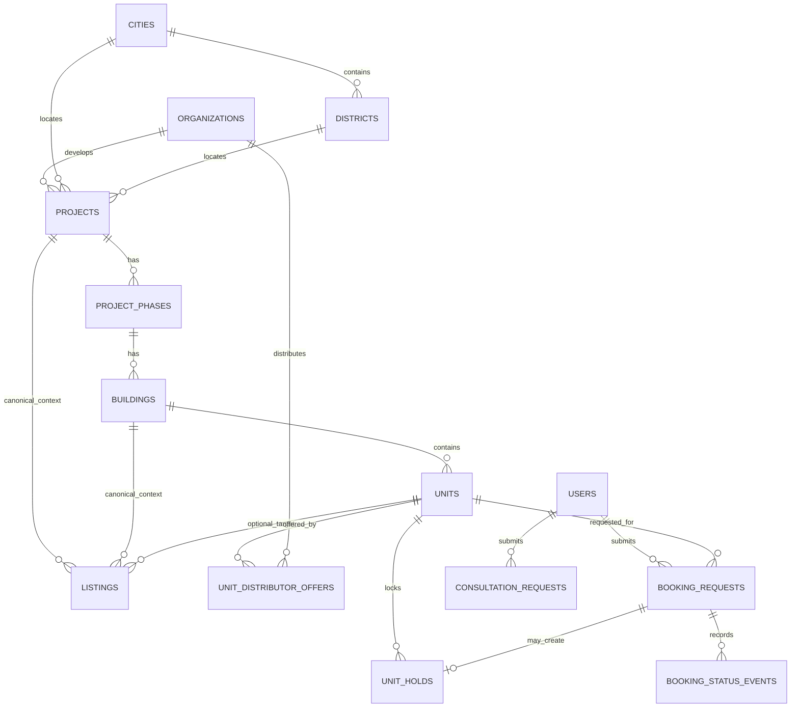
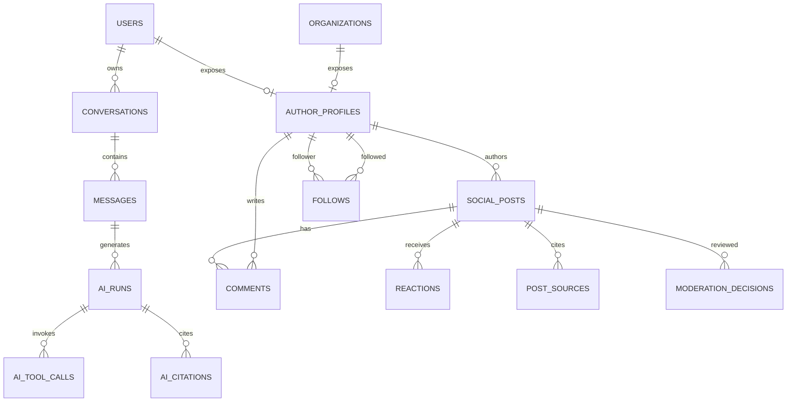
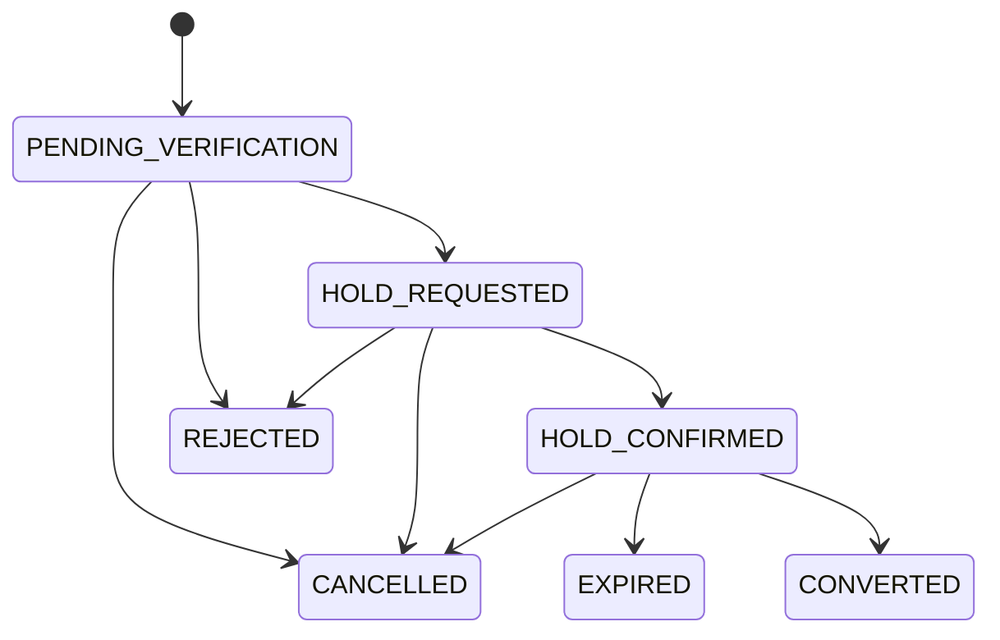

# Thiết kế cơ sở dữ liệu

## 1. Trạng thái và lựa chọn nền tảng

- Trạng thái: **Proposed — chờ review**.
- Hệ quản trị đề xuất: PostgreSQL managed, bật backup/PITR theo mục tiêu chưa được xác định tại OQ-045.
- Một database logic cho modular monolith ở giai đoạn đầu; module sở hữu bảng của mình dù cùng schema vật lý.
- Không dùng Redis/search index/object storage làm nguồn sự thật nghiệp vụ.
- Schema dưới đây là logical design. Tên enum/reference code, retention, tenant key và một số nullable/required field chỉ được chốt sau khi các OQ P0 được trả lời.

### 1.1 Mapping với mock UI hiện tại

Mock types (`src/types.ts`) dùng convention khác DB schema đề xuất. Bảng dưới ghi nhận các khác biệt chính cần migration:

| Đặc điểm | Mock (`types.ts`) | DB Schema đề xuất | Ghi chú |
|---|---|---|---|
| Primary key | Readable string (`'PROJ-LUMI'`, `'UNIT-LUMI-L1-1205'`) | UUID | Cần tạo mapping table khi import |
| Giá bán | `price: string` ("6.85 tỷ") + `priceValueNumber: number` (billions) | `bigint` VND integer (`price_amount_vnd`) | `priceValueNumber * 1_000_000_000` |
| Giá thuê | `priceValueNumber` (millions) | `bigint` VND integer + `price_period` | `priceValueNumber * 1_000_000` |
| Property type | Tiếng Việt (`'Căn hộ'`, `'Biệt thự'`) | `property_type_code` (taxonomy chuẩn) | Cần mapping table |
| Location | Flat: `district: string`, `city: string` | FK: `city_id`, `district_id` UUID | Cần resolve sang geography reference |
| Timestamp | `updatedAt: string` (display format) | `timestamptz` UTC: `observed_at`, `published_at` | Parse và chuẩn hóa |
| Version | Không có | `version integer` trên mọi mutable resource | Thêm mới |
| Booking | `BookingPreviewRequest { customerName, customerPhone, distributor }` | `booking_requests` table có `phone_e164`, `consent`, `offer_id` | Restructure hoàn toàn |
| Social author | `SocialAuthor` inline trong post | `author_profiles` tách riêng với FK `user_id`/`organization_id` | Normalize |
| Saved items | `savedListingIds: string[]` (chỉ listing) | `saved_items` hỗ trợ listing/project/unit/post | Mở rộng scope |
| Social category | `SocialFeedCategory` có giá trị thừa không dùng trong UI | `post_type` taxonomy chuẩn | Cleanup type trước migration |

## 2. Quy ước dữ liệu

| Chủ đề | Quy ước đề xuất |
|---|---|
| Primary key | UUID (`uuid`), sinh ở application hoặc database theo chuẩn được chọn |
| External identity | Cặp `source_id` + `external_id`, có unique constraint; không dùng ID đối tác làm PK |
| Money | `bigint` số nguyên VND, tên `*_amount_vnd`; không lưu “triệu/tỷ” |
| Decimal | `numeric(p,s)` cho diện tích, tọa độ, tỷ lệ; không dùng float cho tiền |
| Time | `timestamptz` UTC; `effective_at`, `observed_at`, `published_at`, `created_at`, `updated_at` có nghĩa riêng |
| Soft delete | Chỉ dùng khi cần retention/audit; `deleted_at` không thay thế status/lifecycle |
| Version | `version integer` cho optimistic concurrency trên resource mutable quan trọng |
| Flexible metadata | `jsonb` chỉ cho dữ liệu mở rộng không tham gia invariant cốt lõi; field cần filter/join phải là cột |
| Status | Code ổn định; state transition kiểm tra ở domain và database constraint phù hợp |
| Text search | `tsvector`/GIN cho field đã chọn, dictionary/ngôn ngữ cần benchmark với tiếng Việt |
| Provenance | Dữ kiện quan trọng gắn `source_id`, `observed_at/effective_at`, verification/freshness metadata |

Mọi bảng mutable có `created_at`, `updated_at`; các cột này được lược bớt khỏi bảng mô tả bên dưới để dễ đọc.

## 3. Sơ đồ quan hệ tổng quan

### 3.1 Catalog, listing, inventory và booking

### 3.2 AI, social và tương tác

## 4. Identity, organization và consent

### `users`

| Cột chính | Kiểu/constraint | Ghi chú |
|---|---|---|
| `user_id` | uuid PK | Canonical user |
| `status` | text/check | `pending`, `active`, `suspended`, `deleted` là trạng thái đề xuất; policy chưa duyệt |
| `display_name` | text nullable | Không dùng để phân quyền |
| `phone_e164` | text nullable unique | Chỉ lưu nếu auth/product cho phép; mã hóa/tokenization tùy threat model |
| `email_normalized` | citext nullable unique | Cần extension/quy tắc xác minh nếu dùng email |
| `identity_provider_subject` | text nullable unique | Hoặc tách `user_identities` nếu nhiều provider |
| `last_active_at` | timestamptz nullable | Không thay audit |
| `deleted_at` | timestamptz nullable | Deletion/retention chờ policy |

Nếu dùng nhiều auth provider, tạo `user_identities(user_identity_id, user_id, provider, provider_subject, verified_at)` với unique `(provider, provider_subject)` thay vì thêm nhiều cột vào `users`.

### `organizations`

Đại diện agency, developer, distributor hoặc tổ chức vận hành; không mặc định đồng nghĩa tenant.

| Cột | Kiểu/constraint | Ghi chú |
|---|---|---|
| `organization_id` | uuid PK |  |
| `organization_type` | text | Tập giá trị chờ OQ-002/OQ-004 |
| `name` | text |  |
| `slug` | text unique | Dùng cho URL nếu public |
| `status` | text |  |
| `contact_metadata` | jsonb | Chỉ thông tin public/được phép |

### `organization_memberships`

`membership_id`, `organization_id` FK, `user_id` FK, `role_key`, `status`, `valid_from`, `valid_until`; unique active membership theo quy tắc được duyệt. `role_key` chưa chốt cho đến OQ-002.

### `author_profiles`

Một profile công khai thuộc đúng một user **hoặc** một organization.

- `author_profile_id` PK.
- `user_id` nullable FK, `organization_id` nullable FK.
- CHECK đúng một owner khác null.
- `handle` unique, `display_name`, `bio`, `avatar_media_id`, `specialties`, `visibility`.
- `profile_type_code` giữ nhãn hồ sơ quan sát trong UI (`USER`, `SALE`, `CREATOR`, `AGENCY`, `DEVELOPER`, `OFFICIAL_APP`) sau khi taxonomy được duyệt; đây không phải authorization role.
- Các count có thể là projection/cache (`followers_count`, `posts_count`) nhưng không là nguồn sự thật.

`author_contact_methods` tách phone/email/Zalo khỏi profile: `contact_method_id`, `author_profile_id`, `method_type`, encrypted/tokenized `value`, `display_value` nếu được phép, `visibility`, `verified_at`, `consent_reference`. Unique/visibility phụ thuộc policy; API không trả giá trị ngoài quyền.

### `verifications`

`verification_id`, `author_profile_id` FK, `verification_type`, `status`, `evidence_reference`, `reviewed_by_user_id`, `reviewed_at`, `expires_at`, `reason`. Verification của listing/project/data source dùng lifecycle riêng của entity, không trộn vào dấu xác minh tác giả. Mọi thay đổi phải audit.

### `user_consents`

`consent_id`, `user_id`, `consent_type`, `policy_version`, `granted`, `captured_at`, `withdrawn_at`, `source`, `evidence_json`. Lead của khách vãng lai cần snapshot consent riêng trên request nếu chưa có `user_id`.

## 5. Geography và nguồn dữ liệu

### Reference geography

| Bảng | Cột chính |
|---|---|
| `cities` | `city_id`, `code` unique, `name`, `country_code`, `centroid` nullable |
| `districts` | `district_id`, `city_id`, `code`, `name`, `boundary` nullable; unique `(city_id, code)` |
| `wards` | Chỉ thêm nếu nguồn/UI yêu cầu; không nằm trong MVP đã xác nhận |

Tọa độ dùng PostGIS chỉ khi OQ-014 xác nhận radius/polygon; nếu chỉ marker, `latitude numeric`, `longitude numeric` đủ cho giai đoạn đầu.

### Provenance/ingestion

| Bảng | Trách nhiệm |
|---|---|
| `data_sources` | Nguồn partner/manual/news, owner, trust tier, license/usage metadata, active status |
| `sync_runs` | Một lần ingest: source, loại dữ liệu, started/completed, status, cursor, counters, error summary |
| `source_records` | External ID, checksum/version, first/last seen, canonical entity mapping, raw object key tùy retention |
| `data_quality_issues` | Record/entity, rule code, severity, details, resolution status/actor |

Không lưu payload thô có PII vô thời hạn; retention và object storage policy chờ OQ-028/OQ-045.

## 6. Catalog dự án và tồn kho

### `projects`

| Cột chính | Kiểu/constraint |
|---|---|
| `project_id` | uuid PK |
| `developer_organization_id` | uuid nullable FK organizations |
| `city_id`, `district_id` | FK; district phải thuộc city qua validation/constraint phù hợp |
| `slug` | text unique nếu public URL được duyệt |
| `name`, `summary`, `description` | text |
| `status_code` | text; taxonomy chờ nguồn nghiệp vụ |
| `address_text` | text |
| `latitude`, `longitude` | numeric nullable |
| `launch_at`, `expected_handover_at` | timestamptz/date nullable |
| `min_price_amount_vnd`, `max_price_amount_vnd` | bigint nullable, CHECK min ≤ max |
| `currency_code` | char(3), mặc định chỉ sau product confirmation |
| `source_id`, `observed_at`, `verification_status` | provenance |
| `version` | integer |

Không lưu `unit_count` như nguồn sự thật. Nếu cần hiển thị nhanh, dùng projection/materialized count có cơ chế cập nhật.

### Hierarchy

- `project_phases(phase_id, project_id, code, name, status, launch_at, handover_at, sort_order)`; unique `(project_id, code)`.
- `buildings(building_id, phase_id, code, name, floor_count, status)`; unique `(phase_id, code)`.
- Không suy ra hierarchy từ chuỗi `projectName/phase/building` trong mock.

### `units`

| Cột chính | Kiểu/constraint | Ghi chú |
|---|---|---|
| `unit_id` | uuid PK | Canonical unit |
| `building_id` | uuid FK | Có thể cần model khác nếu unit không thuộc building; chờ OQ-013 |
| `unit_code` | text | unique `(building_id, unit_code)` |
| `floor_number` | integer nullable |  |
| `unit_type_code` | text | Taxonomy chuẩn |
| `bedroom_count`, `bathroom_count` | smallint nullable | CHECK không âm |
| `net_area_sqm`, `gross_area_sqm` | numeric nullable | CHECK > 0 |
| `direction_code`, `view_code` | text nullable | Reference code |
| `canonical_status` | text | Chỉ cập nhật theo authority/policy OQ-009/OQ-011 |
| `status_observed_at` | timestamptz | Freshness |
| `version` | integer | Concurrency |

### `unit_distributor_offers`

- `offer_id` PK, `unit_id` FK, `distributor_organization_id` FK.
- `source_id`, `external_id`, `status_code`, `status_observed_at`.
- `list_price_amount_vnd`, `net_price_amount_vnd` nullable; fee/tax inclusions phải có field/policy rõ.
- `promotion_text`/structured promotion tùy nguồn, `valid_from`, `valid_until`.
- `priority` không được dùng để thay authority mà không có rule.
- Unique `(source_id, external_id)` và index `(unit_id, status_code, status_observed_at desc)`.

### `unit_status_observations`

Bảng append-only lưu lịch sử nhận trạng thái thay vì chỉ ghi đè snapshot:

- `unit_status_observation_id`, `unit_id`, `offer_id` nullable, `source_id`, `sync_run_id` nullable.
- `status_code`, `observed_at` từ nguồn, `received_at` của hệ thống, `source_version`/`payload_hash`.
- `accepted_as_canonical` và `decision_reason` chỉ phản ánh kết quả authority/conflict rule đã được duyệt; không để worker tự suy đoán.
- Unique theo source event/version hoặc checksum để ingest idempotent; index `(unit_id, observed_at desc)`.

`units.canonical_status/status_observed_at` là snapshot hiện hành được cập nhật theo rule OQ-009/OQ-011; observation là audit/history để giải thích freshness và xung đột.

### Chi tiết dự án

| Bảng | Nội dung |
|---|---|
| `project_media` | `project_id`, `media_asset_id`, type, caption, sort order, provenance |
| `project_legal_documents` | title/type/reference, issue/effective date, issuer, media/object, verification |
| `project_progress_events` | event date, title, description, media, source |
| `amenities` + `project_amenities` | Taxonomy tiện ích và quan hệ many-to-many |
| `project_layouts` | unit type/building scope, area, bedrooms, media, version; thay `layouts: any` hiện tại |
| `project_price_observations` | project/unit type/metric, amount VND, effective/observed time, source |
| `project_content_links` | Liên kết article/event/video/3D khi mô hình content được duyệt |

## 7. Tin đăng thứ cấp

### `listings`

| Nhóm | Cột đề xuất |
|---|---|
| Identity | `listing_id`, `source_id`, `external_id`, `slug`, `status`, `published_at`, `expires_at` |
| Classification | `transaction_kind` (`sale`/`rent`), `property_type_code` |
| Canonical links | `project_id`, `building_id`, `unit_id` nullable; không ép liên kết nếu chưa xác định |
| Location | `city_id`, `district_id`, `address_text`, `latitude`, `longitude` |
| Physical | `area_sqm`, `bedroom_count`, `bathroom_count`, `floor_number`, `direction_code` |
| Commercial | `price_amount_vnd`, `price_period` nullable cho thuê, `price_per_sqm_amount_vnd` có thể tính/projection |
| Detail | `title`, `description`, `furnishing_code`, `legal_status_code`, `attributes_json` cho field hiếm |
| Contact/ownership | `owner_organization_id`/`created_by_user_id` theo role đã duyệt; không public PII trực tiếp |
| Trust | `verification_status`, `observed_at`, `version`, `deleted_at` |

Constraints/index chính:

- Unique `(source_id, external_id)` khi có external record.
- CHECK sale/rent và `price_period` theo contract được duyệt.
- CHECK giá/diện tích dương khi có.
- Index `(transaction_kind, city_id, district_id, status, published_at desc)`.
- Index có chọn lọc cho giá, diện tích, phòng ngủ theo query plan thực tế.
- GIN cho search vector title/description/project/address sau benchmark tiếng Việt.
- Không lập quá nhiều composite index trước khi có query telemetry.

### `listing_media`

`listing_media_id`, `listing_id`, `media_asset_id`, `media_role`, `sort_order`, `caption`; unique sort/order rule trong listing. Media lifecycle thuộc module Media.

### `listing_feature_values` — tùy chọn

Chỉ thêm nếu taxonomy tiện ích/thuộc tính cần filter linh hoạt. Không dùng EAV cho các field cốt lõi như giá, diện tích, phòng và vị trí.

## 8. Saved, interest và lead

### `saved_items`

- `saved_item_id`, `user_id`.
- `listing_id`, `project_id`, `unit_id`, `social_post_id` đều nullable.
- CHECK đúng một trong bốn FK khác null.
- Partial unique index cho từng cặp `(user_id, <resource_id>) WHERE <resource_id> IS NOT NULL`.
- `collection_key` chỉ thêm nếu product xác nhận nhiều collection.

Phương án này giữ FK chặt và API có thể trả một saved feed thống nhất. Nếu resource type tăng nhanh, cân nhắc resource registry; chưa cần ở MVP.

### `interest_signals`

Cấu trúc target tương tự saved nhưng có `signal_type`, `source_surface`, `captured_at`, `withdrawn_at`. Semantics chờ OQ-023; không tự hợp nhất với saved.

### `consultation_requests`

| Cột | Ghi chú |
|---|---|
| `consultation_request_id` | PK |
| `requester_user_id` | nullable cho guest nếu được phép |
| Target FK | listing/project/unit/post; exactly-one hoặc request-level generic registry sau khi scope chốt |
| `topics` | Tách `consultation_request_topics` nếu cần query/report; không lưu chuỗi mơ hồ |
| `name`, `phone_e164`, `note` | PII; quyền/retention riêng |
| `consent_policy_version`, `consented_at` | Snapshot bằng chứng |
| `source_surface`, `status`, `assigned_organization_id`, `assigned_user_id` | Assignment rule chưa xác định |
| `idempotency_key`, `version` | Unique theo actor/scope |

`consultation_status_events` lưu from/to status, actor, reason và time nếu lifecycle nhiều bước được duyệt.

## 9. Booking và hold

### `booking_requests`

- `booking_request_id`, `unit_id`, `requester_user_id` nullable theo auth policy.
- Snapshot PII: `customer_name`, `phone_e164`, `email_normalized` nullable cho đến OQ-022, `note`.
- `source_offer_id` nullable, `source_surface`.
- `status`, `idempotency_key`, `version`.
- `consent_policy_version`, `consented_at`.
- `submitted_at`, `cancelled_at`, `resolved_at`.
- Unique idempotency theo actor + key; guest scope cần fingerprint/token an toàn, không dựa vào IP đơn thuần.

### `unit_holds`

- `unit_hold_id`, `unit_id`, `booking_request_id` unique nullable theo flow.
- `status`, `starts_at`, `expires_at`, `released_at`, `release_reason`.
- `created_by_user_id`/system actor, `version`.
- Một partial unique index/exclusion constraint bảo đảm chỉ một hold active cho mỗi `unit_id`, theo representation trạng thái đã chọn.
- Job expiry phải idempotent và kiểm tra version/time trong transaction.

### `booking_status_events`

`booking_status_event_id`, `booking_request_id`, `from_status`, `to_status`, `actor_type`, `actor_id`, `reason_code`, `metadata_json`, `created_at`.

State machine đề xuất để thảo luận, **chưa được phê duyệt**:

Không tạo bảng payment/KYC/contract trước khi OQ-019/OQ-020 được duyệt.

## 10. Conversation và AI

### `conversations`

`conversation_id`, `owner_user_id`, `title`, `status`, `last_message_at`, `message_count` projection, `version`, `deleted_at`. Guest conversation chỉ được thêm khi OQ-003/OQ-034 có chính sách session/retention.

### `messages`

| Cột | Ghi chú |
|---|---|
| `message_id`, `conversation_id` | PK/FK |
| `sequence_number` | Unique `(conversation_id, sequence_number)` |
| `role` | `user`, `assistant`, `tool`, `system` theo visibility policy |
| `content_text` / structured parts | Không public tool/system content; attachments chờ OQ-031 |
| `status` | `pending`, `streaming`, `completed`, `failed`, `cancelled` đề xuất |
| `reply_to_message_id` | nullable nếu cần regenerate/branch |
| `created_by_user_id` | nullable cho assistant/tool |
| `completed_at`, `error_code` | Không lưu secret/error raw |

### `conversation_contexts`

Liên kết message/conversation tới listing/project/unit/post bằng FK chặt và `context_role`. Có exactly-one target check tương tự saved; quyền được kiểm tra khi tạo và khi retrieval.

### `ai_runs`

- `ai_run_id`, `message_id`, `use_case`, `status`.
- `model_provider`, `model_name`, `model_version`, `prompt_template_version`, `policy_version`.
- `input_token_count`, `output_token_count`, `estimated_cost`, `time_to_first_token_ms`, `total_latency_ms`.
- `safety_result`, `grounding_result`, `started_at`, `completed_at`, `error_code`.
- Không lưu chain-of-thought. Prompt/output thô chỉ lưu nếu policy cho phép, có redaction, encryption, retention và quyền riêng.

### `ai_tool_calls`

`tool_call_id`, `ai_run_id`, `tool_name`, `tool_version`, sanitized input hash/metadata, status, latency, result record IDs/provenance, error code. Không log bearer token hoặc PII thô.

### `ai_citations`

`citation_id`, `ai_run_id`, `ordinal`, `claim_reference`/character offsets nếu UI hỗ trợ, `source_type`, FK target phù hợp hoặc `source_record_id`, `public_url` nullable, `source_title`, `observed_at`, `trust_tier`, `access_scope`. Citation snapshot cần đủ để audit nhưng không vượt quyền/bản quyền.

### AI evaluation tables

`ai_feedback` và `ai_eval_results` chỉ thêm khi eval process được duyệt. Fixture benchmark không chứa PII; match/evaluation output lưu `algorithm_version`, feature snapshot/hash và explanation reference.

## 11. Social và moderation

### `social_posts`

| Cột | Ghi chú |
|---|---|
| `social_post_id`, `author_profile_id` | PK/FK |
| `post_type` | community/analysis/property/video taxonomy chờ OQ-036 |
| `title`, `body` | Validation theo loại bài |
| `status` | Proposed: draft/pending_review/published/rejected/archived |
| `visibility` | public/followers/private chỉ thêm theo policy |
| `location_text`, `city_id`, `district_id` | Structured khi cần filter |
| `published_at`, `edited_at`, `version`, `deleted_at` | Lifecycle |

### Post relations

| Bảng | Cấu trúc chính |
|---|---|
| `post_media` | post, media asset, role/order/caption |
| `post_sources` | post, source URL/record, title, publisher, published/effective time, trust/verification |
| `post_targets` | post và exactly-one listing/project/unit target; dùng bảng riêng theo target nếu cần FK/unique đơn giản hơn |
| `post_market_metrics` | metric code, value/unit, geography, effective_at, source; không lưu chỉ số không nguồn như text |
| `post_bookmarks` | Có thể dùng `saved_items.social_post_id`; không tạo bảng lặp nếu API unified được duyệt |

### `comments`

`comment_id`, `post_id`, `author_profile_id`, `parent_comment_id` nullable, `body`, `status`, `published_at`, `edited_at`, `version`, `deleted_at`. `parent_comment_id` chỉ bật cho threading thật sau OQ-039; nếu chỉ mention phẳng, để null và lưu mention riêng.

### Tương tác

- `reactions(reaction_id, actor_profile_id, target_post_id/target_comment_id, reaction_type, created_at)` với exactly-one target và unique actor/target/type.
- `follows(follower_profile_id, followed_profile_id, status, created_at)`; CHECK không tự follow, unique pair.
- `shares(share_id, actor_user_id nullable, post_id, channel, canonical_url, created_at)` chỉ ghi sự kiện server theo định nghĩa OQ-041.
- Count là projection; source of truth là interaction rows hoặc aggregate ledger phù hợp tải.

### Moderation

- `moderation_decisions(decision_id, social_post_id nullable, comment_id nullable, media_asset_id nullable, policy_version, decision, reason_codes, model_run_id nullable, reviewer_user_id nullable, decided_at, supersedes_id)` với CHECK đúng một target. Nếu scope moderation mở rộng, thêm FK cụ thể bằng migration thay vì chấp nhận ID không ràng buộc.
- `content_reports`, `user_blocks`, `moderation_appeals` chỉ thêm nếu OQ-037 xác nhận phạm vi.
- Không hard-delete evidence đang cần appeal/audit; retention phải tuân chính sách.

## 12. Market content và notification

### Market content

| Bảng | Trách nhiệm |
|---|---|
| `market_price_observations` | Geography/project/property type/metric/value/effective time/source |
| `market_updates` | Nội dung tổng hợp “thị trường hôm nay”, status/publish/source/version |
| `articles` | Tin/news/risk content metadata, canonical URL, publisher, dates, verification/license |
| `risk_knowledge` | Nội dung cảnh báo có version, source, reviewer/status; không coi AI output là dữ kiện chuẩn |

Một metric cùng khái niệm phải có taxonomy/unit duy nhất để tránh tình trạng số mock mâu thuẫn.

### Notifications

- `notifications(notification_id, recipient_user_id, type, subject_type/id, title, body/template_data, status, read_at, created_at)`.
- `notification_preferences` chỉ thêm khi kênh/sự kiện được duyệt.
- `notification_delivery_attempts` lưu channel/provider/message ID/status/error code/attempt time; không lưu payload PII thô trong log.

## 13. Jobs, outbox và audit

### `jobs`

`job_id`, `job_type`, `payload_json`, `status`, `priority`, `run_after`, `attempt_count`, `max_attempts`, `locked_by`, `lock_expires_at`, `last_error_code`, `dedupe_key`, timestamps. Index claim job trên `(status, run_after, priority)`; payload có version và không chứa secret.

### `outbox_events`

`event_id`, `event_type`, `aggregate_type`, `aggregate_id`, `aggregate_version`, `payload_json`, `occurred_at`, `published_at`, `attempt_count`. Tạo trong cùng transaction với mutation nghiệp vụ. Consumer dùng `event_id` để idempotent.

### `audit_logs`

`audit_id`, `occurred_at`, actor type/ID, organization context nullable, action, target type/ID, request/trace ID, before/after redacted metadata, reason, source IP hash/metadata theo policy. Chỉ append; quyền đọc và retention riêng.

## 14. Transaction và invariant quan trọng

### Tạo hold

1. Bắt đầu transaction.
2. Lock row `units` hoặc advisory/locking strategy được benchmark.
3. Kiểm tra canonical status, freshness và active hold.
4. Kiểm tra/replay `idempotency_key`.
5. Tạo booking/hold/status event/outbox.
6. Commit; sau commit worker phát notification.

Partial unique constraint là lớp bảo vệ cuối; application check cung cấp lỗi nghiệp vụ dễ hiểu.

### Mutation idempotent

- Saved/reaction/follow dùng unique constraint + upsert/delete idempotent.
- Lead/booking/post/comment dùng bảng/idempotency record theo actor, route, key và request hash; cùng key khác payload trả conflict.
- Webhook dùng `(source_id, external_event_id)` và replay window.

### Optimistic concurrency

Update resource mutable nhận `If-Match`/`version`; SQL update có `WHERE version = expected`, tăng version khi thành công; không khớp trả 409/412 theo API convention được duyệt.

## 15. Index, partition và scale

- Thiết kế index từ query contract và `EXPLAIN ANALYZE`, không tạo index cho mọi cột.
- Các bảng lớn tiềm năng: messages, reactions, comments, audit_logs, jobs, observations. Chỉ partition khi số liệu/maintenance chứng minh cần.
- BRIN phù hợp log/observation append-only theo thời gian; B-tree/GIN cho truy vấn tương tác.
- Read replica chỉ dùng cho truy vấn chấp nhận lag; không dùng kiểm tra hold/booking.
- Analytics nặng chuyển sang replica/warehouse sau khi scope và tải được xác nhận.

## 16. Retention, deletion và backup

Chưa có thời hạn được phê duyệt. Trước production cần data-classification matrix cho:

- profile/auth identifiers;
- phone/email/lead/booking và consent evidence;
- conversations/prompts/AI runs;
- social content/moderation evidence;
- partner raw payload và source documents;
- audit/security logs và backups.

Deletion phải phân biệt: user-visible soft delete, legal retention, anonymization và physical purge kể cả search/vector/cache/backup theo khả năng. RPO/RTO, PITR window và restore drill chờ OQ-045.

## 17. Data-quality và migration từ mock

Không import trực tiếp dữ liệu mock vào production trước khi xử lý:

- `priceValueNumber` đang dùng thang khác nhau giữa sale/rent; chuyển sang VND integer từ field có đơn vị rõ.
- Timestamp đang trộn ISO và chuỗi hiển thị; parse về UTC có source timezone hoặc loại record không xác định.
- Listing chỉ chứa `projectName`; cần mapping canonical có confidence và review.
- Unit lặp tên project/phase/building/distributor; tách hierarchy và organization.
- Có hai bộ project mock và hai message model; chọn canonical contract.
- Category social trùng số ít/số nhiều; chuẩn hóa taxonomy.
- Một số social reference/ID và metric giá không khớp; quarantine thay vì tự suy đoán.
- Badge saved hiện đếm khác modal; count phải query cùng source.

Mỗi rule migration có code, severity, result và report; record không map được được giữ ở staging/quarantine để product quyết định.

## 18. Các quyết định còn chặn schema vật lý

Trước migration đầu tiên cần trả lời: OQ-002..004, OQ-008..013, OQ-019..023, OQ-028, OQ-034, OQ-036..040 và OQ-043..045. Khi trả lời, cập nhật schema, state machine, nullability, tenant key, retention, index và ADR trước khi tạo migration.
