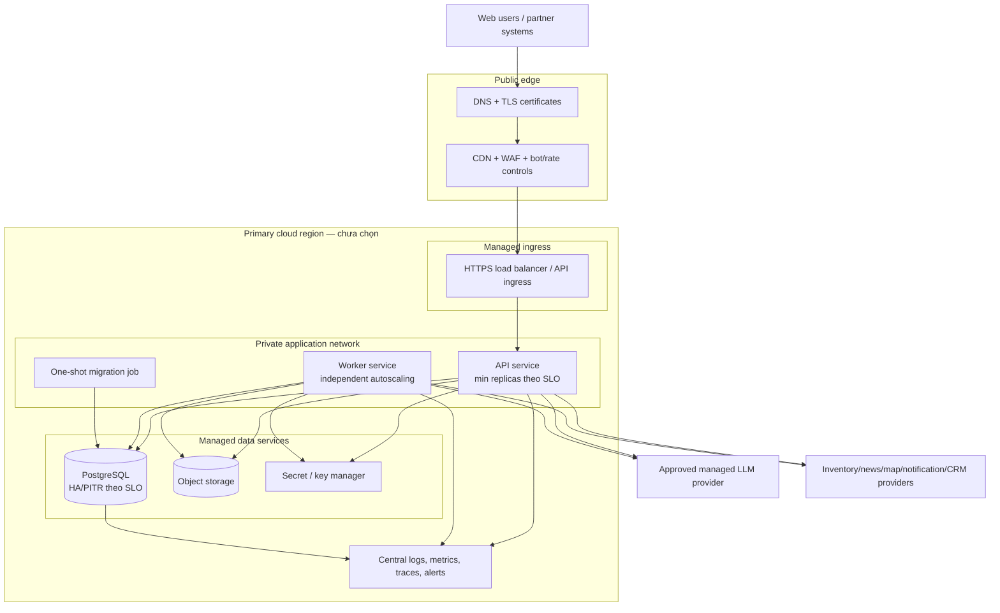

# Thiết kế hạ tầng và triển khai cloud

## 1. Trạng thái

- Trạng thái: **Proposed — chờ review**.
- Thiết kế ở mức provider-neutral vì cloud/region/data residency chưa được chọn (OQ-043).
- Không đưa tên dịch vụ cụ thể của AWS/GCP/Azure vào baseline để tránh giả định.
- Capacity, SLO, RPO/RTO và ngân sách chưa có số (OQ-044..046); mọi sizing hiện chỉ là topology, không phải cam kết.

## 2. Mục tiêu

- Triển khai frontend, API và worker độc lập theo môi trường.
- Giữ API/worker stateless để scale ngang.
- Bảo vệ PostgreSQL, object storage, secret và dữ liệu PII khỏi truy cập công khai.
- Hỗ trợ migration, rollback, backup/restore, audit và quan sát end-to-end.
- Kiểm soát chi phí AI/media/egress và chỉ thêm thành phần khi có số đo.
- Cung cấp đường nâng cấp mà không buộc microservice hoặc multi-region từ đầu.

## 3. Topology production logic

Object storage có thể được CDN phục vụ trực tiếp qua origin access; signed upload URL cho client không cho phép list bucket hoặc ghi ngoài prefix đã cấp.

## 4. Môi trường

| Môi trường | Mục đích | Dữ liệu | Quy tắc đề xuất |
|---|---|---|---|
| Local | Phát triển frontend/API/worker | Fixture/seed giả lập, không PII | Container/service dependencies tối thiểu; provider mock hoặc dev credential riêng |
| Dev | Tích hợp liên tục | Synthetic/test | Có thể scale-to-zero; không share secret production |
| Staging | Pre-production, migration/e2e/load canary | Synthetic hoặc sanitized theo policy | Topology gần production; sandbox partner/model |
| Production | Người dùng thật | Production/PII | Account/project/network/secret tách riêng; break-glass/audit |

Số môi trường cuối chờ OQ-048. Không copy database production thô sang dev/staging; nếu cần debug dùng export tối thiểu đã token hóa/ẩn danh và có audit.

## 5. Edge, network và DNS

- DNS và certificate managed; TLS hiện đại, HSTS sau khi domain/subdomain được kiểm thử.
- CDN phục vụ static SPA/media public; HTML có cache strategy hỗ trợ rollback nhanh.
- WAF/bot controls cho auth, AI, search, lead, booking, social mutation và webhook theo risk.
- Chỉ load balancer/ingress public; API/worker/database không có public admin port.
- Database chỉ nhận kết nối từ workload identity/security group được phép; mã hóa transit.
- Egress tới LLM/partner qua allowlist/NAT/private endpoint nếu khả dụng và chi phí hợp lý.
- Admin/debug endpoint không public; production debug UI bị tắt.
- Webhook partner có hostname/path riêng nếu cần isolation/rate/security policy.

Chi tiết VPC/subnet/region/zone phụ thuộc provider và OQ-043.

## 6. Compute

### 6.1 Web

- Build artifact immutable có content hash.
- Host trên static object/CDN hoặc managed static hosting.
- Runtime config công khai tách khỏi build secret; không bundle LLM/API secret.
- SPA fallback/router rules được thêm sau khi deep link OQ-051 được duyệt.

### 6.2 API

- Container/service stateless, health endpoints riêng `liveness` và `readiness`.
- Scale ngang theo CPU/memory và request/concurrency metric; SSE connection count cần metric riêng.
- Graceful shutdown: ngừng nhận request mới, hoàn tất request ngắn/đóng stream có event thích hợp.
- Connection pool database giới hạn theo tổng replica để không làm cạn DB.
- Resource limit/request và autoscaling min/max được sizing từ load test, không tự đặt trong tài liệu.

### 6.3 Worker

- Deploy riêng API để job nặng không ảnh hưởng latency web.
- Có worker pool/queue class cho ingestion, notification, media và AI batch nếu tải chứng minh cần isolation.
- Claim job có lease, heartbeat, retry, dead-letter/quarantine và idempotency.
- Autoscale theo job lag/oldest age/concurrency, không chỉ CPU.
- Worker shutdown trả/release lease an toàn.

### 6.4 Migration job

- One-shot workload từ cùng release artifact hoặc artifact migration versioned.
- Chạy một lần với lock; output/audit rõ; fail sẽ chặn rollout app cần schema mới.
- Migration production không chạy tự động từ mọi API replica.

## 7. Data services

### PostgreSQL

- Managed PostgreSQL, mã hóa at rest/in transit, automated backup và point-in-time recovery.
- Multi-zone/standby chỉ cấu hình theo availability/RPO/RTO được duyệt.
- Tách credential/role: migration, API read-write, worker, monitoring; least privilege.
- Connection pooling managed hoặc sidecar/service phù hợp provider.
- Slow-query monitoring, storage/IO/connection/autovacuum alert.
- Read replica/warehouse chỉ khi analytics/read load chứng minh cần; booking luôn dùng primary.

### Object storage

- Bucket/container tách theo environment và, khi cần, theo public/private/quarantine.
- Public access block mặc định; CDN origin identity hoặc signed URL.
- Versioning/lifecycle/retention theo loại media và policy.
- Upload vào quarantine prefix, scan/validate rồi mới promote logical state.
- Server-side encryption và access log/audit.
- Không dựa vào original filename làm object key.

### Redis/search/managed queue

Không provision baseline. Chỉ thêm bằng ADR sau metric/threshold OQ-050:

- Redis cho distributed rate-limit/hot ephemeral cache, không cho inventory truth.
- Search cluster khi PostgreSQL search không đạt quy mô/chất lượng.
- Managed queue/broker khi DB job/outbox không đáp ứng throughput/fan-out/isolation.

Việc “để sẵn” dịch vụ không dùng vẫn tăng chi phí, attack surface và on-call burden.

## 8. Secret, key và identity workload

- Secret trong managed secret store; IaC/state/CI log/repository không chứa plaintext secret.
- Workload identity/short-lived credential ưu tiên hơn static access key.
- Secret tách theo environment/provider/use case và rotation owner.
- Database credential rotation không yêu cầu rebuild image.
- Encryption keys do managed KMS; key policy tách người quản trị key và workload sử dụng.
- LLM, notification, map, partner webhook credential có quota/permission riêng.
- Break-glass production có time-bound approval và audit; quy trình cụ thể chờ tổ chức vận hành.

## 9. CI/CD và artifact supply chain

```mermaid
flowchart LR
    commit["Commit / PR"] --> checks["Type check, pytest, lint/format policy"]
    checks --> contract["OpenAPI/schema/contract tests"]
    contract --> security["SAST, dependency, secret, IaC scan"]
    security --> build["Reproducible web/API/worker images"]
    build --> registry["Signed artifact registry + SBOM"]
    registry --> dev["Deploy dev"]
    dev --> integ["Integration/e2e/migration/AI eval"]
    integ --> approval["Review/approval gate"]
    approval --> staging["Deploy staging + canary tests"]
    staging --> prod["Progressive production rollout"]
    prod --> verify["SLO/error/AI cost & quality verification"]
```

Pipeline đề xuất:

1. Install dependencies (pip/uv lock); type check (mypy/pyright) và pytest.
2. Validate OpenAPI/event schema backward compatibility.
3. Scan secret/dependency/license/container/IaC; tạo SBOM và ký artifact nếu platform hỗ trợ.
4. Build một lần, promote cùng immutable artifact qua môi trường.
5. Chạy migration compatibility và smoke/e2e.
6. AI prompt/model/index change chạy eval gate riêng, kể cả khi không đổi code.
7. Progressive/canary/blue-green theo capability provider; có auto/manual rollback rule.
8. Post-deploy verify request errors, DB, job lag, data freshness, AI safety/cost.

Branching/review rules và CI provider chưa được chọn.

## 10. Deployment và rollback

- API change tương thích ngược với frontend đang cache và worker phiên bản trước trong cửa sổ rollout.
- Database dùng expand/backfill/switch/contract; destructive contract ở release sau.
- Feature flag cho source feed, AI model/prompt, social publishing và booking; flag có owner/expiry.
- Rollback application dùng artifact trước; không mặc định rollback migration đã ghi dữ liệu.
- Web asset/HTML cache strategy cho phép trỏ lại release ổn định.
- Worker event schema versioned; consumer xử lý event cũ trong retention window.
- Kill switch cho AI/provider, ingestion source và mutation rủi ro.

## 11. Observability

### Logs

- JSON structured, timestamp UTC, service/env/version, request/trace ID, module, outcome.
- Redact phone/email/token/cookie/prompt/private note; không log request/response body mặc định.
- Audit log tách retention và access khỏi application log.
- Log sampling chỉ cho traffic thành công; không bỏ error/security event quan trọng.

### Metrics

| Lớp | Metrics chính |
|---|---|
| Edge/API | RPS, status/error code, latency, active SSE, rate-limit/WAF block |
| Database | connections, pool wait, CPU/IO/storage, slow query, lock wait/deadlock, replica lag nếu có |
| Worker | queue depth, oldest job, processing latency, retry/dead letter/quarantine |
| Data | source sync success, record errors, observed age, stale unit/price percentage |
| Booking/lead | creation/conflict/state transition, assignment lag nếu SLA được duyệt |
| AI | TTFT/latency, tokens/cost, model/tool errors, citation/safety/fallback/eval metrics |
| Media | upload/scan/transform errors, storage/egress volume |

### Tracing

- Trace edge → API → DB/external và outbox/job continuation qua correlation metadata.
- Sampling theo risk/cost; không đưa raw content/PII vào span attributes.

### Alerting

- Mỗi alert cần user impact, owner, severity, runbook, dedup/silence rule.
- Ngưỡng dựa trên SLO/baseline, không đặt số tùy ý trong thiết kế.
- Alert chính: availability/error burn, DB capacity/backup failure, oldest critical job, stale inventory, booking invariant, AI safety/cost spike, partner failure.

## 12. Backup, DR và business continuity

- Automated DB backup + PITR; backup encryption và access audit.
- Object versioning/lifecycle theo loại dữ liệu; không coi replication là backup duy nhất.
- IaC, migration và artifact registry cho phép tái tạo service.
- Restore test định kỳ vào môi trường cô lập với kiểm tra integrity/application smoke.
- Runbook cho database restore, region/provider outage, credential compromise, partner data corruption và AI provider outage.
- Single-region hay multi-region, backup window, RPO/RTO và failover automation chỉ chốt sau OQ-043/OQ-045/OQ-046.
- Multi-region active-active không đề xuất mặc định vì booking consistency, dữ liệu residency và chi phí phức tạp.

## 13. Security controls

| Lớp | Control đề xuất |
|---|---|
| SDLC | Review, protected branch, signed artifact/SBOM, dependency/secret/IaC scan |
| Edge | TLS, WAF, rate/bot control, DDoS capability của provider |
| Identity | IdP được duyệt, MFA cho privileged actor, short session/rotation theo threat model |
| Authorization | Server-side RBAC/resource/org checks; deny by default |
| Data | Encryption, PII classification/redaction, least privilege, retention/purge |
| Media | Signed upload, MIME/checksum/size validation, malware scan, private/public separation |
| Webhook | Signature, timestamp, replay protection, schema/idempotency, source isolation |
| AI | Provider policy, prompt injection defenses, tool allowlist, PII control, safety/eval |
| Operations | Environment isolation, break-glass, immutable audit, patch/vulnerability SLA cần owner |

Threat modeling theo luồng phải diễn ra trước implementation của auth, booking, media, social mutation và external ingestion.

## 14. Scalability plan

1. Thu thập traffic/data/job/AI baseline và tối ưu query/index/connection pool.
2. Scale stateless API/worker và database vertical capacity trong giới hạn hợp lý.
3. Thêm read replica/analytics isolation nếu read/OLAP ảnh hưởng OLTP.
4. Thêm cache/search/queue theo bottleneck đã đo.
5. Partition/archive bảng append-only khi maintenance/query chứng minh cần.
6. Tách service chỉ khi module có nhu cầu deploy/scale/ownership/compliance độc lập.

Trigger số cụ thể chờ OQ-044/OQ-050. Không dùng DAU làm chỉ số duy nhất; cần peak RPS, concurrent SSE, dataset, query shape, job lag và provider quota.

## 15. Cost controls

- Tag/label cost theo environment/service/team/use case khi provider hỗ trợ.
- Budget và anomaly alert cho cloud tổng, LLM token, media storage/transcode/egress, map và notification.
- Dev/staging scale-down/schedule nếu phù hợp nhưng không làm staging mất giá trị test.
- CDN/compression/image variants giảm media egress.
- Model routing/context/result limits và batch cho job không realtime sau eval.
- Lifecycle/archive log/media/raw source theo retention; không giữ vô hạn.
- Review idle resource, oversized DB/worker và external API retry storm.
- Không thêm Redis/search/GPU chỉ vì “có thể cần”.

Ngưỡng ngân sách và owner chờ OQ-046.

## 16. Infrastructure as Code

- Mọi resource production được quản lý bằng IaC sau khi provider được chọn.
- Module reusable nhưng environment state/config tách; production state được bảo vệ/lock/audit.
- Plan trong PR, apply qua CI role có approval; không dùng credential cá nhân dài hạn.
- Policy-as-code cho public exposure, encryption, backup, logging, secret và tag bắt buộc.
- Drift detection định kỳ; thay đổi khẩn cấp phải import/đồng bộ lại IaC.
- Không commit generated state, private key hoặc secret.

Cấu trúc dự kiến tại [project-structure.md](./project-structure.md); chưa tạo `infra/` trước review.

## 17. Runbook tối thiểu trước production

- API elevated error/latency và SSE failure.
- Database saturation, deadlock, failover và restore.
- Job queue lag/dead-letter và replay an toàn.
- Inventory source stale/corrupt và quarantine/rollback source version.
- Booking/hold invariant conflict hoặc expiry failure.
- LLM outage, quota/cost spike, unsafe output và kill switch.
- Media malware/abuse/takedown.
- Social moderation incident và PII leakage.
- Credential compromise/rotation.
- Deployment/migration rollback.

Owner/on-call/escalation chờ OQ-049.

## 18. Cổng sẵn sàng production

- [ ] Cloud/region/data residency, account ownership và budget được duyệt.
- [ ] Capacity test phản ánh OQ-044; SLO/RPO/RTO và alert/runbook có owner.
- [ ] Auth/RBAC/PII/consent/threat model và penetration/security review phù hợp rủi ro.
- [ ] Backup/PITR và restore test thành công.
- [ ] Migration/rollback/feature flag/kill switch được diễn tập.
- [ ] Partner feed có signature, idempotency, freshness và quarantine.
- [ ] Booking concurrency/idempotency được integration/load test nếu bật.
- [ ] Social moderation/reporting policy được duyệt nếu bật UGC mutation.
- [ ] AI provider/data policy/eval/citation/safety/cost gate đạt chuẩn đã duyệt.
- [ ] Không có secret/PII production trong frontend, repository, build log hoặc non-production data.

