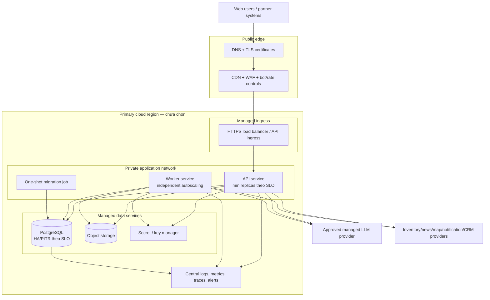

```mermaid
flowchart LR
    commit["Commit / PR"] --> checks["Type check, pytest, lint/format policy"]
    checks --> contract["OpenAPI/schema/contract tests"]
    contract --> security["SAST, dependency, secret, IaC scan"]
    security --> build["Reproducible web/API/worker images"]
    build --> registry["Signed artifact registry + SBOM"]
    registry --> dev["Deploy dev"]
    dev --> integ["Integration/e2e/migration/AI eval"]
    integ --> approval["Review/approval gate"]
    approval --> staging["Deploy staging + canary tests"]
    staging --> prod["Progressive production rollout"]
    prod --> verify["SLO/error/AI cost & quality verification"]
```

# Thiết kế hạ tầng và triển khai cloud

## 1. Trạng thái

- Trạng thái: **Proposed — chờ review**.
- Thiết kế ở mức **không gắn với nhà cung cấp cụ thể** (provider-neutral), vì cloud/region/nơi lưu trữ dữ liệu chưa được chọn — xem OQ-043 (chọn cloud nào, vùng nào?).
- Không đưa tên dịch vụ cụ thể của AWS/GCP/Azure vào thiết kế ban đầu để tránh giả định.
- Công suất, SLO (cam kết chất lượng dịch vụ), RPO/RTO (mất bao nhiêu dữ liệu / phục hồi bao lâu) và ngân sách chưa có số — xem OQ-044..046. Mọi kích thước hiện chỉ là sơ đồ topology, không phải cam kết.

## 2. Mục tiêu

- Triển khai frontend, API và worker **độc lập** theo từng môi trường (dev/staging/production).
- Giữ API/worker **stateless** (không lưu trạng thái trong bộ nhớ) để dễ mở rộng ngang (thêm instance).
- Bảo vệ PostgreSQL, object storage (kho lưu file), secret (mật khẩu/key) và dữ liệu cá nhân (PII) khỏi truy cập công khai.
- Hỗ trợ migration (thay đổi database), rollback (quay lại phiên bản cũ), backup/restore, audit (nhật ký thao tác) và giám sát toàn bộ hệ thống.
- Kiểm soát chi phí AI/media/egress (lưu lượng ra ngoài). Chỉ thêm thành phần khi có số đo chứng minh cần.
- Cho phép nâng cấp dần mà không buộc phải tách microservice hay chạy nhiều vùng ngay từ đầu.

## 3. Topology production

> Sơ đồ bên dưới cho thấy luồng kết nối từ người dùng tới các thành phần hệ thống.

Object storage có thể được CDN (mạng phân phối nội dung) phục vụ trực tiếp. Client upload file bằng signed URL (URL có chữ ký tạm thời) — URL này chỉ cho phép ghi vào thư mục được cấp, không cho phép liệt kê hay xóa file khác.

## 4. Môi trường

| Môi trường | Mục đích | Dữ liệu | Quy tắc |
|---|---|---|---|
| **Local** | Phát triển trên máy lập trình viên | Dữ liệu giả (fixture/seed), không chứa PII | Chỉ cần container tối thiểu. Provider dùng mock hoặc credential dev riêng |
| **Dev** | Tích hợp liên tục (CI) | Dữ liệu test tổng hợp | Có thể tắt khi không dùng (scale-to-zero). Không dùng chung secret với production |
| **Staging** | Kiểm thử trước production | Dữ liệu tổng hợp hoặc đã ẩn danh | Cấu hình gần giống production. Dùng sandbox đối tác/AI model |
| **Production** | Người dùng thật | Dữ liệu thật, có PII | Tách riêng account/network/secret. Có audit và quy trình truy cập khẩn cấp |

Số môi trường cụ thể chờ OQ-048 (cần mấy môi trường?). **Không copy** database production thô sang dev/staging. Nếu cần debug, dùng export tối thiểu đã ẩn danh và có audit.

## 5. Edge, network và DNS

> Cấu hình biên mạng: DNS, CDN, tường lửa, và các quy tắc kết nối.

- **DNS** và certificate (chứng chỉ SSL) quản lý tự động. Bật TLS hiện đại, HSTS (bắt buộc dùng HTTPS) sau khi domain được kiểm thử.
- **CDN** phục vụ SPA (trang web tĩnh) và media công khai. HTML có cache strategy hỗ trợ rollback nhanh (trỏ lại bản cũ khi cần).
- **WAF** (tường lửa ứng dụng web) và bot controls cho các luồng nhạy cảm: đăng nhập, AI, tìm kiếm, lead, booking, đăng bài, và webhook.
- Chỉ load balancer/ingress mở công khai. API/worker/database **không có** public admin port.
- Database chỉ nhận kết nối từ workload identity (danh tính ứng dụng) được phép. Mã hóa dữ liệu khi truyền.
- Kết nối ra ngoài (tới LLM, đối tác) chỉ cho phép các địa chỉ trong **danh sách trắng**. Ưu tiên dùng private endpoint (kết nối riêng) nếu có và chi phí hợp lý.
- Admin/debug endpoint không public. Giao diện debug production bị tắt.
- Webhook đối tác có hostname/path riêng nếu cần tách biệt bảo mật.

Chi tiết VPC/subnet/region/zone phụ thuộc nhà cung cấp và OQ-043.

## 6. Compute

> Cách triển khai các thành phần chạy code: web, API, worker, migration.

### 6.1 Web (frontend)

- Build artifact không thay đổi (immutable), có content hash để xác định phiên bản.
- Host trên static CDN hoặc managed static hosting.
- Config công khai (API URL, tên app) tách khỏi build secret. **Không bao giờ** đưa key LLM/API vào frontend.
- SPA fallback/router rules thêm sau khi deep link được duyệt — xem OQ-051 (cấu trúc URL?).

### 6.2 API (FastAPI)

- Container/service **stateless** (không lưu session trong memory). Có health endpoint riêng: `liveness` (còn sống?) và `readiness` (sẵn sàng nhận request?).
- Mở rộng ngang theo CPU/memory và số request đồng thời. Kết nối SSE (AI streaming) cần metric riêng.
- Tắt an toàn (**graceful shutdown**): ngừng nhận request mới, hoàn tất request đang xử lý, đóng stream AI đúng cách.
- Connection pool tới database giới hạn theo tổng số replica, tránh quá tải DB.
- Giới hạn resource và autoscaling min/max được chọn dựa trên load test thực tế, không đặt số trong tài liệu.

### 6.3 Worker (xử lý nền)

- Deploy **tách riêng** API để job nặng không làm chậm response web.
- Có thể chia worker pool theo loại việc: nhập liệu, thông báo, xử lý media, AI batch — chỉ khi tải chứng minh cần.
- Nhận job có lease (khóa tạm), heartbeat (nhịp tim), retry (thử lại), dead-letter (hàng đợi lỗi) và idempotent (chạy lại không lặp).
- Tự mở rộng theo **số job chờ** và **tuổi job cũ nhất**, không chỉ theo CPU.
- Khi tắt worker, trả lại lease an toàn để job không bị treo.

### 6.4 Migration job (thay đổi database)

- Chạy 1 lần duy nhất từ artifact cùng bản release.
- Có khóa để tránh chạy đồng thời. Ghi log rõ ràng. Nếu thất bại → **chặn** việc deploy app cần schema mới.
- Migration production **không chạy tự động** từ mọi API replica. Chỉ chạy từ job riêng.

## 7. Data services

> Cách quản lý PostgreSQL, object storage, và các dịch vụ dữ liệu khác.

### PostgreSQL

- Dùng managed PostgreSQL. Mã hóa dữ liệu lưu trữ (at rest) và khi truyền (in transit). Backup tự động và PITR (khôi phục tới thời điểm bất kỳ).
- Chỉ bật multi-zone/standby (chạy dự phòng nhiều zone) khi có yêu cầu uptime/RPO/RTO cụ thể đã duyệt.
- **Tách quyền** database: role riêng cho migration, API read-write, worker, monitoring. Mỗi role chỉ có quyền tối thiểu cần thiết.
- Connection pooling (quản lý kết nối) qua managed service hoặc sidecar phù hợp.
- Giám sát: slow query (truy vấn chậm), dung lượng, IO, kết nối, autovacuum, deadlock.
- Read replica (bản sao chỉ đọc) chỉ thêm khi phân tích/đọc nặng ảnh hưởng giao dịch chính. **Booking luôn dùng primary**.

### Object storage (kho lưu file)

- Tách bucket theo môi trường. Khi cần, tách thêm theo: public (công khai), private (riêng tư), quarantine (cách ly chờ kiểm tra).
- Mặc định **chặn** truy cập public. Dùng CDN origin identity hoặc signed URL để cấp quyền.
- Versioning/lifecycle/retention (giữ phiên bản/vòng đời/thời hạn lưu) theo loại media và chính sách.
- File upload vào thư mục quarantine trước. Sau khi scan virus/validate → mới chuyển sang trạng thái chính thức.
- Mã hóa phía server và ghi log truy cập.
- **Không** dùng tên file gốc của người dùng làm object key (tránh xung đột, ký tự đặc biệt).

### Redis / search engine / managed queue

**Không triển khai** ở giai đoạn đầu. Chỉ thêm khi có số liệu chứng minh cần — xem OQ-050 (khi nào đủ bằng chứng?):

- **Redis**: cho giới hạn tốc độ truy cập (rate-limit) và cache tạm, **không** dùng làm nguồn sự thật cho tồn kho.
- **Search engine** (Elasticsearch/OpenSearch): khi PostgreSQL full-text search không đạt chất lượng/quy mô.
- **Message queue** (RabbitMQ/SQS): khi DB job/outbox không đáp ứng throughput hoặc cần tách biệt.

Dịch vụ "để sẵn" không dùng vẫn tốn tiền, tăng rủi ro bảo mật, và tăng gánh nặng vận hành.

## 8. Secret, key và danh tính workload

> Cách quản lý mật khẩu, key API, và quyền truy cập của ứng dụng.

- Secret lưu trong **managed secret store** (kho bí mật quản lý bởi cloud). Không lưu secret dạng text thuần trong code, IaC state, CI log hay repository.
- Ưu tiên **workload identity** (danh tính ứng dụng tự động) hơn static access key (key cố định).
- Tách secret theo: môi trường, nhà cung cấp, mục đích sử dụng. Mỗi secret có người chịu trách nhiệm xoay vòng (rotation).
- Xoay vòng credential database **không cần** rebuild lại container image.
- Key mã hóa do managed KMS quản lý. Tách riêng: người quản trị key ≠ workload dùng key.
- Credential cho LLM, notification, bản đồ, webhook đối tác có quota/quyền riêng.
- Truy cập khẩn cấp production (**break-glass**) cần phê duyệt có thời hạn và ghi audit. Quy trình cụ thể chờ tổ chức vận hành.

## 9. CI/CD và chuỗi cung ứng artifact

> Quy trình từ commit code → kiểm tra → build → triển khai.

Các bước pipeline đề xuất:

1. Cài dependencies (pip/uv lock). Chạy type check (mypy/pyright) và pytest.
2. Kiểm tra OpenAPI/event schema tương thích ngược (không phá hỏng phiên bản cũ).
3. Quét bảo mật: secret lộ, dependency có lỗ hổng, license, container, IaC. Tạo SBOM (danh mục phần mềm) nếu platform hỗ trợ.
4. Build **một lần** duy nhất. Promote cùng artifact qua các môi trường (dev → staging → production).
5. Chạy migration compatibility test và smoke/e2e test.
6. Thay đổi AI prompt/model/index chạy eval gate riêng, **kể cả khi không đổi code**.
7. Triển khai từ từ (progressive/canary/blue-green). Có quy tắc rollback tự động và thủ công.
8. Sau deploy: kiểm tra lỗi request, DB, job tồn đọng, dữ liệu cũ, AI safety/cost.

Branching/review rules và CI provider chưa được chọn.

## 10. Deployment và rollback

> Cách triển khai phiên bản mới và quay lại khi có lỗi.

- API thay đổi phải **tương thích ngược** với frontend đang cache và worker phiên bản cũ trong thời gian triển khai.
- Database dùng quy trình **expand → backfill → switch → contract**: thêm cột mới → copy dữ liệu → chuyển sang dùng cột mới → xóa cột cũ ở release sau.
- Feature flag (bật/tắt tính năng) cho: nguồn dữ liệu, AI model/prompt, đăng bài xã hội, booking. Mỗi flag có người chịu trách nhiệm và ngày hết hạn.
- Rollback ứng dụng: dùng artifact phiên bản trước. **Không** mặc định rollback migration đã ghi dữ liệu.
- Web asset/HTML cache cho phép trỏ lại bản release ổn định ngay lập tức.
- Worker event schema có version. Consumer phải xử lý được event cũ trong thời gian lưu giữ.
- **Kill switch** (nút tắt khẩn cấp) cho: AI/provider, nguồn nhập liệu, và các thao tác thay đổi dữ liệu rủi ro.

## 11. Observability (giám sát hệ thống)

> Cách theo dõi, đo lường và cảnh báo tình trạng hệ thống.

### Logs (nhật ký)

- Định dạng JSON có cấu trúc: timestamp UTC, service/env/version, request/trace ID, module, kết quả.
- **Ẩn** thông tin nhạy cảm: số điện thoại, email, token, cookie, prompt AI, ghi chú riêng. Không log request/response body mặc định.
- Audit log (nhật ký thao tác quan trọng) tách riêng khỏi application log, có thời hạn lưu và quyền truy cập riêng.
- Log sampling (lấy mẫu) chỉ áp dụng cho traffic thành công. **Không bỏ** error/security event.

### Metrics (chỉ số)

| Lớp | Chỉ số chính |
|---|---|
| Edge/API | Số request/giây, mã lỗi, độ trễ, số kết nối SSE đang mở, số lần bị WAF chặn |
| Database | Số kết nối, thời gian chờ pool, CPU/IO/dung lượng, truy vấn chậm, deadlock, độ trễ replica |
| Worker | Số job chờ, tuổi job cũ nhất, thời gian xử lý, retry/dead-letter |
| Data | Đồng bộ nguồn thành công/thất bại, tuổi dữ liệu, % đơn vị/giá cũ |
| Booking/lead | Số tạo/xung đột/chuyển trạng thái, thời gian phân công |
| AI | Thời gian chữ đầu tiên, độ trễ, token/chi phí, lỗi model/tool, citation/safety/eval |
| Media | Lỗi upload/scan/xử lý, dung lượng/lưu lượng ra |

### Tracing (theo dõi luồng request)

- Theo dõi từ edge → API → DB/dịch vụ ngoài, và từ outbox/job tiếp tục, bằng correlation metadata (mã liên kết).
- Lấy mẫu theo mức rủi ro/chi phí. **Không đưa** nội dung thô hoặc PII vào span attributes.

### Alerting (cảnh báo)

- Mỗi cảnh báo cần: mô tả ảnh hưởng người dùng, người chịu trách nhiệm, mức độ, runbook (hướng dẫn xử lý), quy tắc gộp/im lặng.
- Ngưỡng dựa trên SLO/baseline thực tế, không đặt số tùy ý.
- Cảnh báo chính: lỗi/downtime vượt ngưỡng, DB sắp đầy/backup lỗi, job tồn đọng quá lâu, dữ liệu tồn kho cũ, xung đột booking, AI lỗi/chi phí tăng đột biến, đối tác mất kết nối.

## 12. Backup, DR và kinh doanh liên tục

> Cách bảo vệ dữ liệu và phục hồi khi có sự cố.

- Backup database tự động + PITR (khôi phục tới thời điểm bất kỳ). Backup được mã hóa và ghi log truy cập.
- Object storage có versioning/lifecycle theo loại dữ liệu. **Không** coi replication là backup duy nhất.
- IaC (Infrastructure as Code), migration và artifact registry cho phép **tái tạo lại** toàn bộ service từ đầu.
- Test restore định kỳ vào môi trường cô lập. Kiểm tra dữ liệu đúng và ứng dụng chạy được.
- Cần runbook cho: restore database, sự cố vùng/provider, lộ credential, dữ liệu đối tác bị hỏng, AI provider bị sập.
- Single-region hay multi-region, thời gian backup, RPO/RTO và failover tự động chỉ chốt sau OQ-043/OQ-045/OQ-046.
- Multi-region active-active (chạy đồng thời nhiều vùng) **không đề xuất** mặc định vì phức tạp: tính nhất quán booking, yêu cầu lưu trữ dữ liệu trong nước, và chi phí cao.

## 13. Security controls (kiểm soát bảo mật)

| Lớp | Biện pháp đề xuất |
|---|---|
| SDLC (quy trình dev) | Review code, protected branch, ký artifact/SBOM, quét dependency/secret/IaC |
| Edge (biên mạng) | TLS, WAF, chống bot/DDoS |
| Identity (danh tính) | IdP được duyệt, MFA cho admin, session ngắn hạn |
| Authorization (phân quyền) | Kiểm tra quyền phía server. Mặc định: **từ chối** |
| Data (dữ liệu) | Mã hóa, phân loại/ẩn PII, quyền tối thiểu, xóa theo thời hạn |
| Media (file/ảnh/video) | Signed upload, kiểm tra MIME/checksum/kích thước, quét malware, tách public/private |
| Webhook (API đối tác gọi vào) | Chữ ký, timestamp, chống replay, idempotent |
| AI | Chính sách provider, chống prompt injection, chỉ cho phép tool trong danh sách, kiểm soát PII, safety/eval |
| Operations (vận hành) | Tách môi trường, break-glass có audit, nhật ký không sửa được, SLA vá lỗi bảo mật |

Cần làm **threat modeling** (phân tích mối đe dọa) theo từng luồng trước khi implement: auth, booking, media, đăng bài, và nhập liệu từ bên ngoài.

## 14. Kế hoạch mở rộng (scalability)

> Thứ tự mở rộng hệ thống khi tải tăng.

1. Thu thập baseline (điểm xuất phát) về traffic/dữ liệu/job/AI. Tối ưu query/index/connection pool.
2. Mở rộng ngang API/worker stateless. Tăng database vertical (CPU/RAM/storage).
3. Thêm read replica nếu analytics/đọc nặng ảnh hưởng giao dịch chính.
4. Thêm cache/search engine/queue theo **bottleneck đã đo**, không theo dự đoán.
5. Partition/archive (chia bảng/lưu trữ cũ) cho bảng chỉ ghi thêm (append-only) khi query/bảo trì chứng minh cần.
6. Tách service chỉ khi module có nhu cầu deploy/scale/ownership/compliance **độc lập đã chứng minh**.

Số cụ thể chờ OQ-044 (quy mô dự kiến?) và OQ-050 (khi nào đủ bằng chứng?). Không dùng DAU làm chỉ số duy nhất — cần: peak RPS (request/giây cao điểm), concurrent SSE, kích thước dataset, dạng query, job tồn đọng, và quota provider.

## 15. Kiểm soát chi phí

- Gắn tag/label chi phí theo: môi trường, service, team, mục đích sử dụng.
- Cảnh báo ngân sách và bất thường cho: cloud tổng, token LLM, storage/transcode/egress media, bản đồ, notification.
- Dev/staging có thể giảm quy mô/lên lịch tắt — nhưng **không** làm staging mất giá trị test.
- Dùng CDN/compression/ảnh nhiều kích thước để giảm lưu lượng media ra ngoài.
- AI: giới hạn context/kết quả, batch job không cần realtime. Chọn model phù hợp use case.
- Xóa/archive log/media/dữ liệu nguồn theo thời hạn lưu giữ. Không giữ vô hạn.
- Kiểm tra định kỳ: resource không dùng, DB/worker quá lớn, retry storm (vòng lặp thử lại) tới API ngoài.
- **Không** thêm Redis/search engine/GPU chỉ vì "có thể cần sau này".

Ngưỡng ngân sách và người chịu trách nhiệm chờ OQ-046 (ngân sách bao nhiêu?).

## 16. Infrastructure as Code (IaC)

> Quản lý hạ tầng bằng code thay vì cấu hình thủ công.

- Mọi resource production được quản lý bằng IaC (Terraform/Pulumi/CDK) sau khi chọn provider.
- Module có thể tái sử dụng, nhưng state/config tách theo môi trường. Production state được bảo vệ, khóa, và ghi audit.
- Plan (xem trước thay đổi) trong PR. Apply (áp dụng) qua CI role có phê duyệt. Không dùng credential cá nhân dài hạn.
- Policy-as-code bắt buộc: không mở public, phải mã hóa, phải backup, phải ghi log, phải có tag.
- Phát hiện drift (cấu hình lệch khỏi code) định kỳ. Thay đổi khẩn cấp phải import/đồng bộ lại vào IaC.
- **Không commit** generated state, private key hoặc secret vào repository.

Cấu trúc thư mục dự kiến tại [project-structure.md](./project-structure.md). Chưa tạo `infra/` trước khi review.

## 17. Runbook tối thiểu trước production

> Danh sách các tình huống sự cố cần có hướng dẫn xử lý trước khi lên production.

- API lỗi nhiều / chậm, và SSE (streaming AI) bị đứt.
- Database: quá tải, deadlock, failover, và restore.
- Job queue: tồn đọng, dead-letter (job lỗi liên tục), replay (chạy lại) an toàn.
- Nguồn tồn kho: dữ liệu cũ/hỏng, cách ly và rollback phiên bản nguồn.
- Booking/giữ chỗ: xung đột trạng thái hoặc hết hạn không giải phóng căn.
- LLM: sập, vượt quota/chi phí, output không an toàn, bật kill switch.
- Media: phát hiện malware, nội dung vi phạm, yêu cầu gỡ bỏ.
- Cộng đồng: sự cố kiểm duyệt, lộ thông tin cá nhân.
- Credential bị lộ → xoay vòng (rotation).
- Deployment/migration cần rollback.

Người trực vận hành và quy trình escalation chờ OQ-049 (ai trực vận hành?).

## 18. Checklist sẵn sàng production

- [ ] Cloud/region/nơi lưu dữ liệu, tài khoản, và ngân sách được duyệt.
- [ ] Test tải phản ánh OQ-044. SLO/RPO/RTO và cảnh báo/runbook có người chịu trách nhiệm.
- [ ] Auth/phân quyền/PII/consent/threat model và kiểm tra bảo mật phù hợp rủi ro.
- [ ] Backup/PITR và restore test thành công.
- [ ] Migration/rollback/feature flag/kill switch được diễn tập.
- [ ] Feed đối tác có chữ ký, idempotent, kiểm tra độ mới, và cách ly dữ liệu lỗi.
- [ ] Booking: test xung đột đồng thời và idempotent nếu bật.
- [ ] Kiểm duyệt/báo cáo nội dung cộng đồng được duyệt nếu bật UGC.
- [ ] AI: chính sách provider/dữ liệu/eval/citation/safety/cost đạt chuẩn.
- [ ] Không có secret/PII production trong frontend, repository, build log hoặc dữ liệu non-production.
