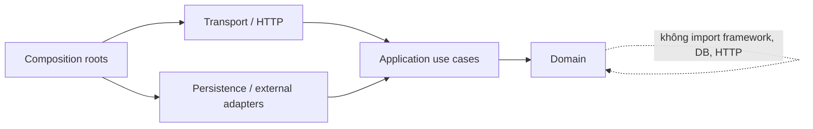

# Cấu trúc dự án đề xuất

## 1. Trạng thái
*Tóm tắt: Trạng thái hiện tại của tài liệu cấu trúc dự án.*

- Trạng thái: **Proposed — chờ review**.
- Đây là định hướng thư mục cho giai đoạn triển khai. Các thư mục và code này hiện **chưa được tạo**.
- File `AGENTS.md` không có mặt trong repository tại thời điểm khảo sát. Nếu file đó được thêm sau này, quy ước trong `AGENTS.md` sẽ được ưu tiên. Khi đó tài liệu này phải được cập nhật lại.

## 2. Hiện trạng repository
*Tóm tắt: Phân tích cấu trúc thư mục hiện tại và những điểm cần cải thiện.*

```text
src/
  App.tsx
  main.tsx
  index.css
  types.ts
  components/
    common/
      BottomNav.tsx
      Header.tsx
      SavedModal.tsx
    ai/
      AIChatTab.tsx
      AIGuide.tsx
      AIHero.tsx
      AIPage.tsx
      ChatComposer.tsx
      ChatHistorySidebar.tsx
      HotProjects.tsx
      MarketToday.tsx
      NewsSection.tsx
      PopularAreas.tsx
      PriceUpdate.tsx
      PropertyContextCard.tsx
      RiskSection.tsx
    market/
      AIComparisonModal.tsx
      AIEvaluationModal.tsx
      AdvancedFiltersModal.tsx
      ContactSaleModal.tsx
      MarketAISearch.tsx
      MarketFilters.tsx
      MarketPage.tsx
      MarketSearch.tsx              # orphan: không import; ứng viên xóa
      MarketTabs.tsx
      ProjectFilters.tsx
      ProjectView.tsx
      PropertyCard.tsx
      PropertyDetail.tsx
      PropertyGrid.tsx
      projects/
        BookingPreviewModal.tsx
        PrimaryUnitDetailModal.tsx
        ProjectCard.tsx
        ProjectDiscoverySections.tsx
        ProjectInventoryModal.tsx
        ProjectMapView.tsx
        ProjectPageModal.tsx
        ProjectSearchBar.tsx
    social/
      SocialAISearchBar.tsx
      SocialAISearchResults.tsx
      SocialCommentsModal.tsx
      SocialCreatePostModal.tsx
      SocialPage.tsx
      SocialPostCard.tsx
      SocialPostDetailModal.tsx
      SocialProfileModal.tsx
      SocialShareModal.tsx
  data/
    mockListings.ts
    mockNews.ts
    mockPriceData.ts
    mockPrimaryInventory.ts
    mockPrimaryProjects.ts
    mockProjects.ts
    mockSocialData.ts
  state/
    useAppState.tsx
```

Đánh giá:

- Cấu trúc hiện tại phù hợp để làm mock UI (giao diện giả lập). Tuy nhiên, file `useAppState.tsx` (~53KB) đang chứa quá nhiều domain state/action và logic giả lập.
- File `src/types.ts` trộn lẫn type (kiểu dữ liệu) từ nhiều phần: catalog, chat, market và social. Ví dụ, `SocialFeedCategory` chứa các giá trị thừa. Các giá trị này không được dùng trong UI (`FOR_YOU`, `PROJECT`, `PRICE`, `PLANNING`, `INFRASTRUCTURE`, `INVESTMENT`, `VIDEO`).
- File `MarketSearch.tsx` không còn được import. File `MarketPage.tsx` hiện đang dùng `MarketAISearch.tsx`. File cũ cần được xóa đi hoặc đánh dấu deprecated (không khuyên dùng).
- Dữ liệu mock và business behavior (logic nghiệp vụ) đang chạy cùng frontend. Hệ thống chưa có boundary (ranh giới) hoặc API contract (hợp đồng giao tiếp API).
- Dự án chưa có router, cấu trúc test, migration (kịch bản chuyển đổi database), backend, OpenAPI, hoặc mã nguồn infrastructure (hạ tầng).
- Thư mục `market/projects/` chứa 8 component lớn. Tổng dung lượng khoảng 132KB. Các file này phục vụ luồng dự án sơ cấp, tồn kho và booking (đặt chỗ).
- Không nên thực hiện "big-bang rewrite" (đập đi xây lại toàn bộ một lần). Cần giữ cho UI chạy được. Quá trình chia tách nên thực hiện theo lát dọc (vertical slice).

## 3. Cấu trúc đích ở mức repository
*Tóm tắt: Định hướng tổ chức thư mục tổng thể cho cả frontend, backend và các công cụ hỗ trợ.*

```text
.
├── src/                              # Web React/Vite hiện tại
│   ├── app/                          # bootstrap, providers, router, route guards
│   ├── api/
│   │   ├── client/                   # HTTP/SSE client, auth/error handling
│   │   └── generated/                # sinh từ OpenAPI; không sửa tay
│   ├── components/                   # shared presentational components
│   ├── features/
│   │   ├── ai/
│   │   ├── market/
│   │   ├── projects/
│   │   ├── inventory/
│   │   ├── saved/
│   │   └── social/
│   ├── state/                        # chỉ client UI state dùng chung
│   └── test/
├── server/                           # Python FastAPI backend
│   ├── app/
│   │   ├── main.py                   # FastAPI application factory
│   │   ├── worker.py                 # background worker entry point
│   │   ├── config.py                 # pydantic Settings, env validation
│   │   ├── dependencies.py           # FastAPI Depends, DB session, auth
│   │   ├── shared/                   # primitives kỹ thuật dùng chung
│   │   ├── modules/
│   │   │   ├── identity/
│   │   │   ├── geography/
│   │   │   ├── catalog/
│   │   │   ├── listings/
│   │   │   ├── inventory/
│   │   │   ├── bookings/
│   │   │   ├── leads/
│   │   │   ├── saved/
│   │   │   ├── conversations/
│   │   │   ├── ai/
│   │   │   ├── social/
│   │   │   ├── moderation/
│   │   │   ├── market_content/
│   │   │   ├── media/
│   │   │   └── notifications/
│   │   └── platform/
│   │       ├── jobs/
│   │       ├── outbox/
│   │       ├── audit/
│   │       └── observability/
│   ├── tests/
│   │   ├── integration/
│   │   ├── contract/
│   │   └── fixtures/
│   ├── pyproject.toml                # dependencies, project metadata
│   └── alembic/                      # DB migration (Alembic)
│       ├── versions/
│       └── env.py
├── db/
│   ├── migrations/                   # immutable sau khi chạy production
│   ├── seeds/                        # chỉ reference/dev data; không chứa PII
│   └── README.md
├── contracts/
│   ├── openapi.yaml                  # source of truth API contract
│   ├── events/                       # JSON Schema cho event/outbox khi cần
│   └── examples/
├── infra/
│   ├── modules/                      # provider-specific sau OQ-043
│   ├── environments/
│   │   ├── dev/
│   │   ├── staging/
│   │   └── production/
│   └── README.md
├── scripts/                          # task automation nhỏ, có tài liệu
├── docs/                             # thiết kế/ADR/runbook
└── README.md
```

Backend sẽ dùng Python FastAPI. Nó sử dụng Pydantic cho validation/serialization (kiểm tra và chuyển đổi dữ liệu). Cùng với đó là SQLAlchemy cho ORM/query (tương tác cơ sở dữ liệu), và Alembic cho migration (chuyển đổi database). Test runner và các chi tiết khác sẽ được chọn trong giai đoạn implementation (triển khai thực tế).

## 4. Cấu trúc chuẩn bên trong một backend module
*Tóm tắt: Cấu trúc thư mục tiêu chuẩn cho một module nghiệp vụ trong backend.*

```text
server/app/modules/bookings/
├── domain/
│   ├── models.py                     # entity/value/state transition thuần
│   ├── policies.py                   # invariant, không biết HTTP/DB
│   └── events.py
├── application/
│   ├── create_booking_request.py     # use case orchestration
│   ├── cancel_booking_request.py
│   ├── ports.py                      # repository/gateway interfaces (Protocol)
│   └── schemas.py                    # Pydantic request/response DTOs
├── transport/
│   └── router.py                     # FastAPI APIRouter, Depends, responses
├── adapters/
│   ├── persistence/                  # SQLAlchemy repositories
│   └── external/
├── __init__.py                       # public exports duy nhất
└── README.md                         # boundary, owner, invariants, events
```

Không phải module nào cũng cần đủ tất cả các folder ngay từ đầu. Chỉ tạo folder khi thực sự có code bên trong. Không tạo các lớp hoặc abstraction (trừu tượng hóa) trống chỉ để “đúng mẫu”.

## 5. Quy tắc phụ thuộc
*Tóm tắt: Các quy tắc về sự phụ thuộc giữa các thành phần để đảm bảo kiến trúc sạch.*



1. Thư mục `domain/` không được import FastAPI, SQLAlchemy, vendor SDK (thư viện của bên thứ ba), biến môi trường hoặc module khác.
2. Thư mục `application/` làm nhiệm vụ điều phối use case (ca sử dụng) thông qua port (giao diện trừu tượng để tách logic khỏi chi tiết kỹ thuật). Nơi này không chứa SQL hoặc HTTP response object.
3. Thư mục `transport/` chịu trách nhiệm parse/validate request. Nó gọi use case và map error sang API contract.
4. Thư mục `adapters/` chứa các adapter (hiện thực cụ thể của port). Các dependency (phụ thuộc) sẽ được nối ở composition root (nơi kết nối các module lại).
5. Các module chỉ được dùng những gì module khác export qua `__init__.py` hoặc các event/schema công khai. Không được import trực tiếp file bên trong module khác.
6. Không được dùng trực tiếp database table của module khác để cập nhật dữ liệu. Việc đọc projection (dạng dữ liệu đọc) hoặc join chỉ được phép theo contract đã thống nhất. Các invariant (bất biến nghiệp vụ) vẫn thuộc về module sở hữu (owner).
7. Thư mục `shared/` chỉ chứa các primitive (thành phần cơ sở) kỹ thuật ổn định. Ví dụ như Result/Error, clock (thời gian), ID, transaction context. Thư mục này không được biến thành “misc/utils” (nơi chứa code tạp nham).

## 6. Boundary frontend
*Tóm tắt: Ranh giới và tổ chức bên trong các tính năng (features) của frontend.*

Mỗi `src/features/<feature>/` nên chứa:

```text
features/market/
├── api/                # query/mutation hooks và key factory
├── components/
├── routes/
├── model/              # view model/local types, không lặp API generated type tùy tiện
├── state/              # state chỉ thuộc feature
└── test/
```

Quy tắc:

- Server state (dữ liệu từ server) như listing, project, conversation, post, saved do query/cache layer quản lý. Không copy các dữ liệu này vào global Context.
- Global state chỉ lưu giữ theme (giao diện), modal/overlay, current city (nếu được coi là tuỳ chọn người dùng). Ngoài ra nó cũng giữ auth/session facade (quản lý phiên đăng nhập).
- URL có thể dùng để giữ các state cần chia sẻ. Ví dụ như resource ID, tab đang mở, trạng thái filter/sort/page (khi OQ-051 được duyệt).
- API DTO (Đối tượng truyền dữ liệu) được sinh tự động từ `contracts/openapi.yaml`. Tầng mapper (chuyển đổi) sẽ đổi nó sang view model (mô hình hiển thị) khi UI cần cấu trúc khác.
- Feature không được đọc trực tiếp mock cho production. Mock fixture (dữ liệu mẫu) chỉ được dùng cho quá trình dev/test và phải khớp với contract.
- Các trạng thái error/loading/empty/offline là một phần của component contract. Nó không được phát sinh ngẫu nhiên ở từng màn hình khác nhau.

## 7. Contract và generated code
*Tóm tắt: Quy định về hợp đồng giao tiếp API (contract) và mã nguồn tự sinh.*

- File `contracts/openapi.yaml` là nguồn sự thật (source of truth) cho REST/SSE envelope. Điều này áp dụng ở mức độ mô tả mà OpenAPI hỗ trợ.
- Việc kiểm tra lệch contract giữa API implementation (hiện thực API) và frontend client sẽ được thực hiện tự động trong CI.
- Code tự sinh (generated code) được đặt trong `src/api/generated/`. Backend FastAPI dùng Pydantic schemas làm contract. Nó có thể tự động sinh ra OpenAPI. Các file tự sinh sẽ có header và tuyệt đối không được chỉnh sửa bằng tay.
- Event schema (cấu trúc sự kiện) phải có version (phiên bản), namespace (không gian tên) và tuân thủ quy tắc backward-compatibility (tương thích ngược).
- Ví dụ về request/response đã được duyệt sẽ nằm ở `contracts/examples/`. Test contract sẽ sử dụng chính các ví dụ này.
- Không đưa domain entity (thực thể nghiệp vụ) trực tiếp ra ngoài API. Tầng presenter (trình bày) cần tạo ra các DTO ổn định để trả về.

## 8. Database migration và seed
*Tóm tắt: Quản lý sự thay đổi của cơ sở dữ liệu và dữ liệu mẫu (seed).*

- Mỗi migration (kịch bản thay đổi DB) cần có thứ tự, được review và có checksum. Các migration đã chạy trên production thì không được sửa lại.
- Những thay đổi phá vỡ (breaking changes) phải tuân theo quy trình: `expand → backfill → switch → contract` (mở rộng → điền dữ liệu → chuyển đổi → giới hạn contract).
- Backfill (cập nhật dữ liệu cũ) với thời gian chạy dài phải dùng job có checkpoint. Không giữ transaction lớn quá lâu trong quá trình deployment (triển khai).
- Seed (dữ liệu mẫu) chỉ bao gồm dữ liệu demo/reference cho môi trường dev. Tuyệt đối không chứa thông tin nhạy cảm. Dữ liệu mock hiện tại phải qua bước data-quality review (đánh giá chất lượng) trước khi sử dụng.
- Migration/schema check phải được chạy trong hệ thống CI. Ứng dụng chỉ được deploy sau khi bước migration tương thích ngược đã thành công.
- Khi cần rollback (khôi phục), ưu tiên rollback phiên bản ứng dụng hoặc feature flag. Các database migration có tính phá hủy cần có kế hoạch riêng và phải xác minh bản backup.

## 9. Tests đề xuất
*Tóm tắt: Các loại test cần thiết và vị trí tương ứng.*

| Lớp | Vị trí | Mục đích |
|---|---|---|
| Unit | gần domain/use case hoặc `test/unit` theo convention được chọn | Invariant, state machine, formatter/parser |
| Integration | `server/test/integration` | Repository, transaction, row lock, outbox, migration |
| Contract | `server/tests/contract` + OpenAPI | Request/response/error, webhook signature, generated client |
| AI eval | fixture/version dưới module AI, dữ liệu đã ẩn danh | Retrieval, citation, safety, structured extraction |
| Frontend component | gần feature | Loading/error/empty/accessibility và mutation state |
| E2E | thư mục được chọn ở implementation planning | Luồng search, saved, lead, booking conflict, chat, post/comment |

Chưa chốt framework test trong giai đoạn thiết kế này.

## 10. Configuration và secrets
*Tóm tắt: Quản lý cấu hình môi trường và các thông tin bảo mật.*

- Hệ thống chỉ parse/validate environment (phân tích và kiểm tra biến môi trường) một lần ở thời điểm startup. Ứng dụng sẽ fail fast (dừng ngay lập tức) nếu thiếu cấu hình bắt buộc.
- Cấu hình phải được tách theo từng service và môi trường. Không bao giờ commit secret (thông tin bảo mật) vào source code.
- Tên biến môi trường cần có namespace theo dịch vụ. Không dùng chung config ngầm từ frontend cho backend.
- Public frontend config (cấu hình frontend công khai) chỉ chứa những giá trị an toàn, có thể công khai. Các key nhạy cảm như model key, webhook secret, DB credential luôn phải nằm ở server secret manager.
- Feature flags (cờ tính năng) phải có owner, expiry date (ngày hết hạn) và default (giá trị mặc định) an toàn. Không dùng feature flag để thay thế cơ chế authorization (phân quyền).

## 11. Naming và conventions
*Tóm tắt: Quy chuẩn đặt tên và các thông lệ viết code.*

- Identifier (định danh) trong source code phải viết bằng tiếng Anh. Tuy nhiên, tài liệu và product copy có thể viết bằng tiếng Việt.
- Đối với database: dùng `snake_case`, tên bảng là danh từ số nhiều. Khóa chính dùng định dạng UUID với tên `<entity>_id`. Các trường timestamp có hậu tố `*_at`.
- Đối với API: dùng resource là danh từ số nhiều. Chỉ dùng `kebab-case` khi thực sự cần. Chuỗi JSON dùng định dạng `camelCase`.
- Event (sự kiện) đặt tên theo format: `<bounded_context>.<entity>.<past_tense_action>.v1`. Ví dụ: `bookings.hold.created.v1`.
- Tiền tệ (Money): phải có hậu tố `...AmountVnd`. Không dùng các số “giá” đơn thuần mà không kèm đơn vị.
- Thời gian (Time): sử dụng kiểu `timestamptz` hoặc RFC3339 UTC. Các trường display string (chuỗi hiển thị) không được dùng làm nguồn dữ liệu chính.
- ID đối tác (partner ID) phải được lưu ở các trường riêng biệt như `external_id`, `source_id`. Không dùng chúng để thay thế khóa chính canonical UUID.

## 12. Lộ trình chuyển đổi đề xuất sau khi duyệt
*Tóm tắt: Các bước thực hiện để chuyển đổi từ dự án hiện tại sang kiến trúc mới.*

Lộ trình này chỉ thể hiện thứ tự để giảm thiểu rủi ro. Đây chưa phải là authorization (sự cho phép) để bắt đầu viết code:

1. Chốt các vấn đề P0, các OpenAPI conventions và schema nền tảng.
2. Dựng identity/data source boundary và phần catalog ở chế độ read-only (chỉ đọc).
3. Chuyển các chức năng read/search của listing/project/unit từ mock sang API theo từng lát dọc.
4. Thêm chức năng saved/interests và lead (khách hàng tiềm năng). Phần này phải đi kèm auth/idempotency/audit (xác thực/tính lũy đẳng/lưu vết).
5. Thêm tính năng conversation (hội thoại) và các AI read-only tools/citation/eval.
6. Chỉ bật tính năng booking/hold sau khi các vấn đề về state/source/transaction đã được duyệt. Cần kiểm tra kỹ các case concurrency (đồng thời).
7. Chỉ bật các social mutation (chỉnh sửa dữ liệu mxh) sau khi permission/moderation/reporting policy (chính sách phân quyền/kiểm duyệt/báo cáo) được duyệt.
8. Xóa các luồng chạy mock hoặc localStorage trên production. Chỉ xóa sau khi migration xong và telemetry (hệ thống đo lường) xác nhận đã ổn định.

## 13. Checklist review cấu trúc
*Tóm tắt: Các hạng mục cần kiểm tra để đảm bảo cấu trúc dự án đáp ứng yêu cầu.*

- [ ] Team đã thống nhất việc giữ một repository (monorepo) hay tách rời frontend/backend.
- [ ] Stack Python FastAPI (SQLAlchemy, Alembic, Pydantic) đã được setup và benchmark.
- [ ] Module owners và các public contracts đã được cấp phép và duyệt.
- [ ] Workflow (luồng công việc) OpenAPI và code generation đã được duyệt.
- [ ] Các quy ước về migration, seed, và test phù hợp với hệ thống CI/CD dự kiến.
- [ ] Chiến lược cho Router/deep link và auth đã được trả lời rõ ràng.
- [ ] Không có thư mục hay service nào được tạo ra chỉ để dự đoán những nhu cầu chưa xác nhận.

