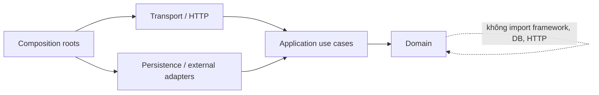

# Cấu trúc dự án đề xuất

## 1. Trạng thái

- Trạng thái: **Proposed — chờ review**.
- Đây là định hướng thư mục cho giai đoạn triển khai; **chưa tạo các thư mục/code này**.
- Không tìm thấy `AGENTS.md` trong repository tại thời điểm khảo sát. Nếu file đó được thêm sau này, quy ước trong `AGENTS.md` có ưu tiên và tài liệu này phải được cập nhật.

## 2. Hiện trạng repository

```text
src/
  App.tsx
  main.tsx
  index.css
  types.ts
  components/
    common/
      BottomNav.tsx
      Header.tsx
      SavedModal.tsx
    ai/
      AIChatTab.tsx
      AIGuide.tsx
      AIHero.tsx
      AIPage.tsx
      ChatComposer.tsx
      ChatHistorySidebar.tsx
      HotProjects.tsx
      MarketToday.tsx
      NewsSection.tsx
      PopularAreas.tsx
      PriceUpdate.tsx
      PropertyContextCard.tsx
      RiskSection.tsx
    market/
      AIComparisonModal.tsx
      AIEvaluationModal.tsx
      AdvancedFiltersModal.tsx
      ContactSaleModal.tsx
      MarketAISearch.tsx
      MarketFilters.tsx
      MarketPage.tsx
      MarketSearch.tsx              # orphan: không import; ứng viên xóa
      MarketTabs.tsx
      ProjectFilters.tsx
      ProjectView.tsx
      PropertyCard.tsx
      PropertyDetail.tsx
      PropertyGrid.tsx
      projects/
        BookingPreviewModal.tsx
        PrimaryUnitDetailModal.tsx
        ProjectCard.tsx
        ProjectDiscoverySections.tsx
        ProjectInventoryModal.tsx
        ProjectMapView.tsx
        ProjectPageModal.tsx
        ProjectSearchBar.tsx
    social/
      SocialAISearchBar.tsx
      SocialAISearchResults.tsx
      SocialCommentsModal.tsx
      SocialCreatePostModal.tsx
      SocialPage.tsx
      SocialPostCard.tsx
      SocialPostDetailModal.tsx
      SocialProfileModal.tsx
      SocialShareModal.tsx
  data/
    mockListings.ts
    mockNews.ts
    mockPriceData.ts
    mockPrimaryInventory.ts
    mockPrimaryProjects.ts
    mockProjects.ts
    mockSocialData.ts
  state/
    useAppState.tsx
```

Đánh giá:

- Cấu trúc phù hợp để làm mock UI, nhưng `useAppState.tsx` (~53KB) đang chứa nhiều domain state/action và logic giả lập.
- `src/types.ts` trộn type từ catalog, chat, market và social. `SocialFeedCategory` chứa các giá trị thừa không dùng trong UI (`FOR_YOU`, `PROJECT`, `PRICE`, `PLANNING`, `INFRASTRUCTURE`, `INVESTMENT`, `VIDEO`).
- `MarketSearch.tsx` không còn được import; `MarketPage.tsx` dùng `MarketAISearch.tsx`. File cũ cần được xóa hoặc đánh dấu deprecated.
- Dữ liệu mock và business behavior chạy cùng frontend, chưa có boundary/API contract.
- Chưa có router, test structure, migration, backend, OpenAPI hoặc infrastructure code.
- `market/projects/` chứa 8 component lớn (tổng ~132KB) cho luồng dự án sơ cấp, tồn kho và booking.
- Không nên thực hiện một lần "big-bang rewrite"; cần giữ UI chạy được và tách theo lát dọc.

## 3. Cấu trúc đích ở mức repository

```text
.
├── src/                              # Web React/Vite hiện tại
│   ├── app/                          # bootstrap, providers, router, route guards
│   ├── api/
│   │   ├── client/                   # HTTP/SSE client, auth/error handling
│   │   └── generated/                # sinh từ OpenAPI; không sửa tay
│   ├── components/                   # shared presentational components
│   ├── features/
│   │   ├── ai/
│   │   ├── market/
│   │   ├── projects/
│   │   ├── inventory/
│   │   ├── saved/
│   │   └── social/
│   ├── state/                        # chỉ client UI state dùng chung
│   └── test/
├── server/                           # Python FastAPI backend
│   ├── app/
│   │   ├── main.py                   # FastAPI application factory
│   │   ├── worker.py                 # background worker entry point
│   │   ├── config.py                 # pydantic Settings, env validation
│   │   ├── dependencies.py           # FastAPI Depends, DB session, auth
│   │   ├── shared/                   # primitives kỹ thuật dùng chung
│   │   ├── modules/
│   │   │   ├── identity/
│   │   │   ├── geography/
│   │   │   ├── catalog/
│   │   │   ├── listings/
│   │   │   ├── inventory/
│   │   │   ├── bookings/
│   │   │   ├── leads/
│   │   │   ├── saved/
│   │   │   ├── conversations/
│   │   │   ├── ai/
│   │   │   ├── social/
│   │   │   ├── moderation/
│   │   │   ├── market_content/
│   │   │   ├── media/
│   │   │   └── notifications/
│   │   └── platform/
│   │       ├── jobs/
│   │       ├── outbox/
│   │       ├── audit/
│   │       └── observability/
│   ├── tests/
│   │   ├── integration/
│   │   ├── contract/
│   │   └── fixtures/
│   ├── pyproject.toml                # dependencies, project metadata
│   └── alembic/                      # DB migration (Alembic)
│       ├── versions/
│       └── env.py
├── db/
│   ├── migrations/                   # immutable sau khi chạy production
│   ├── seeds/                        # chỉ reference/dev data; không chứa PII
│   └── README.md
├── contracts/
│   ├── openapi.yaml                  # source of truth API contract
│   ├── events/                       # JSON Schema cho event/outbox khi cần
│   └── examples/
├── infra/
│   ├── modules/                      # provider-specific sau OQ-043
│   ├── environments/
│   │   ├── dev/
│   │   ├── staging/
│   │   └── production/
│   └── README.md
├── scripts/                          # task automation nhỏ, có tài liệu
├── docs/                             # thiết kế/ADR/runbook
└── README.md
```

Backend dùng Python FastAPI với Pydantic (validation/serialization), SQLAlchemy (ORM/query), Alembic (migration). Test runner và các chi tiết khác được chọn khi implementation.

## 4. Cấu trúc chuẩn bên trong một backend module

```text
server/app/modules/bookings/
├── domain/
│   ├── models.py                     # entity/value/state transition thuần
│   ├── policies.py                   # invariant, không biết HTTP/DB
│   └── events.py
├── application/
│   ├── create_booking_request.py     # use case orchestration
│   ├── cancel_booking_request.py
│   ├── ports.py                      # repository/gateway interfaces (Protocol)
│   └── schemas.py                    # Pydantic request/response DTOs
├── transport/
│   └── router.py                     # FastAPI APIRouter, Depends, responses
├── adapters/
│   ├── persistence/                  # SQLAlchemy repositories
│   └── external/
├── __init__.py                       # public exports duy nhất
└── README.md                         # boundary, owner, invariants, events
```

Không phải module nào cũng cần đủ tất cả folder ngay từ đầu. Chỉ tạo folder khi có code thật; không tạo lớp/abstraction trống để “đúng mẫu”.

## 5. Quy tắc phụ thuộc



1. `domain/` không import FastAPI, SQLAlchemy, vendor SDK, environment hoặc module khác.
2. `application/` điều phối use case qua port; không chứa SQL/HTTP response object.
3. `transport/` parse/validate request, gọi use case và map error sang API contract.
4. `adapters/` hiện thực port; dependency được nối ở composition root.
5. Module khác chỉ import từ `module/__init__.py` hoặc event/schema công khai, không import file nội bộ.
6. Không dùng database table của module khác để cập nhật trực tiếp. Read projection/join chỉ được phép theo contract đã thống nhất; invariant vẫn thuộc owner module.
7. `shared/` chỉ chứa primitive kỹ thuật ổn định như Result/Error, clock, ID, transaction context; không trở thành “misc/utils”.

## 6. Boundary frontend

Mỗi `src/features/<feature>/` nên chứa:

```text
features/market/
├── api/                # query/mutation hooks và key factory
├── components/
├── routes/
├── model/              # view model/local types, không lặp API generated type tùy tiện
├── state/              # state chỉ thuộc feature
└── test/
```

Quy tắc:

- Server state (listing, project, conversation, post, saved) do query/cache layer quản lý; không copy vào global Context.
- Global state chỉ giữ theme, modal/overlay, current city nếu product coi là preference và auth/session facade.
- URL giữ state có thể chia sẻ: resource ID, tab, filter/sort/page khi OQ-051 được duyệt.
- API DTO được sinh từ `contracts/openapi.yaml`; mapper chuyển sang view model khi UI cần hình dạng khác.
- Feature không đọc trực tiếp mock production. Mock fixture chỉ dùng dev/test và khớp contract.
- Error/loading/empty/offline state là một phần của component contract, không phát sinh ngẫu nhiên ở từng màn hình.

## 7. Contract và generated code

- `contracts/openapi.yaml` là nguồn sự thật cho REST/SSE envelope ở mức mô tả được OpenAPI hỗ trợ.
- API implementation và frontend client đều được kiểm tra lệch contract trong CI.
- Generated code nằm trong `src/api/generated/`; FastAPI backend dùng Pydantic schemas làm contract và có thể sinh OpenAPI tự động. Các file generated có header và không chỉnh tay.
- Event schema có version, namespace và backward-compatibility rule.
- Ví dụ request/response đã duyệt nằm ở `contracts/examples/`; test contract sử dụng chính ví dụ này.
- Không đưa domain entity trực tiếp ra API; presenter tạo DTO ổn định.

## 8. Database migration và seed

- Mỗi migration có thứ tự, review và checksum; migration đã chạy production không sửa lại.
- Thay đổi phá vỡ dùng quy trình `expand → backfill → switch → contract`.
- Backfill dài chạy bằng job có checkpoint, không giữ transaction lớn trong deployment.
- Seed chỉ gồm reference/dev demo data không nhạy cảm; dữ liệu mock hiện tại phải qua data-quality review trước khi dùng.
- Migration/schema check chạy trong CI; deploy app chỉ sau bước migration tương thích ngược thành công.
- Rollback ưu tiên rollback ứng dụng/feature flag; database migration phá hủy cần kế hoạch riêng và backup xác minh.

## 9. Tests đề xuất

| Lớp | Vị trí | Mục đích |
|---|---|---|
| Unit | gần domain/use case hoặc `test/unit` theo convention được chọn | Invariant, state machine, formatter/parser |
| Integration | `server/test/integration` | Repository, transaction, row lock, outbox, migration |
| Contract | `server/tests/contract` + OpenAPI | Request/response/error, webhook signature, generated client |
| AI eval | fixture/version dưới module AI, dữ liệu đã ẩn danh | Retrieval, citation, safety, structured extraction |
| Frontend component | gần feature | Loading/error/empty/accessibility và mutation state |
| E2E | thư mục được chọn ở implementation planning | Luồng search, saved, lead, booking conflict, chat, post/comment |

Không chốt framework test trong giai đoạn thiết kế.

## 10. Configuration và secrets

- Parse/validate environment một lần ở startup; fail fast nếu cấu hình bắt buộc thiếu.
- Tách config theo service/env nhưng không commit secret.
- Tên biến môi trường có namespace theo dịch vụ; không dùng config ngầm từ frontend cho backend.
- Public frontend config chỉ chứa giá trị an toàn công khai; model key, webhook secret, DB credential luôn ở server secret manager.
- Feature flags có owner, expiry date và default an toàn; không dùng flag để thay authorization.

## 11. Naming và conventions

- Source code identifier tiếng Anh; tài liệu/product copy có thể tiếng Việt.
- Database: `snake_case`, bảng số nhiều, khóa UUID `<entity>_id`, timestamp `*_at`.
- API: resource danh từ số nhiều, `kebab-case` chỉ khi cần; JSON `camelCase`.
- Event: `<bounded_context>.<entity>.<past_tense_action>.v1`, ví dụ `bookings.hold.created.v1`.
- Money: hậu tố `...AmountVnd`; không dùng số “giá” không kèm đơn vị.
- Time: `timestamptz`/RFC3339 UTC; trường display string không làm nguồn dữ liệu.
- ID đối tác lưu riêng `external_id`, `source_id`; không dùng thay canonical UUID.

## 12. Lộ trình chuyển đổi đề xuất sau khi duyệt

Lộ trình này chỉ là thứ tự giảm rủi ro, chưa phải authorization để viết code:

1. Chốt P0, OpenAPI conventions và schema nền tảng.
2. Dựng identity/data source boundary và catalog read-only.
3. Chuyển listing/project/unit read/search từ mock sang API theo lát dọc.
4. Thêm saved/interests và lead với auth/idempotency/audit.
5. Thêm conversation + AI read-only tools/citation/eval.
6. Chỉ bật booking/hold sau khi state/source/transaction được duyệt và test concurrency.
7. Chỉ bật social mutation sau khi permission/moderation/reporting policy được duyệt.
8. Xóa mock/localStorage production path sau migration và telemetry xác nhận ổn định.

## 13. Checklist review cấu trúc

- [ ] Team thống nhất giữ một repository hay tách frontend/backend.
- [ ] Python FastAPI stack (SQLAlchemy, Alembic, Pydantic) được setup và benchmark.
- [ ] Module owners và public contracts được duyệt.
- [ ] OpenAPI/code generation workflow được duyệt.
- [ ] Migration/seed/test conventions phù hợp CI/CD dự kiến.
- [ ] Router/deep link và auth strategy đã trả lời.
- [ ] Không có folder/service được tạo chỉ để dự đoán nhu cầu chưa xác nhận.

