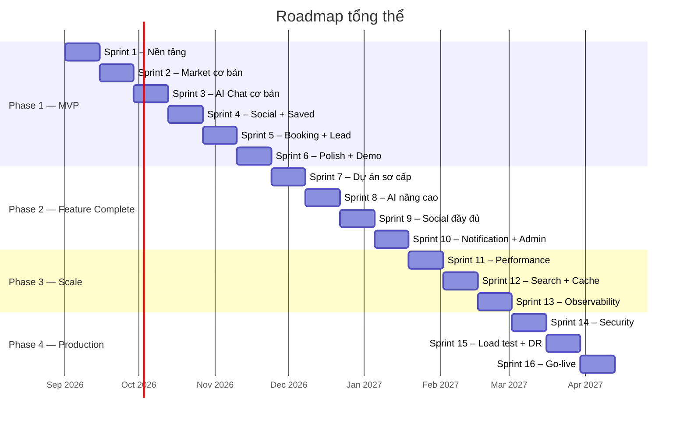

# Kế hoạch Sprint — BĐS AI Platform

## Tổng quan chiến lược

| Phase | Sprint | Mục tiêu | Thời gian |
|---|---|---|---|
| **1 — MVP** | 1–6 | App chạy được end-to-end, đủ để demo cho investor/stakeholder | 12 tuần |
| **2 — Feature Complete** | 7–10 | Đầy đủ tính năng cho user thật: dự án sơ cấp, AI nâng cao, social, admin | 8 tuần |
| **3 — Scale** | 11–13 | Tối ưu hiệu năng, cache, search, giám sát — sẵn sàng cho 100K+ user | 6 tuần |
| **4 — Production** | 14–16 | Bảo mật, load test, DR, go-live — phục vụ 1M user | 6 tuần |

**Tổng: ~32 tuần (~8 tháng)**

> **Lưu ý**: Sprint plan này giả định team 2-3 backend dev + 1 frontend dev. Nếu team lớn hơn, có thể chạy song song và rút ngắn.

---

# Phase 1 — MVP (Sprint 1–6)

> **Mục tiêu**: App chạy end-to-end, có thể demo. Chấp nhận giới hạn: 1 thành phố, không scale, UI sửa tối thiểu.

---

## Sprint 1 — Tái cấu trúc dự án & Nền tảng backend (2 tuần)

> **Mục tiêu**: Chuẩn hóa Monorepo, dựng FastAPI skeleton, PostgreSQL + Alembic, Auth Mock OTP, Geography API và kết nối Frontend.

### 📋 Danh sách 10 Tasks Chi tiết (Chuẩn Enterprise)

#### 🔹 [Task 1.0] [Architecture] Restructure & Format Project Structure chuẩn Enterprise Monorepo
- **Ước lượng**: 6h | **Priority**: P0 - Blocker | **Labels**: `architecture`, `sprint-1`
- **📥 Đầu vào**: `docs/project-structure.md`, codebase flat ban đầu.
- **🛠️ Chi tiết công việc**:
  1. Gom toàn bộ Frontend vào `client/` (`src/`, `package.json`, `vite.config.ts`, `node_modules/`...).
  2. Dọn dẹp file orphan `MarketSearch.tsx`.
  3. Module hóa `client/src/` theo features: `ai`, `market`, `projects`, `social`, `saved`, `api`, `components/common`.
  4. Khởi tạo khung Backend `server/app/modules/` (12 domains), `server/tests/`, `server/alembic/`.
  5. Tạo root `Makefile`, `docker-compose.yml`, `.gitignore`, `.editorconfig`, `README.md`.
- **📤 Đầu ra**: Cấu trúc Monorepo độc lập `client/` và `server/`.
- **✅ Tiêu chí nghiệm thu**: `npm --prefix client run build` pass 100%, dev server chạy mượt mà tại `http://localhost:3000/`.

---

#### 🔹 [Task 1.1] [BE] Setup FastAPI Application Factory, Config & Health Endpoints
- **Ước lượng**: 2h | **Priority**: P0 - Blocker | **Labels**: `backend`, `sprint-1`
- **📥 Đầu vào**: `docs/system-architecture.md`, `server/.env.example`.
- **🛠️ Chi tiết công việc**:
  1. Tạo `server/app/config.py` dùng Pydantic `BaseSettings` nạp `DATABASE_URL`, `ENV`, `SECRET_KEY`, `CORS_ORIGINS`.
  2. Tạo `server/app/main.py` với app factory `create_app()`, cấu hình `CORSMiddleware`.
  3. Xây dựng endpoints: `GET /health` (liveness) và `GET /ready` (readiness).
- **📤 Đầu ra**: `server/app/config.py`, `server/app/main.py`.
- **✅ Tiêu chí nghiệm thu**: `curl -s http://localhost:8000/health` trả HTTP 200 `{"status": "ok"}`; Swagger UI mở được tại `http://localhost:8000/docs`.

---

#### 🔹 [Task 1.2] [BE] Setup PostgreSQL 16, Async SQLAlchemy 2.0 & Alembic Migrations
- **Ước lượng**: 4h | **Priority**: P0 - Blocker | **Labels**: `backend`, `devops`, `sprint-1`
- **📥 Đầu vào**: `docs/database-design.md`, `docker-compose.yml` (service Postgres).
- **🛠️ Chi tiết công việc**:
  1. Tạo `server/app/shared/database.py` cấu hình `create_async_engine`, `async_sessionmaker` và `Base(DeclarativeBase)`.
  2. Khởi tạo `server/alembic/` với template async, cấu hình `env.py` trỏ vào `Base.metadata`.
  3. Tạo initial migration.
- **📤 Đầu ra**: `server/app/shared/database.py`, `server/alembic/`.
- **✅ Tiêu chí nghiệm thu**: `docker compose up -d postgres` chạy OK; `alembic upgrade head` áp dụng migration không lỗi.

---

#### 🔹 [Task 1.3] [BE] Module Identity: Phone OTP Mock & JWT Token Authentication
- **Ước lượng**: 8h | **Priority**: P1 - High | **Labels**: `backend`, `sprint-1`
- **📥 Đầu vào**: `docs/api-design.md` (Mục 4: Auth), bảng `users`.
- **🛠️ Chi tiết công việc**:
  1. Tạo model `User` trong `server/app/modules/identity/domain/models.py`.
  2. DTOs: `RequestOTPRequest`, `VerifyOTPRequest`, `AuthTokenResponse`.
  3. Router: `POST /api/v1/auth/request-otp`, `POST /api/v1/auth/verify-otp` (OTP `123456`), `GET /api/v1/auth/me`.
  4. Dependency: `get_current_user` giải mã JWT Bearer token.
- **📤 Đầu ra**: Module `server/app/modules/identity/` hoàn chỉnh.
- **✅ Tiêu chí nghiệm thu**: Gửi SĐT -> nhận OTP -> xác thực OTP `123456` sinh JWT token; `GET /auth/me` kèm token trả đúng profile user.

---

#### 🔹 [Task 1.4] [BE] Module Geography: Schema, Seed 30 Quận/Huyện Hà Nội & REST Endpoints
- **Ước lượng**: 4h | **Priority**: P0 - Blocker | **Labels**: `backend`, `sprint-1`
- **📥 Đầu vào**: `docs/database-design.md`, dữ liệu `HANOI_DISTRICTS`.
- **🛠️ Chi tiết công việc**:
  1. Thiết kế bảng `cities` và `districts`.
  2. Viết script seed 30 quận/huyện Hà Nội.
  3. Endpoints: `GET /api/v1/cities`, `GET /api/v1/cities/{id}/districts`.
- **📤 Đầu ra**: Module `server/app/modules/geography/` & script seed.
- **✅ Tiêu chí nghiệm thu**: `curl -s http://localhost:8000/api/v1/cities/HN/districts` trả về đúng 30 quận/huyện Hà Nội từ DB.

---

#### 🔹 [Task 1.5] [BE] API Conventions: Error Envelope, Cursor Pagination & CORS
- **Ước lượng**: 4h | **Priority**: P1 - High | **Labels**: `backend`, `sprint-1`
- **📥 Đầu vào**: `docs/api-design.md` (Mục 2 & 3).
- **🛠️ Chi tiết công việc**:
  1. Error Envelope: format `{"error": {"code": "...", "message": "...", "details": [...]}}`.
  2. Global exception handlers cho Validation, NotFound, Conflict.
  3. Helper cursor pagination mã hóa Base64: `encode_cursor`, `decode_cursor`.
  4. Middleware Request ID (`X-Request-ID`).
- **📤 Đầu ra**: `server/app/shared/errors.py`, `server/app/shared/pagination.py`.
- **✅ Tiêu chí nghiệm thu**: Request sai trả về format Error Envelope chuẩn HTTP 422; Unit test helper pagination pass 100%.

---

#### 🔹 [Task 1.6] [DevOps] CI Pipeline cơ bản với GitHub Actions
- **Ước lượng**: 4h | **Priority**: P1 - High | **Labels**: `devops`, `sprint-1`
- **📥 Đầu vào**: `docs/infrastructure.md` (Mục 9).
- **🛠️ Chi tiết công việc**:
  1. Tạo workflow `.github/workflows/ci.yml`.
  2. Backend: `ruff check .`, `mypy app`, `pytest`.
  3. Frontend: `npm ci`, `npx tsc --noEmit`, `npm run build`.
- **📤 Đầu ra**: `.github/workflows/ci.yml`.
- **✅ Tiêu chí nghiệm thu**: PR lên GitHub tự động kích hoạt workflow và chuyển trạng thái ✅ PASS.

---

#### 🔹 [Task 1.7] [FE] Setup API Client Architecture: Axios Instance & JWT Interceptors
- **Ước lượng**: 4h | **Priority**: P0 - Blocker | **Labels**: `frontend`, `sprint-1`
- **📥 Đầu vào**: `docs/api-design.md`, `client/.env.example`.
- **🛠️ Chi tiết công việc**:
  1. Cài đặt `axios` trong `client/`.
  2. Tạo `client/src/api/client.ts`: Request interceptor gắn Bearer token, Response interceptor bắt lỗi 401 & chuẩn hóa error.
  3. Viết API services: `client/src/api/auth.ts`, `client/src/api/geography.ts`.
  4. Nối `MarketFilters.tsx` gọi API load quận/huyện từ Backend.
- **📤 Đầu ra**: `client/src/api/client.ts`, services và `MarketFilters.tsx` kết nối API thật.
- **✅ Tiêu chí nghiệm thu**: Bộ lọc quận/huyện trên UI gọi `GET /api/v1/cities/HN/districts` trả về 200 và render đủ 30 quận/huyện.

---

#### 🔹 [Task 1.8] [FE] Màn hình đăng nhập Auth Flow: Phone Input -> OTP -> State Persistence
- **Ước lượng**: 4h | **Priority**: P1 - High | **Labels**: `frontend`, `sprint-1`
- **📥 Đầu vào**: Backend Auth API (Task 1.3), API client (Task 1.7).
- **🛠️ Chi tiết công việc**:
  1. Tạo `client/src/features/identity/AuthModal.tsx` 2 bước: Nhập SĐT -> Nhập OTP `123456`.
  2. Lưu `token` vào state và `localStorage`.
  3. Cập nhật Header: Nút đăng nhập -> Avatar/Tên user khi đã auth.
- **📤 Đầu ra**: Component `AuthModal.tsx`, trạng thái profile trên Header.
- **✅ Tiêu chí nghiệm thu**: Nhập SĐT -> nhập OTP 123456 -> Đăng nhập thành công; F5 lại trang vẫn duy trì trạng thái đăng nhập.

---

#### 🔹 [Task 1.9] [FE] Tích hợp React Router DOM & URL-based Deep Linking Navigation
- **Ước lượng**: 6h | **Priority**: P1 - High | **Labels**: `frontend`, `sprint-1`
- **📥 Đầu vào**: `docs/requirements.md`, `client/src/App.tsx`, `BottomNav.tsx`.
- **🛠️ Chi tiết công việc**:
  1. Cài `react-router-dom`.
  2. Cấu hình routes: `/ai`, `/market`, `/social`, `/saved`.
  3. Cập nhật `BottomNav.tsx` và Header dùng `NavLink` / `useNavigate`.
- **📤 Đầu ra**: Router hoàn chỉnh trong `client/src/App.tsx`.
- **✅ Tiêu chí nghiệm thu**: Truy cập trực tiếp `http://localhost:3000/market` mở đúng tab Thị trường; F5 không bị reset về trang chủ.

---

### 🎯 Deliverables Tổng kết Sprint 1
- [x] **Task 1.0**: Cấu trúc Monorepo chuẩn Enterprise (`client/`, `server/`, `Makefile`, `docker-compose.yml`)
- [ ] **Task 1.1**: FastAPI App Factory, Config & Health endpoints chạy OK
- [ ] **Task 1.2**: PostgreSQL 16 + Alembic migration chạy trơn tru
- [ ] **Task 1.3**: Đăng nhập bằng SĐT (Mock OTP `123456`) -> Cấp phát JWT token
- [ ] **Task 1.4**: API Geography nạp đủ 30 quận/huyện Hà Nội từ DB
- [ ] **Task 1.5**: Error Envelope, Cursor Pagination helper & CORS chuẩn
- [ ] **Task 1.6**: CI Pipeline GitHub Actions tự động kiểm tra code
- [ ] **Task 1.7**: Frontend API client kết nối Backend thật
- [ ] **Task 1.8**: Giao diện đăng nhập Auth flow hoàn chỉnh
- [ ] **Task 1.9**: React Router DOM điều hướng URL mượt mà

---

## Sprint 2 — Market cơ bản (2 tuần)

> Listing search, filter, detail — thay hoàn toàn mock data bằng API thật.

### Backend Tasks

| # | Task | Chi tiết | Ước lượng |
|---|---|---|---|
| 2.1 | **Listings schema** | Bảng `listings`: id, title, price_amount_vnd, area_sqm, bedrooms, bathrooms, property_type, transaction_kind, district_id, city_id, address, images (jsonb), description, created_at, updated_at | 4h |
| 2.2 | **Seed listings data** | Script chuyển `mockListings.ts` → SQL seed. Chuyển đổi giá (tỷ → VND integer), type (tiếng Việt → code) | 6h |
| 2.3 | **GET /listings** | Filter: city, district, price_min/max, area_min/max, bedrooms, property_type, transaction_kind. Cursor pagination. Sort: price, area, created_at | 8h |
| 2.4 | **GET /listings/{id}** | Detail response với tất cả fields + ảnh | 2h |
| 2.5 | **Full-text search** | PostgreSQL `tsvector` trên title + address + description. `GET /listings?q=căn hộ 2 phòng ngủ Tây Hồ` | 6h |
| 2.6 | **Saved items** | Bảng `saved_items` (user_id, resource_kind, resource_id). `PUT/DELETE /me/saved-items/listing/{id}`, `GET /me/saved-items` | 4h |

### Frontend Tasks

| # | Task | Chi tiết | Ước lượng |
|---|---|---|---|
| 2.7 | **Kết nối MarketPage với API** | Thay mock data → API call. MarketFilters gửi query params, PropertyGrid render từ API response | 8h |
| 2.8 | **PropertyDetail từ API** | Load detail từ `GET /listings/{id}` thay mock | 4h |
| 2.9 | **Saved items UI** | SavedModal load từ API. Nút lưu gọi API thật | 4h |
| 2.10 | **Infinite scroll** | PropertyGrid load thêm listings khi cuộn xuống (cursor pagination) | 4h |

### Deliverables Sprint 2
- [ ] Tìm kiếm listing bằng text + filter chạy end-to-end
- [ ] Chi tiết listing load từ API
- [ ] Lưu listing hoạt động
- [ ] Pagination hoạt động (cuộn → load thêm)
- [ ] Mock data listing đã chuyển hết vào DB

---

## Sprint 3 — AI Chat cơ bản (2 tuần)

> Chat với AI về bất động sản, AI search, streaming response.

### Backend Tasks

| # | Task | Chi tiết | Ước lượng |
|---|---|---|---|
| 3.1 | **LLM adapter** | `ModelGateway` class, wrapper Gemini/OpenAI API. Config model per use case. Timeout, retry, cost tracking | 8h |
| 3.2 | **Conversations schema** | Bảng `conversations`, `messages`. `POST /conversations`, `GET /conversations`, `GET /conversations/{id}/messages` | 4h |
| 3.3 | **Chat endpoint + SSE** | `POST /conversations/{id}/messages` → tạo AI run → stream response qua SSE. Lưu message vào DB | 12h |
| 3.4 | **NL Search tool** | AI phân tích câu hỏi → trích xuất filter → query listings DB → trả kết quả có citation | 8h |
| 3.5 | **System prompt + safety** | Prompt template: context BĐS Việt Nam, giới hạn trả lời trong phạm vi, disclaimer pháp lý/tài chính | 4h |

### Frontend Tasks

| # | Task | Chi tiết | Ước lượng |
|---|---|---|---|
| 3.6 | **Chat UI kết nối API** | AIChatTab gửi message → nhận SSE stream → hiển thị từng token. Lưu conversation history | 8h |
| 3.7 | **Chat history** | ChatHistorySidebar load từ API thật | 4h |
| 3.8 | **AI search trên Market** | MarketAISearch gọi NL search endpoint, hiển thị kết quả listing | 4h |

### Deliverables Sprint 3
- [ ] Chat với AI về BĐS, response streaming
- [ ] AI hiểu "tìm căn hộ 2PN dưới 3 tỷ ở Cầu Giấy" → trả kết quả thật
- [ ] Lịch sử hội thoại lưu và load lại được
- [ ] Disclaimer pháp lý/tài chính hiển thị

---

## Sprint 4 — Social + Saved (2 tuần)

> Bảng tin cộng đồng, xem bài, bình luận, lưu.

### Backend Tasks

| # | Task | Chi tiết | Ước lượng |
|---|---|---|---|
| 4.1 | **Social schema** | Bảng `author_profiles`, `social_posts`, `comments`, `reactions`, `follows`. Seed mock social data | 8h |
| 4.2 | **Feed API** | `GET /social/posts` với filter: category, author, following. Cursor pagination. Sort: newest, trending | 6h |
| 4.3 | **Post detail + comments** | `GET /social/posts/{id}`, `GET /social/posts/{id}/comments`, `POST /social/posts/{id}/comments` | 6h |
| 4.4 | **Reactions + Follow** | `POST /social/posts/{id}/reactions`, `PUT/DELETE /social/authors/{id}/follow` | 4h |
| 4.5 | **Saved items mở rộng** | Thêm saved cho social post (đã có API generic từ Sprint 2) | 2h |

### Frontend Tasks

| # | Task | Chi tiết | Ước lượng |
|---|---|---|---|
| 4.6 | **SocialPage kết nối API** | Thay mock data → API. Feed, filter tabs, infinite scroll | 8h |
| 4.7 | **Post detail + comments** | SocialPostDetailModal, SocialCommentsModal load từ API | 4h |
| 4.8 | **React/follow/save** | Nút like/follow/save gọi API thật | 4h |

### Deliverables Sprint 4
- [ ] Feed cộng đồng load từ API, filter theo topic
- [ ] Xem chi tiết bài viết, bình luận
- [ ] Like, follow, save hoạt động
- [ ] Mock social data đã chuyển vào DB

---

## Sprint 5 — Booking + Lead (2 tuần)

> Liên hệ tư vấn, booking/giữ chỗ cơ bản.

### Backend Tasks

| # | Task | Chi tiết | Ước lượng |
|---|---|---|---|
| 5.1 | **Projects schema** | Bảng `projects`, `phases`, `buildings`. Seed mock project data. `GET /projects`, `GET /projects/{id}` | 6h |
| 5.2 | **Consultation request** | Bảng `consultation_requests`. `POST /consultation-requests`. Idempotency-Key | 6h |
| 5.3 | **Booking preview** | `POST /booking-preview` → trả thông tin căn + giá + điều khoản. Không giữ chỗ thật ở MVP | 4h |
| 5.4 | **Contact sale** | `POST /contact-requests` → ghi lead vào DB, trả confirmation | 4h |
| 5.5 | **Rate limiting** | Giới hạn: 5 consultation/user/ngày, 10 AI messages/user/giờ | 4h |

### Frontend Tasks

| # | Task | Chi tiết | Ước lượng |
|---|---|---|---|
| 5.6 | **ContactSaleModal kết nối API** | Form gửi API thật, hiển thị confirmation | 4h |
| 5.7 | **BookingPreviewModal kết nối API** | Gọi booking preview, hiển thị thông tin | 4h |
| 5.8 | **ProjectView kết nối API** | Load project detail từ API | 4h |

### Deliverables Sprint 5
- [ ] Gửi yêu cầu tư vấn (lead) hoạt động end-to-end
- [ ] Booking preview hiển thị thông tin căn
- [ ] Project detail load từ API
- [ ] Rate limiting hoạt động

---

## Sprint 6 — Polish + Demo (2 tuần)

> Fix bugs, UI polish, deploy staging, chuẩn bị demo.

| # | Task | Ước lượng |
|---|---|---|
| 6.1 | **Deploy staging** — Docker Compose production-like. Domain + HTTPS | 8h |
| 6.2 | **Seed realistic data** — 200+ listings, 50+ bài viết, 10+ dự án | 6h |
| 6.3 | **Error states** — Loading skeleton, empty state, error retry | 8h |
| 6.4 | **Mobile responsive** — Kiểm tra và fix responsive trên mobile | 6h |
| 6.5 | **Performance quick wins** — Image lazy loading, gzip, query optimization | 4h |
| 6.6 | **Demo script** — Kịch bản demo end-to-end | 4h |
| 6.7 | **Bug fixing** — Buffer cho bug fix | 8h |

### 🎯 MVP Milestone
- [ ] App chạy trên staging, có domain thật
- [ ] Demo flow: search → AI → detail → contact → social
- [ ] 200+ listings, 50+ bài viết thật
- [ ] Mobile responsive
- [ ] Có thể gửi link demo

---

# Phase 2 — Feature Complete (Sprint 7–10)

## Sprint 7 — Dự án sơ cấp (2 tuần)

| # | Task | Ước lượng |
|---|---|---|
| 7.1 | **Inventory schema** — Bảng `units` với trạng thái, giá, tầng, diện tích, hướng | 6h |
| 7.2 | **Unit API** — `GET /projects/{id}/inventory`, filter | 6h |
| 7.3 | **Hold/booking thật** — Row lock + unique index, TTL 24h + job hết hạn | 12h |
| 7.4 | **Booking state machine** — available → held → booked → sold | 8h |
| 7.5 | **Frontend: ProjectInventoryModal** — Kết nối API | 8h |
| 7.6 | **Frontend: Booking upgrade** — Giữ chỗ thật, countdown TTL | 4h |

## Sprint 8 — AI nâng cao (2 tuần)

| # | Task | Ước lượng |
|---|---|---|
| 8.1 | **AI Evaluation** — Đánh giá listing theo 5 tiêu chí, score + citation | 12h |
| 8.2 | **AI Comparison** — So sánh 2-3 listings, bảng so sánh | 8h |
| 8.3 | **Trust tier** — Tag dữ liệu T1-T4, hiển thị nguồn | 6h |
| 8.4 | **AI tools mở rộng** — price_history, area_stats, risk_assessment | 8h |
| 8.5 | **Frontend: AI modals** — Evaluation + Comparison kết nối API | 10h |

## Sprint 9 — Social đầy đủ (2 tuần)

| # | Task | Ước lượng |
|---|---|---|
| 9.1 | **Tạo bài viết** — Upload ảnh (signed URL → object storage) | 10h |
| 9.2 | **Media pipeline** — Virus scan, image resize, CDN serve | 8h |
| 9.3 | **Comment threading** — Reply 1 cấp, edit, delete, report | 6h |
| 9.4 | **Moderation cơ bản** — Report, admin review, auto-flag | 6h |
| 9.5 | **Social AI search** — Tìm bài bằng ngôn ngữ tự nhiên | 6h |
| 9.6 | **Frontend: Create post + AI search** — Kết nối API | 10h |

## Sprint 10 — Notification + Admin (2 tuần)

| # | Task | Ước lượng |
|---|---|---|
| 10.1 | **Notification system** — DB + trigger: comment, booking, lead | 8h |
| 10.2 | **Background worker** — Celery/arq: notification, hold expiry | 8h |
| 10.3 | **Admin API** — Leads, bookings, reports | 8h |
| 10.4 | **Admin dashboard UI** — Trang admin đơn giản | 10h |
| 10.5 | **Email notification** — SendGrid/SES | 4h |
| 10.6 | **Frontend: Notification bell** | 4h |

---

# Phase 3 — Scale (Sprint 11–13)

## Sprint 11 — Performance (2 tuần)

| # | Task | Ước lượng |
|---|---|---|
| 11.1 | **Redis cache** — Listing detail, geography, feed | 8h |
| 11.2 | **DB optimization** — Slow queries, index, N+1, connection pool | 8h |
| 11.3 | **CDN setup** — Static + media, image optimization | 6h |
| 11.4 | **API optimization** — Sparse fields, gzip, ETag | 6h |
| 11.5 | **Frontend performance** — Code splitting, lazy load, virtual scroll | 8h |
| 11.6 | **Benchmark** — k6 load test 1000 concurrent | 6h |

## Sprint 12 — Search + AI Scale (2 tuần)

| # | Task | Ước lượng |
|---|---|---|
| 12.1 | **Search engine** — Elasticsearch/Meilisearch cho listings | 12h |
| 12.2 | **pgvector** — Embedding + semantic search | 10h |
| 12.3 | **AI cost optimization** — Model routing, caching | 8h |
| 12.4 | **Search analytics** — Log queries, zero-results, CTR | 6h |
| 12.5 | **Rate limiting nâng cao** — Sliding window, separate limits | 4h |

## Sprint 13 — Observability (2 tuần)

| # | Task | Ước lượng |
|---|---|---|
| 13.1 | **Structured logging** — JSON, trace ID, PII redaction | 6h |
| 13.2 | **Metrics + dashboards** — Prometheus + Grafana | 8h |
| 13.3 | **Distributed tracing** — OpenTelemetry + Jaeger | 6h |
| 13.4 | **Alerting** — Error rate, latency, DB, AI cost | 4h |
| 13.5 | **Health checks** — Deep check: DB, Redis, LLM | 4h |
| 13.6 | **Error tracking** — Sentry backend + frontend | 4h |
| 13.7 | **AI eval pipeline** — Automated quality checks on deploy | 8h |

---

# Phase 4 — Production (Sprint 14–16)

## Sprint 14 — Security (2 tuần)

| # | Task | Ước lượng |
|---|---|---|
| 14.1 | **Auth production** — Firebase Auth/Auth0, OTP thật, refresh token | 12h |
| 14.2 | **RBAC** — user/creator/moderator/admin, permission middleware | 8h |
| 14.3 | **Input validation** — XSS, SQL injection, prompt injection | 6h |
| 14.4 | **PII protection** — Encrypt at rest, redact from logs, data export/delete | 6h |
| 14.5 | **WAF + DDoS** — Cloudflare WAF, bot detection | 4h |
| 14.6 | **Security audit** — OWASP top 10, dependency scan, secret rotation | 6h |

## Sprint 15 — Load Test + DR (2 tuần)

| # | Task | Ước lượng |
|---|---|---|
| 15.1 | **Load test 1M** — 10K concurrent, 1K RPS search, 500 AI streams | 10h |
| 15.2 | **Horizontal scaling** — K8s/ECS autoscaling API + worker | 8h |
| 15.3 | **DB scaling** — Read replica, PgBouncer, partition | 8h |
| 15.4 | **Backup + restore test** — Daily backup, PITR test | 4h |
| 15.5 | **DR runbook** — Document + diễn tập | 6h |
| 15.6 | **Feature flags + kill switch** | 4h |

## Sprint 16 — Go-live (2 tuần)

| # | Task | Ước lượng |
|---|---|---|
| 16.1 | **Production environment** — Cloud setup, managed services | 10h |
| 16.2 | **CI/CD production** — Blue-green/canary deploy | 8h |
| 16.3 | **Domain + SSL** | 2h |
| 16.4 | **Data migration** — Real data import, quality checks, thêm TP.HCM | 8h |
| 16.5 | **Monitoring production** — Dashboards, alerts, on-call | 6h |
| 16.6 | **Soft launch** — 100 beta users, monitor, fix | 8h |

### 🚀 Go-live Checklist
- [ ] Load test pass: 10K concurrent, p99 < 500ms
- [ ] Security audit pass
- [ ] Auth production (OTP thật)
- [ ] Backup/restore test thành công
- [ ] Monitoring + alerts hoạt động
- [ ] DR runbook đã diễn tập
- [ ] Beta test 100 users OK
- [ ] Kill switch hoạt động

---

# Resource & Cost

## Team đề xuất

| Role | Số người | Ghi chú |
|---|---|---|
| Backend Developer | 2–3 | Python FastAPI, PostgreSQL, AI |
| Frontend Developer | 1–2 | React, TypeScript |
| DevOps/Platform | 0.5–1 | Phase 3–4 cần nhiều hơn |
| Product/Design | 1 | Review, quyết định OQ |
| QA | 0.5–1 | Manual → automation |

## Cost ước lượng

| Hạng mục | MVP | Production (1M user) |
|---|---|---|
| Cloud | $50–100/tháng | $500–2000/tháng |
| AI (LLM) | $50–100/tháng | $500–3000/tháng |
| CDN + media | $10/tháng | $100–500/tháng |
| Monitoring | Free tier | $100–500/tháng |
| Auth | Free tier | $100–300/tháng |
| **Tổng** | **~$150/tháng** | **~$1500–6000/tháng** |

---

# Quyết định cần có trước Sprint 1

| # | Câu hỏi | Đề xuất MVP |
|---|---|---|
| 1 | **Cloud provider?** | GCP (Cloud Run + Cloud SQL) hoặc AWS (ECS + RDS) |
| 2 | **LLM provider?** | Gemini + OpenAI fallback |
| 3 | **Auth provider?** | Firebase Auth (phone OTP built-in) |
| 4 | **MVP scope?** | Cả 3 tab, giới hạn tính năng |
| 5 | **Booking = preview hay thật?** | Preview ở MVP, thật ở Phase 2 |
