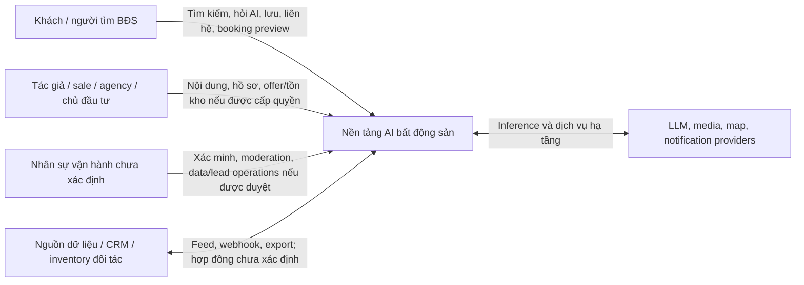
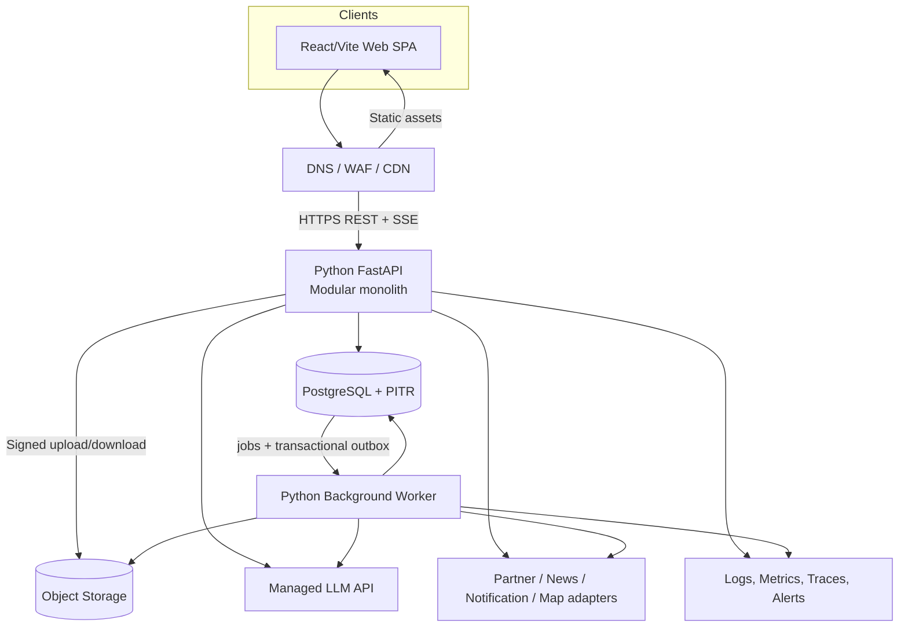
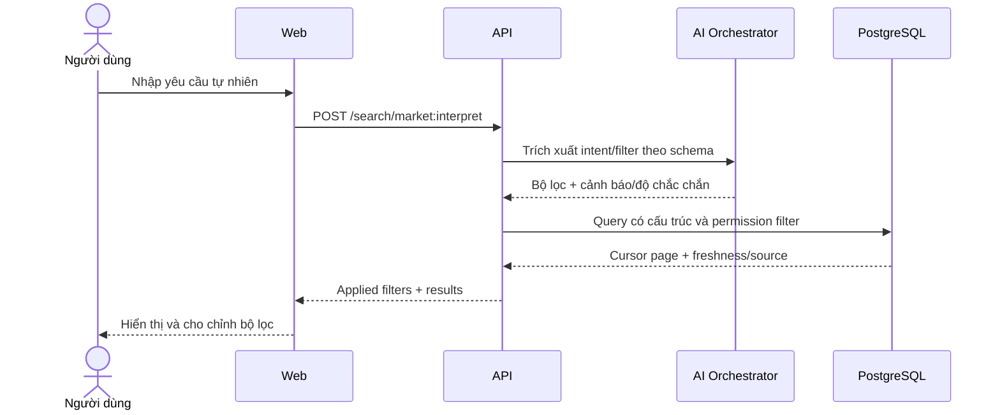
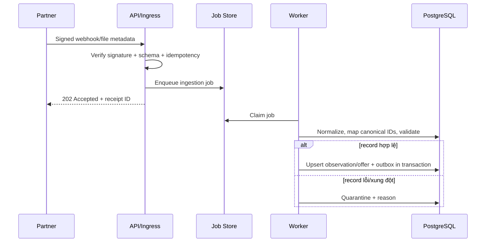

# Kiến trúc hệ thống

## 1. Trạng thái và mục tiêu

- Trạng thái: **Proposed — chờ review**.
- Mục tiêu: hiện thực hóa các luồng trong [requirements.md](./requirements.md) bằng kiến trúc đơn giản, an toàn cho dữ liệu bất động sản và có đường mở rộng khi có số đo.
- Ràng buộc hiện tại: frontend là React/Vite SPA; chưa có backend, auth, nguồn production hoặc chỉ tiêu quy mô được xác nhận.
- Không có application code nào được tạo từ tài liệu này trước khi thiết kế được duyệt.

## 2. Nguyên tắc kiến trúc

1. **Modular monolith trước microservice**: một API deployable với module boundaries rõ ràng giúp transaction và vận hành đơn giản trong giai đoạn chưa biết tải.
2. **PostgreSQL là nguồn sự thật** cho dữ liệu nghiệp vụ; cache/search index không được quyết định trạng thái căn hoặc booking.
3. **Tách xử lý bất đồng bộ**: một worker riêng thực hiện ingestion, media, moderation, AI batch và notification.
4. **REST cho nghiệp vụ, SSE cho chat AI**: tránh thêm WebSocket khi UI chưa có yêu cầu hai chiều realtime.
5. **Nguồn và thời điểm là dữ liệu hạng nhất**: giá, tồn kho, pháp lý, tin tức và câu trả lời AI phải truy vết được.
6. **AI không có quyền ghi nghiệp vụ**: tool của LLM chỉ đọc; mutation đi qua API chuyên biệt, authorization, validation và audit.
7. **Không tối ưu sớm**: dùng PostgreSQL filtering/full-text, CDN và HTTP cache; chỉ thêm Redis/search cluster/vector khi có bằng chứng.
8. **Provider-neutral tại ranh giới**: LLM, map, notification, storage và feed đối tác nằm sau adapter.

## 3. Sơ đồ ngữ cảnh



Các actor, tích hợp và quyền cụ thể chờ OQ-002, OQ-004, OQ-008, OQ-020, OQ-036 và OQ-047.

## 4. Kiến trúc container



### 4.1 Web SPA

- Giữ frontend React/Vite hiện tại trong giai đoạn chuyển đổi.
- Thay dần mock/localStorage bằng typed API client (sinh từ OpenAPI) và server state.
- Thêm router/deep link sau khi OQ-051 được duyệt.
- Local UI state vẫn ở client; dữ liệu chia sẻ/đa thiết bị phải ở backend.
- Không lưu token dài hạn hoặc PII hội thoại trực tiếp trong `localStorage` nếu cơ chế auth không cho phép.

### 4.2 API modular monolith

- Một tiến trình/stateless deployment phục vụ `/api/v1` và SSE.
- Chứa validation, authorization, use case orchestration, transaction và adapters.
- Không chạy job dài, crawl, transcode hoặc batch embedding trong request thread.
- Scale ngang sau load balancer; session không giữ trong memory của instance.

### 4.3 Background worker

Worker dùng cùng Python codebase/module contracts nhưng là deployable riêng để:

- nhận và chuẩn hóa feed đối tác;
- kiểm tra data quality, deduplicate và quarantine record lỗi;
- xử lý media/metadata/malware scan/transcode khi scope yêu cầu;
- moderation bất đồng bộ và human-review queue khi được duyệt;
- tạo embedding/index và tổng hợp AI theo lịch nếu evaluation chứng minh cần;
- dispatch notification, retry webhook và đồng bộ hệ thống ngoài;
- hết hạn hold, đồng bộ trạng thái và publish outbox event.

### 4.4 PostgreSQL

- Nguồn sự thật cho identity, catalog, inventory, booking, lead, chat metadata, social và audit.
- Dùng transaction/constraint/row lock cho invariant nghiệp vụ.
- Dùng index B-tree/GiST/GIN phù hợp; full-text search ban đầu nằm trong PostgreSQL.
- `pgvector` là extension tùy chọn, chỉ bật khi semantic retrieval đạt hiệu quả qua eval; không mặc định là thành phần MVP.

### 4.5 Object storage và CDN

- Lưu ảnh/video/tài liệu; database chỉ lưu metadata, ownership, checksum, visibility và object key.
- Upload bằng URL ký ngắn hạn; object ở trạng thái `pending` cho đến khi scan/validate hoàn tất.
- CDN phục vụ media công khai/được phép với cache-control phù hợp; tài nguyên riêng tư dùng URL ký.

### 4.6 LLM và dịch vụ ngoài

- Managed LLM qua adapter provider-neutral trong giai đoạn đầu.
- Tất cả request có timeout, retry có giới hạn, circuit breaker và theo dõi chi phí.
- Map, notification, CRM, partner feed chưa chọn nhà cung cấp; không đưa SDK vendor vào domain.

## 5. Ranh giới module

| Module | Trách nhiệm | Dữ liệu sở hữu | Không chịu trách nhiệm |
|---|---|---|---|
| Identity & Access | User, session/identity mapping, role, organization membership, consent | users, organizations, memberships, consents | Feed ranking, lead assignment |
| Geography & Catalog | City/district, canonical project/phase/building/unit identity | cities, districts, projects, phases, buildings, units | Hold/booking transaction |
| Listings | Tin bán/thuê, media, filter/search projection, provenance | listings, listing_media | Dự án canonical và unit status |
| Inventory | Offer của distributor, snapshot/sync, availability view | unit_distributor_offers, inventory observations/sync runs | Chốt booking ngoài state machine |
| Bookings | Request, hold, expiry, status history, concurrency | booking_requests, unit_holds, status_events | Payment/KYC khi chưa có phạm vi |
| Leads | Consultation/contact request, assignment và lifecycle | consultation_requests | Provider-specific notification |
| Saved & Interests | Collection/signal của người dùng trên các resource | saved_items, interest_signals | Feed ranking definition |
| Conversations | Conversation/message/context lifecycle | conversations, messages, contexts | Model inference internals |
| AI Orchestration | Prompt policy, tools, retrieval, model routing, eval/citation | ai_runs, ai_citations, feedback/eval records | Mutation nghiệp vụ |
| Social | Profile công khai, post, comment, reaction, follow, share | author_profiles, posts, comments, reactions, follows | Identity credential |
| Moderation | Policy evaluation và moderation decision | moderation_decisions, reports nếu scope xác nhận | Product policy definition |
| Market Content | Price observation, update, article, risk knowledge | observations, market updates, articles | Canonical unit availability |
| Media | Upload lifecycle, metadata, scan/transform | media_assets | Post/listing ownership rule |
| Notifications | Preference, template, dispatch log | notifications, delivery attempts | Quyết định sự kiện nghiệp vụ |
| Platform Jobs & Audit | Job lifecycle, outbox, audit | jobs, outbox_events, audit_logs | Logic use case của module |

Quy tắc sở hữu: module khác không được cập nhật trực tiếp bảng do module sở hữu. Trong monolith, giao tiếp qua application service/public contract hoặc domain event; không deep-import implementation.

## 6. Luồng dữ liệu chính

### 6.1 Search có ngôn ngữ tự nhiên



LLM không sinh SQL và không được phép bỏ qua validation/authorization. Nếu model lỗi, người dùng vẫn có thể dùng filter thường.

### 6.2 Chat AI có nguồn dẫn

1. API xác thực, rate-limit và lưu user message.
2. AI Orchestrator phân loại intent; bỏ/che PII theo policy.
3. Model chỉ gọi tool allowlist; mỗi tool tự áp permission và limit.
4. Retrieval ưu tiên dữ liệu canonical, sau đó nội dung đã xác minh, cuối cùng UGC được gắn nhãn.
5. Model streaming token/event qua SSE.
6. Server lưu output, model/prompt/tool version, token/cost, latency, safety result và citation.
7. Nếu generation bị hủy/lỗi, message có trạng thái rõ ràng; không giả vờ hoàn tất.

Chi tiết tại [ai-architecture.md](./ai-architecture.md).

### 6.3 Inventory ingestion



Không xác nhận “real-time” cho đến khi nguồn, tần suất và freshness SLA được trả lời.

### 6.4 Booking/hold chống cạnh tranh

```mermaid
sequenceDiagram
    actor U as Người dùng
    participant A as Booking API
    participant D as PostgreSQL
    participant W as Worker

    U->>A: POST booking request + Idempotency-Key
    A->>D: BEGIN; lock canonical unit
    A->>D: Kiểm tra quyền, trạng thái, active hold, request lặp
    alt hợp lệ theo policy
      A->>D: Tạo request/hold + event + outbox; COMMIT
      A-->>U: 201 + status + expiresAt nếu có
      W->>D: Dispatch notification / expiry job
    else đã bị giữ/không còn hàng
      A->>D: ROLLBACK
      A-->>U: 409 RESOURCE_STATE_CONFLICT
    end
```

Transaction cụ thể phụ thuộc định nghĩa trạng thái và hold ở OQ-011, OQ-019, OQ-020.

### 6.5 Mutation cộng đồng

- API xác thực actor, quyền theo loại bài và idempotency.
- Media phải thuộc actor, đã scan và có visibility phù hợp.
- Bài lưu `draft`/`pending_review`/`published` theo policy chưa xác nhận.
- Outbox kích hoạt moderation, indexing, feed projection và notification.
- Nội dung bị ẩn/xóa phải bị loại khỏi query và AI retrieval mới.

## 7. Đồng bộ và consistency

| Dữ liệu | Mức consistency đề xuất | Cơ chế |
|---|---|---|
| Unit hold/booking | Strong trong một database | Transaction, row lock/constraint, idempotency |
| Lead creation | Strong khi ghi; delivery eventual | Transaction + outbox |
| Saved/reaction/follow | Read-after-write cho actor; counter eventual | Unique constraint + async aggregate nếu cần |
| Feed/search index | Eventual | Outbox + worker; nguồn gốc vẫn ở Postgres |
| Partner inventory | Eventual theo freshness SLA chưa xác định | Observation/sync run + stale indicator |
| Notification | At-least-once delivery, consumer idempotent | Outbox/job retry + delivery key |
| AI response | Streaming best-effort, run record durable | Persist run/message states; retry không tự nhân đôi message |

Không cam kết exactly-once qua hệ thống phân tán. Thiết kế dùng at-least-once + idempotency.

## 8. Cache, Redis và queue

### 8.1 MVP đề xuất

- CDN/cache-control cho static asset và media.
- ETag/conditional request cho resource công khai ít đổi.
- PostgreSQL cho dữ liệu và DB-backed job queue/outbox.
- In-process cache chỉ cho cấu hình/reference data không nhạy cảm, TTL ngắn và không ảnh hưởng correctness.
- **Không triển khai Redis ở MVP** khi chưa có profile tải.

### 8.2 Khi nào cân nhắc Redis

Chỉ thêm khi metric chứng minh một trong các nhu cầu:

- distributed rate-limit không đáp ứng được ở edge/API gateway;
- hot read cache làm giảm tải DB có hit rate và invalidation rõ;
- ephemeral generation/progress cần chia sẻ giữa instance;
- fan-out counter/presence thực sự cần latency thấp.

Redis không lưu nguồn sự thật cho unit availability, hold, booking, lead hoặc permission. TTL/key cụ thể chỉ được thiết kế sau OQ-044/OQ-050.

### 8.3 Khi nào thay DB queue

Chuyển sang managed queue/broker khi job volume, retention, fan-out, isolation hoặc vận hành PostgreSQL chứng minh DB queue không đủ. Outbox vẫn là biên transaction từ dữ liệu nghiệp vụ.

## 9. Security và privacy

- Identity provider chờ OQ-003; API không tin user/role/organization từ body.
- Authorization ở application layer và query; object-level checks cho conversation, saved, lead, booking, private media.
- RBAC kết hợp quan hệ tài nguyên/organization nếu multi-tenant được xác nhận.
- TLS mọi kết nối; secret trong managed secret store; rotation và least privilege.
- PII field inventory, classification, encryption at rest, log redaction và retention theo policy.
- Signed URL cho upload; kiểm tra MIME thực, dung lượng, checksum, malware và quyền sở hữu.
- WAF/rate limit/bot protection cho auth, search, AI, lead, booking, post/comment và webhook.
- Webhook dùng chữ ký, timestamp/replay window, allowlist nếu khả thi và idempotency.
- Prompt injection: tách instruction khỏi retrieved data, tool allowlist, output validation, URL/source policy.
- Audit cho permission, verification, moderation, PII access, inventory override, hold/booking transitions.
- Backup được mã hóa; restore test; quyền production tách khỏi dev/staging.

Threat model chi tiết cần được tạo ở giai đoạn implementation planning sau khi auth, integrations và data policy được duyệt.

## 10. Khả năng mở rộng và độ tin cậy

### 10.1 Scale path

1. Scale ngang API/worker stateless và tune/index PostgreSQL.
2. Dùng read replica cho workload đọc không cần nhất quán tức thời nếu metric cho thấy cần.
3. Tách analytics/batch khỏi primary database nếu truy vấn ảnh hưởng OLTP.
4. Thêm Redis/search/vector hoặc managed queue dựa trên bottleneck cụ thể.
5. Chỉ tách module thành service khi có nhu cầu scale/deploy/ownership độc lập đo được; giữ contract/event đã có.

### 10.2 Failure handling

- Timeout và retry exponential có jitter cho call ngoài; chỉ retry operation idempotent.
- Circuit breaker/fallback cho provider; AI/search enhancement hỏng không được làm hỏng filter cơ bản.
- Dead-letter/quarantine cho job không xử lý được; có reason và replay control.
- Graceful shutdown cho SSE/job claim; lock có lease và recovery.
- Migration backward-compatible theo expand/migrate/contract.
- Feature flag/kill switch cho model, source feed và social publishing có rủi ro.

SLO, RPO và RTO chưa có số; theo dõi tại OQ-044/OQ-045.

## 11. Quan sát hệ thống

- Structured log có `request_id`, `trace_id`, actor pseudonymous ID, module, result; không log prompt/PII thô mặc định.
- Metrics: request rate/error/latency, DB pool/slow query, job lag/retry/dead letter, feed freshness, stale inventory, lead/booking state, media failure.
- AI metrics: time-to-first-token, total latency, tool failure, citation coverage, safety blocks, token/cost, model/prompt version và quality eval.
- Distributed trace từ edge/API qua DB, worker và external call khi hệ thống hỗ trợ.
- Audit log tách với application log, có retention/quyền truy cập riêng.
- Alert dựa trên user impact và SLO sau khi SLO được duyệt; mọi alert cần owner/runbook.

## 12. Các phương án đã cân nhắc

| Chủ đề | Phương án chọn (Proposed) | Phương án chưa chọn | Lý do hiện tại |
|---|---|---|---|
| Service topology | Modular monolith + worker | Microservices | Chưa có tải/team boundary; transaction booking đơn giản hơn |
| Database | PostgreSQL | Polyglot DB từ đầu | Domain quan hệ và transaction mạnh |
| Search | SQL filters + PostgreSQL FTS | Elasticsearch/OpenSearch ngay | Chưa có scale/quality chứng minh nhu cầu |
| Semantic retrieval | Bật sau eval, có thể pgvector | Vector DB riêng ngay | Giảm vận hành và chi phí |
| Queue | DB jobs + outbox | Kafka/SQS/PubSub ngay | Job volume/fan-out chưa biết |
| Cache | CDN/HTTP, không Redis ban đầu | Redis mặc định | Tránh invalidation/nguồn thật thứ hai |
| API | REST + SSE | GraphQL/WebSocket | Khớp CRUD/filter và chat một chiều |
| Model serving | Managed provider-neutral | Self-host GPU | Chưa có yêu cầu privacy/cost/latency đủ mạnh |

Các quyết định chính được ghi tại [decisions.md](./decisions.md).

## 13. Traceability và cổng triển khai

- Database: [database-design.md](./database-design.md)
- REST/SSE contracts: [api-design.md](./api-design.md)
- AI/RAG/model serving: [ai-architecture.md](./ai-architecture.md)
- Cloud/CI/CD/operations: [infrastructure.md](./infrastructure.md)
- Source layout/dependency rules: [project-structure.md](./project-structure.md)

Trước implementation phải giải quyết tối thiểu: phạm vi, actor/auth, nguồn dữ liệu, canonical inventory/status, booking semantics, AI/PII policy, moderation và cloud/SLO/budget tương ứng các OQ P0.

