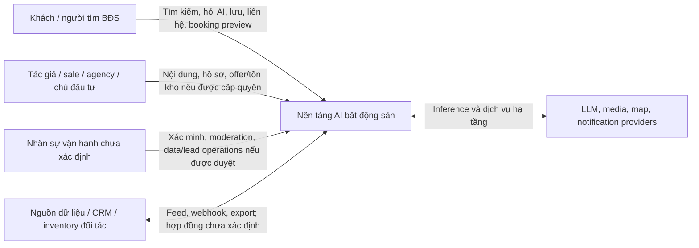
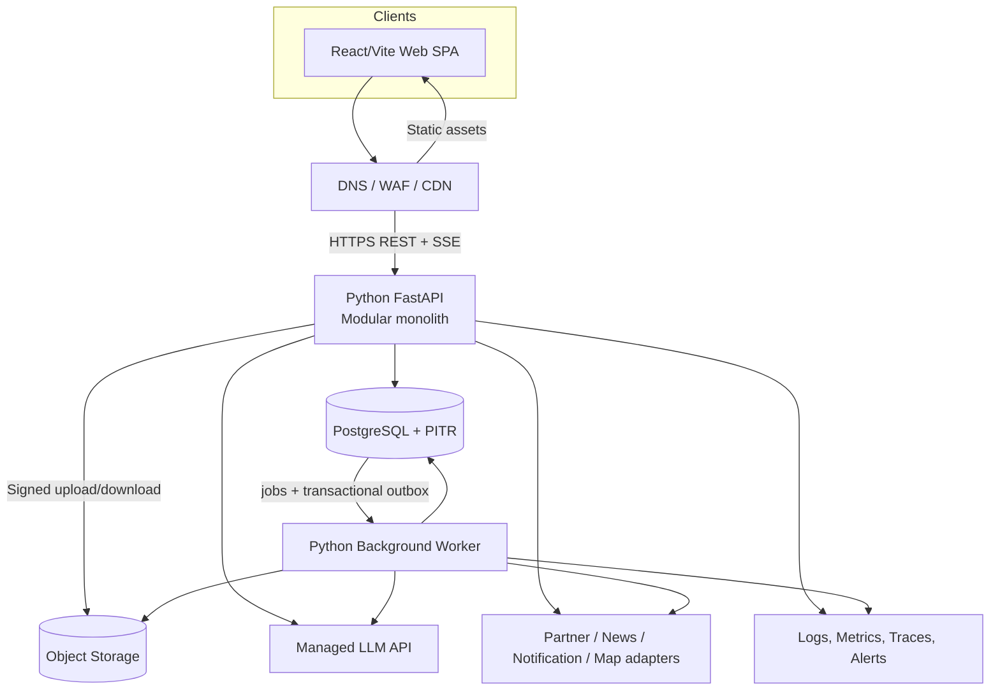
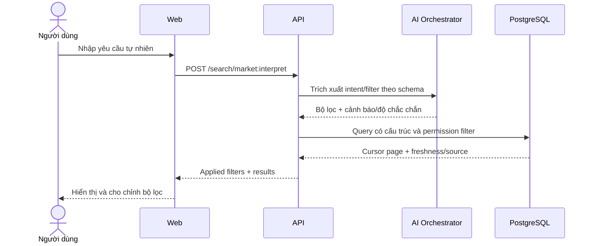
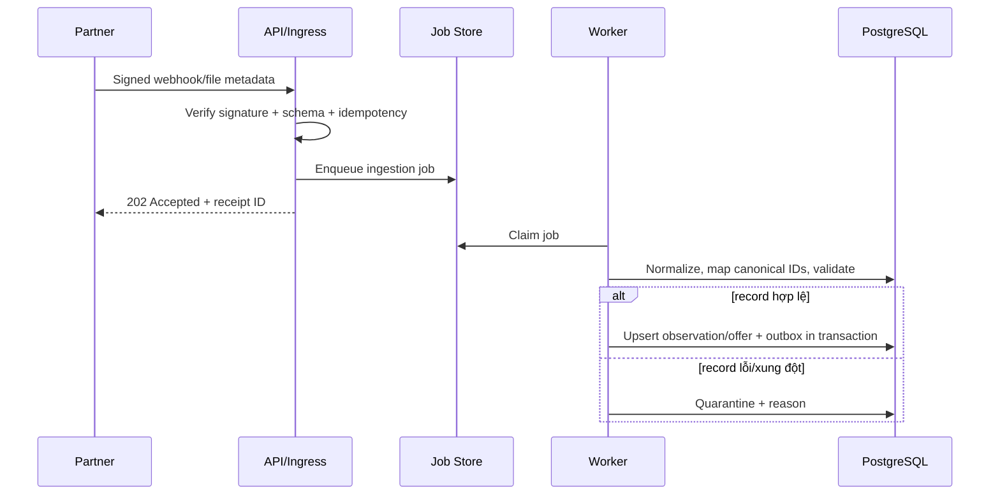

# Kiến trúc hệ thống

## 1. Trạng thái và mục tiêu

- Trạng thái: **Proposed — chờ review**.
- Mục tiêu: Hiện thực hóa các luồng trong [requirements.md](./requirements.md) bằng kiến trúc đơn giản. Kiến trúc này phải an toàn cho dữ liệu bất động sản. Nó cũng cần có đường mở rộng rõ ràng khi có số đo thực tế (ví dụ: lượng người dùng truy cập hàng tháng).
- Ràng buộc hiện tại: Frontend đang là React/Vite SPA (Single Page Application - ứng dụng web một trang). Hiện tại chưa có backend, cơ chế xác thực (auth), nguồn dữ liệu thực tế (production) hoặc chỉ tiêu quy quy mô được xác nhận.
- Không có mã nguồn (application code) nào được tạo từ tài liệu này trước khi thiết kế được duyệt.

## 2. Nguyên tắc kiến trúc

1. **Modular monolith trước microservice**: Sử dụng modular monolith (một ứng dụng chia module có ranh giới rõ) thay vì microservice. Việc triển khai (deploy) một API duy nhất với module ranh giới rõ ràng giúp quản lý giao dịch (transaction) và vận hành đơn giản hơn. Điều này đặc biệt hữu ích trong giai đoạn chưa biết rõ tải hệ thống.
2. **PostgreSQL là nguồn sự thật**: PostgreSQL chứa dữ liệu gốc cho mọi nghiệp vụ. Các công nghệ như cache (bộ nhớ đệm) hay search index (chỉ mục tìm kiếm) không được quyền quyết định trạng thái của căn hộ hoặc quá trình đặt chỗ (booking).
3. **Tách xử lý bất đồng bộ**: Một worker (tiến trình chạy nền) riêng sẽ thực hiện các tác vụ nặng. Các tác vụ này bao gồm ingestion (thu thập dữ liệu), xử lý hình ảnh (media), moderation (kiểm duyệt), xử lý AI hàng loạt (batch) và gửi thông báo (notification).
4. **REST cho nghiệp vụ, SSE cho chat AI**: Sử dụng REST (chuẩn giao tiếp API REST) cho các nghiệp vụ thông thường. Sử dụng SSE (Server-Sent Events - đẩy dữ liệu từ server xuống client) cho tính năng chat AI. Tránh thêm WebSocket (giao thức giao tiếp hai chiều) khi giao diện người dùng (UI) chưa có yêu cầu cập nhật realtime hai chiều.
5. **Nguồn và thời điểm là dữ liệu hạng nhất**: Các thông tin như giá, lượng hàng (tồn kho), pháp lý, tin tức và câu trả lời của AI phải truy vết được nguồn gốc và thời điểm tạo.
6. **AI không có quyền ghi nghiệp vụ**: Công cụ (tool) của mô hình ngôn ngữ lớn (LLM) chỉ có quyền đọc. Mọi thay đổi dữ liệu (mutation) phải đi qua API chuyên biệt. API này sẽ kiểm tra phân quyền (authorization), tính hợp lệ (validation) và lưu vết (audit).
7. **Không tối ưu sớm**: Sử dụng các tính năng có sẵn của PostgreSQL như lọc (filtering) hoặc full-text search. Tận dụng CDN (mạng phân phối nội dung) và HTTP cache. Chỉ thêm các công nghệ phức tạp như Redis, search cluster hoặc vector (biểu diễn dữ liệu dưới dạng số) khi có bằng chứng thực tế cần thiết.
8. **Provider-neutral tại ranh giới**: Các dịch vụ bên ngoài như LLM, bản đồ (map), thông báo, lưu trữ và luồng dữ liệu (feed) của đối tác phải nằm sau adapter (mẫu thiết kế chuyển đổi interface). Điều này giúp dễ dàng thay đổi nhà cung cấp (provider-neutral) sau này.

## 3. Sơ đồ ngữ cảnh



Các đối tượng (actor), luồng tích hợp và quyền hạn cụ thể đang chờ giải quyết ở các câu hỏi mở: OQ-002 (loại người dùng), OQ-004 (nguồn dữ liệu dự án), OQ-008 (loại bài đăng), OQ-020 (quy trình booking), OQ-036 (giao thức đối tác) và OQ-047 (kiểm duyệt).

## 4. Kiến trúc container



### 4.1 Web SPA

- Giữ nguyên frontend React/Vite hiện tại trong giai đoạn chuyển đổi.
- Thay dần dữ liệu giả (mock) và `localStorage` bằng API client có định kiểu (typed API client - sinh từ OpenAPI) và dữ liệu từ server (server state).
- Thêm bộ định tuyến (router) và liên kết sâu (deep link) sau khi câu hỏi OQ-051 (luồng điều hướng) được duyệt.
- Trạng thái giao diện (Local UI state) vẫn lưu ở trình duyệt khách (client). Dữ liệu cần chia sẻ giữa nhiều thiết bị phải lưu ở backend (ví dụ: giỏ hàng, danh sách yêu thích).
- Không lưu token dài hạn hoặc dữ liệu cá nhân nhạy cảm (PII - Personally Identifiable Information) của hội thoại trực tiếp trong `localStorage` nếu cơ chế xác thực không cho phép.

### 4.2 API modular monolith

- Đây là một tiến trình duy nhất, stateless (không lưu trạng thái) phục vụ các endpoint `/api/v1` và SSE.
- Chứa: kiểm tra dữ liệu đầu vào (validation), phân quyền (authorization), điều phối nghiệp vụ (use case orchestration), giao dịch database (transaction), và kết nối dịch vụ ngoài (adapters).
- Không chạy các công việc chạy lâu (long-running job), cào dữ liệu (crawl), chuyển đổi định dạng video (transcode) hoặc tạo vector embedding hàng loạt trong luồng xử lý yêu cầu (request thread).
- Hệ thống sẽ tự động nhân bản (scale ngang) phía sau bộ cân bằng tải (load balancer). Phiên đăng nhập (session) không được giữ trong bộ nhớ (memory) của server.

### 4.3 Background worker

Worker sử dụng chung mã nguồn (codebase) và hợp đồng module (module contracts) bằng Python. Tuy nhiên, nó được triển khai riêng biệt để xử lý các công việc sau:

- Nhận và chuẩn hóa dữ liệu từ đối tác (ví dụ: lấy danh sách nhà từ API đối tác).
- Kiểm tra chất lượng dữ liệu. Hệ thống sẽ loại bỏ trùng lặp (deduplicate) và cô lập (quarantine) các bản ghi lỗi.
- Xử lý hình ảnh/video, quét mã độc và chuyển đổi định dạng khi có yêu cầu.
- Kiểm duyệt nội dung bất đồng bộ và xếp hàng chờ người duyệt (human-review queue).
- Tạo vector embedding và tổng hợp dữ liệu AI theo lịch (nếu kết quả đánh giá cho thấy cần thiết).
- Gửi thông báo, thử gọi lại (retry) webhook bị lỗi và đồng bộ dữ liệu với hệ thống bên ngoài.
- Xử lý các lô đặt chỗ (hold) hết hạn, đồng bộ trạng thái. Worker cũng phát hành các sự kiện (publish outbox event).

### 4.4 PostgreSQL

- Đây là nguồn sự thật duy nhất cho: danh tính người dùng (identity), danh mục (catalog), tồn kho (inventory), đặt chỗ (booking), khách hàng tiềm năng (lead), thông tin hội thoại chat, dữ liệu mạng xã hội và log kiểm toán (audit).
- Sử dụng transaction, các ràng buộc (constraint) và khóa dòng (row lock) để đảm bảo tính toàn vẹn nghiệp vụ. Ví dụ: không cho phép 2 người cùng đặt 1 căn hộ.
- Dùng các chỉ mục (index) phù hợp như B-tree, GiST hoặc GIN. Tính năng tìm kiếm toàn văn bản (full-text search) ban đầu sẽ chạy trực tiếp trong PostgreSQL.
- `pgvector` là một tiện ích mở rộng (extension) tùy chọn. Chỉ bật khi tính năng tìm kiếm theo ngữ nghĩa (semantic retrieval) đạt hiệu quả qua đánh giá. Nó không phải là thành phần mặc định trong phiên bản đầu tiên (MVP - Minimum Viable Product).

### 4.5 Object storage và CDN

- Dùng để lưu trữ ảnh, video và tài liệu. Database chỉ lưu siêu dữ liệu (metadata), thông tin sở hữu, chuỗi kiểm tra (checksum), quyền hiển thị (visibility) và đường dẫn file (object key).
- Khách hàng tải file lên thông qua URL ký có thời hạn ngắn (signed URL). File tải lên sẽ ở trạng thái `pending` cho đến khi quá trình quét và kiểm tra hoàn tất.
- CDN sẽ phục vụ các file media công khai với cấu hình cache phù hợp. Các tài nguyên riêng tư bắt buộc dùng URL ký để truy cập.

### 4.6 LLM và dịch vụ ngoài

- Giai đoạn đầu sẽ sử dụng các dịch vụ LLM có sẵn (Managed LLM) thông qua adapter. Việc này giúp không bị phụ thuộc vào một nhà cung cấp cụ thể.
- Tất cả các lệnh gọi (request) ra bên ngoài đều phải có thời gian chờ (timeout), giới hạn số lần thử lại (retry) và ngắt mạch (circuit breaker). Cần có cơ chế theo dõi chi phí chặt chẽ.
- Các dịch vụ như bản đồ, thông báo, CRM, và feed dữ liệu đối tác chưa được chọn nhà cung cấp. Tránh đưa trực tiếp SDK của nhà cung cấp vào lõi nghiệp vụ (domain).

## 5. Ranh giới module

| Module | Trách nhiệm | Dữ liệu sở hữu | Không chịu trách nhiệm |
|---|---|---|---|
| Identity & Access | Quản lý người dùng, ánh xạ danh tính, vai trò (role), tổ chức và quyền đồng ý. | users, organizations, memberships, consents | Xếp hạng feed, phân bổ lead. |
| Geography & Catalog | Quản lý tỉnh/thành, dự án/phân khu/tòa nhà/căn hộ gốc (canonical). | cities, districts, projects, phases, buildings, units | Giao dịch giữ chỗ hoặc booking. |
| Listings | Quản lý tin bán/thuê, media, tìm kiếm, lưu trữ nguồn gốc tin. | listings, listing_media | Quản lý dự án gốc và trạng thái căn hộ. |
| Inventory | Quản lý giá/số lượng (offer) từ nhà phân phối, đồng bộ dữ liệu. | unit_distributor_offers, inventory observations/sync runs | Chốt booking (ngoài state machine). |
| Bookings | Xử lý yêu cầu, giữ chỗ (hold), hết hạn, lịch sử trạng thái, đồng thời (concurrency). | booking_requests, unit_holds, status_events | Thanh toán hoặc KYC. |
| Leads | Xử lý yêu cầu tư vấn, liên hệ, phân bổ và vòng đời khách hàng. | consultation_requests | Gửi thông báo cụ thể cho nhà cung cấp. |
| Saved & Interests | Lưu trữ các mục yêu thích và tín hiệu quan tâm của người dùng. | saved_items, interest_signals | Định nghĩa quy tắc xếp hạng feed. |
| Conversations | Quản lý vòng đời hội thoại, tin nhắn và ngữ cảnh AI. | conversations, messages, contexts | Nội bộ quá trình suy luận (inference) của model. |
| AI Orchestration | Quản lý prompt, công cụ, truy xuất dữ liệu, định tuyến model, đánh giá/trích dẫn. | ai_runs, ai_citations, feedback/eval records | Ghi đè hoặc thay đổi dữ liệu nghiệp vụ. |
| Social | Quản lý hồ sơ công khai, bài đăng, bình luận, tương tác, theo dõi. | author_profiles, posts, comments, reactions, follows | Xác thực thông tin danh tính. |
| Moderation | Đánh giá chính sách và ra quyết định kiểm duyệt nội dung. | moderation_decisions, reports (nếu có) | Định nghĩa chính sách sản phẩm. |
| Market Content | Cập nhật giá thị trường, tin tức, và kiến thức rủi ro. | observations, market updates, articles | Trạng thái sẵn sàng của căn hộ gốc. |
| Media | Quản lý vòng đời tải lên, metadata, quét/chuyển đổi file. | media_assets | Quy tắc sở hữu tin đăng. |
| Notifications | Cấu hình, template, và lưu nhật ký gửi thông báo. | notifications, delivery attempts | Quyết định phát sinh sự kiện nghiệp vụ. |
| Platform Jobs & Audit | Quản lý vòng đời job, outbox, và nhật ký kiểm toán. | jobs, outbox_events, audit_logs | Logic xử lý nghiệp vụ của module khác. |

Quy tắc sở hữu: Module này không được phép cập nhật trực tiếp bảng cơ sở dữ liệu do module khác sở hữu. Trong monolith, các module giao tiếp thông qua service ứng dụng, public contract hoặc sự kiện nghiệp vụ (domain event). Tuyệt đối không import sâu vào chi tiết triển khai (implementation) của module khác.

## 6. Luồng dữ liệu chính

### 6.1 Search có ngôn ngữ tự nhiên



LLM không được phép sinh trực tiếp mã SQL và không được quyền bỏ qua các bước kiểm tra (validation/authorization). Nếu model gặp lỗi, người dùng vẫn có thể dùng bộ lọc thông thường (filter thường).

### 6.2 Chat AI có nguồn dẫn

1. API sẽ xác thực (auth), giới hạn số lượng request (rate-limit) và lưu trữ tin nhắn của người dùng.
2. AI Orchestrator phân loại ý định (intent). Nó sẽ loại bỏ hoặc che các thông tin nhạy cảm (PII) theo chính sách.
3. Model chỉ được phép gọi các công cụ trong danh sách cho phép (allowlist). Mỗi công cụ tự áp dụng quy tắc phân quyền và giới hạn riêng.
4. Quá trình truy xuất dữ liệu (retrieval) ưu tiên dữ liệu gốc (canonical). Sau đó đến nội dung đã được xác minh. Cuối cùng mới đến nội dung do người dùng tạo (UGC - User Generated Content) có gắn nhãn.
5. Model truyền dữ liệu (streaming) theo từng token hoặc sự kiện qua SSE.
6. Server lưu lại kết quả (output), phiên bản model/prompt/tool, số lượng token, chi phí, độ trễ (latency), kết quả an toàn (safety result) và nguồn trích dẫn (citation).
7. Nếu quá trình tạo văn bản bị hủy hoặc lỗi, tin nhắn phải có trạng thái rõ ràng. Hệ thống không được giả vờ là đã hoàn tất.

Chi tiết có thể xem tại [ai-architecture.md](./ai-architecture.md).

### 6.3 Inventory ingestion



Chưa thể xác nhận khả năng cập nhật thời gian thực ("real-time") cho đến khi làm rõ thông tin về nguồn dữ liệu, tần suất và cam kết độ mới (freshness SLA).

### 6.4 Booking/hold chống cạnh tranh

```mermaid
sequenceDiagram
    actor U as Người dùng
    participant A as Booking API
    participant D as PostgreSQL
    participant W as Worker

    U->>A: POST booking request + Idempotency-Key
    A->>D: BEGIN; lock canonical unit
    A->>D: Kiểm tra quyền, trạng thái, active hold, request lặp
    alt hợp lệ theo policy
      A->>D: Tạo request/hold + event + outbox; COMMIT
      A-->>U: 201 + status + expiresAt nếu có
      W->>D: Dispatch notification / expiry job
    else đã bị giữ/không còn hàng
      A->>D: ROLLBACK
      A-->>U: 409 RESOURCE_STATE_CONFLICT
    end
```

Các giao dịch cụ thể sẽ phụ thuộc vào việc định nghĩa trạng thái và luật giữ chỗ ở các câu hỏi OQ-011 (quyền ưu tiên đặt), OQ-019 (cấu trúc giá) và OQ-020 (quy trình đặt chỗ).

### 6.5 Mutation cộng đồng

- API xác thực đối tượng (actor), kiểm tra quyền theo loại bài đăng và tính toàn vẹn (idempotency - tính toàn vẹn khi gọi nhiều lần).
- File hình ảnh (media) phải thuộc sở hữu của đối tượng đó. File phải được quét và có quyền hiển thị (visibility) phù hợp.
- Bài đăng được lưu dưới dạng `draft` (nháp), `pending_review` (chờ duyệt) hoặc `published` (đã xuất bản) theo chính sách (chưa xác nhận).
- Transactional outbox (ghi sự kiện cùng lúc với dữ liệu trong một transaction) sẽ kích hoạt quá trình kiểm duyệt, lập chỉ mục (indexing), đưa lên feed và gửi thông báo.
- Nội dung bị ẩn hoặc xóa bắt buộc phải bị loại khỏi kết quả tìm kiếm và hệ thống AI retrieval mới.

## 7. Đồng bộ và consistency

| Dữ liệu | Mức consistency đề xuất | Cơ chế |
|---|---|---|
| Unit hold/booking | Nhất quán mạnh (Strong consistency) trong một database | Dùng Transaction, khóa dòng (row lock), ràng buộc (constraint), và idempotency. |
| Lead creation | Nhất quán mạnh khi ghi; nhất quán cuối (eventual consistency) khi giao | Dùng Transaction + outbox. |
| Saved/reaction/follow | Read-after-write (đọc ngay sau khi ghi) cho người tạo; đếm số lượng (counter) dùng nhất quán cuối | Ràng buộc duy nhất (Unique constraint) + gom nhóm bất đồng bộ (async aggregate) nếu cần. |
| Feed/search index | Nhất quán cuối (Eventual consistency) | Outbox + worker. Dữ liệu gốc vẫn lưu ở Postgres. |
| Partner inventory | Nhất quán cuối, phụ thuộc vào cam kết độ trễ (SLA) | Quan sát và đồng bộ (Observation/sync run) kết hợp chỉ báo dữ liệu cũ (stale indicator). |
| Notification | Đảm bảo gửi ít nhất một lần (At-least-once delivery), bên nhận tự xử lý trùng lặp (idempotent) | Outbox/thử lại job (job retry) + khóa giao (delivery key). |
| AI response | Phản hồi dạng chuỗi (Streaming best-effort), ghi log bền vững | Lưu trạng thái chạy và tin nhắn. Retry không làm nhân đôi tin nhắn. |

Hệ thống không cam kết "exactly-once" (gửi đúng một lần) trong môi trường phân tán. Thiết kế sử dụng cơ chế "at-least-once" (gửi ít nhất một lần) kết hợp "idempotency" (xử lý an toàn khi gọi nhiều lần).

## 8. Cache, Redis và queue

### 8.1 MVP đề xuất

- Dùng CDN và `cache-control` để lưu đệm các file tĩnh (static asset) và hình ảnh (media).
- Sử dụng ETag và conditional request cho các tài nguyên công khai ít thay đổi.
- Dùng PostgreSQL cho cả dữ liệu chính và hàng đợi công việc (job queue/outbox).
- Cache trong bộ nhớ tiến trình (in-process cache) chỉ dùng cho dữ liệu cấu hình hoặc từ điển tham chiếu. Dữ liệu này không nhạy cảm, có thời gian sống (TTL) ngắn và không ảnh hưởng đến tính đúng đắn của hệ thống.
- **Không triển khai Redis ở giai đoạn MVP** khi chưa có dữ liệu đánh giá tải thực tế.

### 8.2 Khi nào cân nhắc Redis

Chỉ thêm Redis khi có số liệu (metric) chứng minh cần một trong các điều sau:

- Hệ thống giới hạn truy cập phân tán (distributed rate-limit) tại edge/API gateway không đáp ứng đủ yêu cầu.
- Cần một bộ nhớ đệm đọc nhanh (hot read cache) để giảm tải cho database. Khi đó cần có tỷ lệ truy cập trúng (hit rate) cao và cơ chế xóa cache (invalidation) rõ ràng.
- Các quá trình sinh dữ liệu tạm thời (ephemeral generation/progress) cần chia sẻ giữa các instance (ví dụ: tiến trình upload file lớn).
- Việc đếm số lượng fan-out hoặc trạng thái online (presence) thực sự đòi hỏi độ trễ cực thấp.

Tuyệt đối không dùng Redis làm nguồn sự thật (source of truth) cho trạng thái trống của căn hộ, thông tin giữ chỗ, booking, lead hoặc phân quyền. Các chi tiết về TTL (thời gian sống của cache) hay khóa (key) sẽ được thiết kế sau khi chốt OQ-044 (quy mô) và OQ-050 (cơ sở hạ tầng).

### 8.3 Khi nào thay DB queue

Sẽ chuyển sang hệ thống hàng đợi chuyên dụng (như RabbitMQ, Kafka) khi nào? Đó là khi số lượng công việc (job volume), thời gian lưu trữ, mức độ lan tỏa (fan-out), tính cô lập hoặc chi phí vận hành PostgreSQL cho thấy database queue không còn đủ khả năng. Tuy nhiên, pattern outbox vẫn sẽ là ranh giới giao dịch (transaction boundary) từ phía dữ liệu nghiệp vụ.

## 9. Security và privacy

- API không tin tưởng thông tin người dùng (user), vai trò (role) hay tổ chức (organization) gửi trực tiếp từ request body. Chờ quyết định về Identity provider ở OQ-003.
- Việc phân quyền (authorization) được thực hiện ở tầng ứng dụng (application layer) và trong các truy vấn (query). Áp dụng kiểm tra mức độ đối tượng (object-level checks) đối với hội thoại, mục yêu thích, lead, booking, và media riêng tư.
- Áp dụng kiểm soát truy cập dựa trên vai trò (RBAC - Role-Based Access Control) kết hợp với tài nguyên/tổ chức nếu hệ thống là multi-tenant (đa khách hàng).
- Mọi kết nối phải qua TLS. Mật khẩu và mã khóa (secret) lưu trong kho quản lý bảo mật (managed secret store). Cần có cơ chế xoay vòng khóa (rotation) và nguyên tắc đặc quyền tối thiểu (least privilege).
- Cần phân loại, mã hóa tại nguồn (encryption at rest), và loại bỏ thông tin nhạy cảm (PII) trong log theo đúng chính sách (policy).
- Sử dụng Signed URL cho thao tác upload. Hệ thống sẽ kiểm tra định dạng file (MIME) thực tế, dung lượng, chuỗi kiểm tra (checksum), quét mã độc và xác nhận quyền sở hữu.
- Sử dụng WAF, giới hạn số lượng request (rate limit) và chống bot cho các chức năng quan trọng. Bao gồm: xác thực, tìm kiếm, gọi AI, tạo lead, booking, đăng bài/bình luận và webhook.
- Webhook phải dùng chữ ký điện tử (signature), cửa sổ thời gian (timestamp/replay window) để chống tấn công phát lại. Dùng danh sách cho phép (allowlist) nếu có thể và đảm bảo tính toàn vẹn (idempotency).
- Để chống prompt injection: Cần tách biệt phần lệnh (instruction) khỏi dữ liệu truy xuất được (retrieved data). Dùng danh sách công cụ cho phép (tool allowlist), kiểm tra kỹ kết quả (output validation) và áp dụng chính sách chặt chẽ cho URL/nguồn.
- Ghi log kiểm toán (audit log) cho các thao tác phân quyền, xác minh, kiểm duyệt, truy cập thông tin cá nhân (PII), ghi đè kho hàng (inventory override), và thay đổi trạng thái đặt chỗ.
- Dữ liệu sao lưu (backup) phải được mã hóa. Cần có kịch bản kiểm tra phục hồi (restore test). Quyền truy cập môi trường production phải tách biệt hoàn toàn khỏi dev/staging.

Mô hình rủi ro chi tiết (Threat model) sẽ được lập trong giai đoạn lên kế hoạch triển khai (implementation planning). Việc này làm sau khi chốt xong các vấn đề về xác thực, tích hợp và chính sách dữ liệu.

## 10. Khả năng mở rộng và độ tin cậy

### 10.1 Scale path

1. Mở rộng ngang (scale ngang) các instance API/worker stateless và tối ưu hóa (tune/index) PostgreSQL.
2. Dùng bản sao đọc (read replica) cho các tác vụ không đòi hỏi dữ liệu mới nhất (nhất quán tức thời). Ví dụ: báo cáo thống kê, nếu các chỉ số (metric) cho thấy cần thiết.
3. Tách biệt các tác vụ phân tích (analytics) hoặc xử lý lô (batch) khỏi database chính. Việc này cần làm nếu các truy vấn nặng ảnh hưởng đến giao dịch nghiệp vụ (OLTP).
4. Thêm các hệ thống như Redis, search engine, vector DB hoặc managed queue dựa trên điểm nghẽn cụ thể đã đo lường được.
5. Chỉ tách các module thành dịch vụ độc lập (microservice) khi thực sự có nhu cầu mở rộng, triển khai hoặc quản lý riêng biệt (đã đo lường). Vẫn phải giữ nguyên các giao thức (contract) và sự kiện (event) hiện có.

### 10.2 Failure handling

- Cấu hình timeout và tự động thử lại (retry) với độ trễ tăng dần (exponential backoff) và ngẫu nhiên hóa (jitter) cho các lời gọi ra bên ngoài. Chỉ retry các thao tác an toàn khi gọi nhiều lần (idempotent).
- Sử dụng ngắt mạch (circuit breaker) hoặc phương án dự phòng (fallback) cho các nhà cung cấp bên ngoài. Ví dụ: Nếu tính năng nâng cao tìm kiếm bằng AI bị lỗi, nó không được làm hỏng chức năng lọc (filter) cơ bản.
- Áp dụng hàng đợi thư chết (dead-letter/quarantine) cho các công việc không xử lý được. Lưu kèm lý do lỗi và cho phép chạy lại (replay control).
- Ứng dụng phải dừng một cách an toàn (graceful shutdown) để không ngắt đột ngột SSE hay công việc đang xử lý. Các cơ chế khóa (lock) phải có thời hạn (lease) và khả năng phục hồi.
- Mọi thay đổi dữ liệu (migration) phải tương thích ngược (backward-compatible) theo mô hình expand/migrate/contract (Mở rộng - Chuyển đổi - Thu hẹp).
- Dùng cờ tính năng (feature flag) hoặc công tắc ngắt (kill switch) cho các model AI, nguồn dữ liệu feed, và tính năng đăng tải mạng xã hội (social publishing) có rủi ro cao.

Các cam kết về chất lượng dịch vụ (SLO, RPO và RTO) hiện chưa có con số cụ thể. Cần theo dõi ở OQ-044 (quy mô) và OQ-045 (an toàn dữ liệu).

## 11. Quan sát hệ thống

- Sử dụng log có cấu trúc (structured log) chứa `request_id`, `trace_id`, định danh giả danh (pseudonymous ID) của người dùng, module xử lý và kết quả. Không ghi (log) các prompt AI hoặc thông tin cá nhân (PII) thô theo mặc định.
- Chỉ số giám sát (Metrics): Tần suất request, tỷ lệ lỗi, độ trễ. Theo dõi kết nối database, các truy vấn chậm. Theo dõi độ trễ job, số lần retry, dead letter. Theo dõi độ mới của feed, inventory cũ, trạng thái lead/booking và lỗi media.
- Chỉ số AI (AI metrics): Thời gian trả về token đầu tiên (time-to-first-token), tổng độ trễ. Theo dõi các lỗi công cụ (tool failure), độ phủ nguồn dẫn (citation coverage), các trường hợp bị chặn vì an toàn (safety blocks). Đo lường số lượng token, chi phí, phiên bản model/prompt và chất lượng đánh giá (quality eval).
- Truy vết phân tán (Distributed trace) từ edge/API xuyên suốt DB, worker và các dịch vụ ngoài (nếu hệ thống công cụ hỗ trợ).
- Log kiểm toán (Audit log) phải tách biệt với log ứng dụng. Nó có thời gian lưu trữ (retention) và quyền truy cập riêng biệt.
- Cảnh báo (Alert) phải dựa trên mức độ ảnh hưởng đến người dùng và các cam kết SLO (khi được duyệt). Mọi cảnh báo phải có người chịu trách nhiệm (owner) và kịch bản xử lý (runbook).

## 12. Các phương án đã cân nhắc

| Chủ đề | Phương án chọn (Proposed) | Phương án chưa chọn | Lý do hiện tại |
|---|---|---|---|
| Service topology | Modular monolith + worker | Microservices | Chưa xác định rõ tải trọng và ranh giới nhóm (team boundary). Quản lý giao dịch (transaction) booking sẽ đơn giản hơn trong monolith. |
| Database | PostgreSQL | Polyglot DB (Nhiều loại DB khác nhau) từ đầu | Nghiệp vụ (domain) đòi hỏi tính quan hệ và giao dịch mạnh mẽ. |
| Search | SQL filters + PostgreSQL FTS | Elasticsearch/OpenSearch ngay | Chưa có quy mô (scale) hoặc yêu cầu chất lượng đủ lớn để chứng minh nhu cầu. |
| Semantic retrieval | Bật sau eval, có thể dùng pgvector | Dùng Vector DB riêng biệt ngay | Giảm bớt công sức vận hành và chi phí giai đoạn đầu. |
| Queue | DB jobs + outbox | Kafka/SQS/PubSub ngay | Khối lượng công việc (Job volume) và mức độ lan tỏa (fan-out) chưa xác định. |
| Cache | CDN/HTTP, không dùng Redis ban đầu | Dùng Redis làm mặc định | Tránh rắc rối khi xóa cache (invalidation) và việc có một nguồn sự thật (source of truth) thứ hai. |
| API | REST + SSE | GraphQL/WebSocket | Phù hợp với nhu cầu cơ bản: CRUD (Tạo, Đọc, Sửa, Xóa), bộ lọc (filter) và chat một chiều (server đẩy dữ liệu). |
| Model serving | Managed provider-neutral (Dùng dịch vụ ngoài) | Tự host trên GPU riêng (Self-host GPU) | Chưa có yêu cầu đủ khắt khe về quyền riêng tư (privacy), chi phí (cost) hoặc độ trễ (latency). |

Các quyết định thiết kế chính được ghi nhận chi tiết tại [decisions.md](./decisions.md).

## 13. Traceability và cổng triển khai

- Thiết kế cơ sở dữ liệu: [database-design.md](./database-design.md)
- Giao thức REST/SSE: [api-design.md](./api-design.md)
- Kiến trúc AI/RAG/Model: [ai-architecture.md](./ai-architecture.md)
- Hạ tầng Cloud/CI/CD/Operations: [infrastructure.md](./infrastructure.md)
- Cấu trúc thư mục/Quy tắc phụ thuộc: [project-structure.md](./project-structure.md)

Trước khi bắt đầu code (implementation), phải giải quyết tối thiểu các vấn đề sau: Phạm vi dự án, người dùng/xác thực (actor/auth), nguồn dữ liệu, quy chuẩn tồn kho/trạng thái (canonical inventory/status). Cần làm rõ ý nghĩa của việc đặt chỗ (booking semantics), chính sách AI và thông tin cá nhân (AI/PII policy), quy trình kiểm duyệt (moderation) và các cam kết về cloud, SLO, ngân sách tương ứng với các câu hỏi ưu tiên cao (OQ P0).
